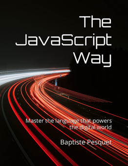

# The JavaScript Way

This repository contains the English source files for **The JavaScript Way** book.

You may browse its content [here](manuscript/), but a nicer alternative is the [online version](https://thejsway.net) which is free to read.

This book is also available on [Leanpub](https://leanpub.com/thejsway) (PDF, EPUB), [Amazon](https://www.amazon.com/dp/295644462X) (Kindle, paperback) and [Educative](https://www.educative.io/courses/the-complete-javascript-course-build-a-real-world-app-from-scratch) (interactive course).

[](https://thejsway.net)

## Development notes

The online version of the book is powered by [Material for Mkdocs](https://squidfunk.github.io/mkdocs-material/). To deploy it locally, clone or download this repository, install [poetry](https://python-poetry.org/) then run the following commands in the cloned/downloaded folder:

```bash
poetry shell
poetry install
mkdocs serve
```

By default, the book is deployed at <http://localhost:8000> on the local machine.

## License

This work is published under a [Creative Commons](LICENSE) license. All code is licensed under an [MIT](CODE_LICENSE) license. [Contributions](CONTRIBUTING.md) are most welcome.

Copyright © 2017-present [Baptiste Pesquet](https://bpesquet.fr).
