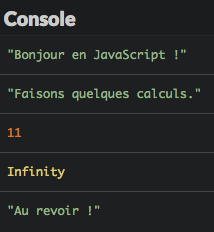
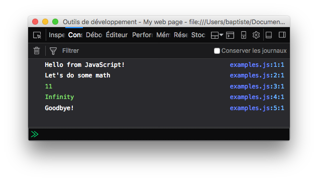
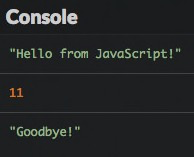
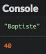

# 3, 2, 1... Code!

Let's get started! This chapter will introduce you to the fundamentals of programming including values, types, and program structure.

## TL;DR

* The JavaScript command `console.log()` shows a message in the **console**, an information zone available in most JavaScript environments.

* A **value** is a piece of information. The **type** of a value defines its role and the operations applicable to it.

* The JavaScript language uses the **number** type to represent a numerical value (with or without decimals) and the **string** type to represent text.

* A string value is surrounded by a pair of single quotes (`'...'`) or a pair of quotation marks (`"..."`).

* Arithmetic operations between numbers are provided by the `+`, `-`, `*` and `/` operators. Applied to two strings, the `+` operator joins them together. This operation is called **concatenation**.

* A computer program is made of several **lines of code** read sequentially during execution.

* **Comments** (`// ...` or `/* ... */`) are non-executed parts of code. They form a useful program documentation.

## Your first program

Here's our very first JavaScript program.

```js
console.log("Hello from JavaScript!");
```

This program displays the text `"Hello from JavaScript!"` in the **console**, a zone displaying textual information available in most JavaScript environments, such as browsers.

To achieve this, it uses a JavaScript command named `console.log()`, whose role is to display a piece of information. The text to be displayed is placed between parentheses and followed by a semicolon, which marks the end of the line.

Displaying a text on the screen (the famous [Hello World](https://en.wikipedia.org/wiki/Hello_world) all programmers know) is often the first thing you'll do when you learn a new programming language. It's the classic example. You've already taken that first step!

## Values and types

A **value** is a piece of information used in a computer program. Values exist in different forms called types. The **type** of a value determines its role and operations available to it.

Every computer language has its own types and values. Let's look at two of the types available in JavaScript.

### Number

A **number** is a numerical value (thanks Captain Obvious). Let's go beyond that though! Like mathematics, you can use integer values (or whole numbers) such as 0, 1, 2, 3, etc, or real numbers with decimals for greater accuracy.

Numbers are mainly used for counting. The main operations you'll see are summarized in the following table. All of them produce a number result.

|Operator|Role|
|---------|----|
|`+`|Addition|
|`-`|Subtraction|
|`*`|Multiplication|
|`/`|Division|

### String

A **string** in JavaScript is text surrounded by quotation marks, such as `"This is a string"`.

You can also define strings with a pair of single quotes: `'This is another string'`. The best practice for single or double quotes is a whole political thing. Use whichever you like, but don't mix the two in the same program!

W> Always remember to close a string with the same type of quotation marks you started it with.

To include special characters in a string, use the `\` character (*backslash*) before the character. For example, type `\n` to add a new line within a string: `"This is\na multiline string"`.

You cannot add or subtract string values like you'd do with numbers. However, the `+` operator has a special meaning when applied to two string values. It will join the two chains together, and this operation is called a **concatenation**. For example, `"Hel" + "lo"` produces the result `"Hello"`.

## Program structure

We already defined a computer program as a list of commands telling a computer what to do. These orders are written as text files and make up what's called the "source code" of the program. The lines of text in a source code file are called **lines of code**.

The source code may include empty lines: these will be ignored when the program executes.

### Statements

Each instruction inside a program is called a **statement**. A statement in JavaScript usually ends with a **semicolon** (albeit it's not strictly mandatory). Your program will be made up of a series of these statements.

I> You usually write only one statement per line.

### Execution flow

When a program is executed, the statements in it are "read" one after another. It's the combination of these individual results that produces the final result of the program.

Here's an example of a JavaScript program including several statements, followed by the result of its execution.

```js
console.log("Hello from JavaScript!");
console.log("Let's do some math");
console.log(4 + 7);
console.log(12 / 0);
console.log("Goodbye!");
```



Depending on your work environment, the execution result may not include quotes around text.



I> As expected, a division by zero (`12/0`) results in an `Infinity` value.

### Comments

By default, each line of text in the source files of a program is considered a statement that should be executed. You can prevent certain lines from executing by putting a double slash before them: `//`. This turns the code into a **comment**.

```js
console.log("Hello from JavaScript!");
// console.log("Let's do some math");
console.log(4 + 7);
// console.log(12 / 0);
console.log("Goodbye!");
```

During execution, the commented-out lines no longer produce results. As we hoped, they weren't executed.



Comments are great for developers so you can write comments to yourself, explanations about your code, and more, without the computer actually executing any of it.

You can also write comments by typing `/*  */` around the code you want commented out.

```js
/* A comment
written on
several lines */

// A one line comment
```

Comments are a great source of info about a program's purpose or structure. Adding comments to complicated or critical parts is a good habit you should build right now!

## Coding time!

Let's put your brand new coding skills into practice.

### Presentation

Write a program that displays your name and age. Here's the result for mine.



### Minimalistic calculator

Write a program that displays the results of adding, subtracting, multiplying and dividing 6 by 3.

### Values prediction

Observe the following program and try to predict the values it displays.

```js
console.log(4 + 5);
console.log("4 + 5");
console.log("4" + "5");
```

Check your prediction by executing it.
