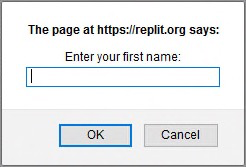

# Play with variables

You know how to use JavaScript to display values. However, for a program to be truly useful, it must be able to store data, like information entered by a user. Let's check that out.

## TL;DR

* A **variable** is an information storage area. Every variable has a **name**, a **value** and a **type**. In JavaScript, the type of a variable is deduced from the value stored in it: JavaScript is a **dynamically typed** language.

* A variable is declared using the `let` keyword followed by the variable name. To declare a **constant** (a variable whose initial value will never change), it's better to use the `const` keyword instead.

* To give a value to a variable, we use the **assignment operator** `=`. For number variables, the operator `+=` can increase and the operator `++` can **increment** their value.

* The **scope** of a variable is the part of the program where the variable is visible. Variables declared with `let` or `const` are **block-scoped**. A **code block** is a portion of a program delimited by a pair of opening and closing curly braces `{ ... }`.

* An **expression** is a piece of code that combines variables, values and operators. Evaluating an expression produces a value, which has a type.

* Expressions may be included in strings delimited by a pair of backticks (\`). Such a string is called a **template literal**.

* **Type conversions** may happen implicitly during the evaluation of an expression, or explicitly when using the `Number()` and `String()` commands, to obtain respectively a number or a string.

* The `prompt()` and `alert()` commands deal with information input and display under the form of dialog boxes.

* Variable naming is essential to program visibility. Following a naming convention like [camelCase](https://en.wikipedia.org/wiki/Camel_case) is good practice.

## Variables

### Role of a variable

A computer program stores data using variables. A **variable** is an information storage area. We can imagine it as a box in which you can put and store things!

### Variable properties

A variable has three main properties:

* Its **name**, which identifies it. A variable name may contain upper and lower case letters, numbers (not in the first position) and characters like the dollar sign (`$`) or underscore (`_`).
* Its **value**, which is the data stored in the variable.
* Its **type**, which determines the role and actions available to the variable.

I> You don't have to define a variable type explicitly in JavaScript. Its type is deduced from the value stored in the variable and may change while the program runs. That's why we say that JavaScript is a **dynamically typed** language. Other languages, like C or Java, require variable types to always be defined. This is called **static typing**.

### Declaring a variable

Before you can store information in a variable, you have to create it! This is called declaring a variable. **Declaring** a variable means the computer reserves memory in which to store the variable. The program can then read or write data in this memory area by manipulating the variable.

Here's a code example that declares a variable and shows its contents:

```js
let a;
console.log(a);
```

In JavaScript, you declare a variable with the `let`  keyword followed by the variable name. In this example, the variable created is called `a`.

I> Previously, JavaScript variables were declared using the `var` keyword. It's still possible, but in most cases it's simpler to use `let` and `const` instead.

Here's the execution result for this program.


Note that the result is `undefined`. This is a special JavaScript type indicating no value. I declared the variable, calling it `a`, but didn't give it a value!

### Assign values to variables

While a program is running, the value stored in a variable can change. To give a new value to a variable, use the `=` operator called the **assignment operator**.

Check out the example below:

```js
let a;
a = 3.14;
console.log(a);
```


We modified the variable by assigning it a value. `a = 3.14` reads as "a receives the value 3.14".

E> Be careful not to confuse the assignment operator `=` with mathematical equality! You'll soon see how to express equality in JavaScript.

You can also combine declaring a variable and assigning it a value in one line. Just know that, within this line, you're doing two different things at once:

```js
let a = 3.14;
console.log(a);
```

### Declaring a constant variable

If the initial value of a variable won't ever change during the rest of program execution, this variable is called a **constant**. This constantness can be enforced by using the keyword `const` instead of `let` to declare it. Thus, the program is more expressive and further attempts to modify the variable can be detected as errors.

```js
const a = 3.14; // The value of a cannot be modified
a = 6.28;       // Impossible!
```


### Increment a number variable

You can also increase the value of a number with `+=` and `++`. The latter is called the **increment operator**, as it allows incrementation (increase by 1) of a variable's value.

In the following example, lines 2 and 3 each increase the value of variable b  by 1.

```js
let b = 0;      // b contains 0
b += 1;         // b contains 1
b++;            // b contains 2
console.log(b); // Shows 2
```

### Variable scope

The **scope** of a variable is the part of the program where the variable is visible and usable. Variables declared with `let` or `const` are **block-scoped**: their visibility is limited to the block where they are declared (and every sub-block, if any). In JavaScript and many other programming languages, a **code block** is a portion of a program delimited by a pair of opening and closing braces. By default, a JavaScript program forms one block of code.

```js
let num1 = 0;
{
  num1 = 1; // OK : num1 is declared in the parent block
  const num2 = 0;
}
console.log(num1); // OK : num1 is declared in the current block
console.log(num2); // Error! num2 is not visible here
```

## Expressions

An **expression** is a piece of code that produces a value. An expression is created by combining variables, values and operators. Every expression has a value and thus a type. Calculating an expression's value is called **evaluation**. During evaluation, variables are replaced by their values.

```js
// 3 is an expression whose value is 3
const c = 3;
// c is an expression whose value is the value of c (3 here)
let d = c;
// (d + 1) is an expression whose value is d's + 1 (4 here)
d = d + 1; // d now contains the value 4
console.log(d); // Show 4
```

Operator priority inside an expression is the same as in math. However, an expression can integrate **parenthesis** that modify these priorities.

```js
let e = 3 + 2 * 4; // e contains 11 (3 + 8)
e = (3 + 2) * 4;   // e contains 20 (5 * 4)
```

It is possible to include expressions in a string by using **backticks** (\`) to delimit the string. Such a string is called a **template literal**. Inside a template literal, expressions are identified by the `${expression}` syntax.

This is often used to create strings containing the values of some variables.

```js
const country = "France";
console.log(`I live in ${country}`); // Show "I live in France"
const x = 3;
const y = 7;
console.log(`${x} + ${y} = ${x + y}`); // Show "3 + 7 = 10"
```

## Type conversions

An expression's evaluation can result in type conversions. These are called **implicit** conversions, as they happen automatically without the programmer's intervention. For example, using the `+` operator between a string and a number causes the concatenation of the two values into a string result.

```js
const f = 100;
// Show "Variable f contains the value 100"
console.log("Variable f contains the value " + f);
```

JavaScript is extremely tolerant in terms of type conversion. However, sometimes conversion isn't possible. If a value fails to convert into a number, you'll get the result `NaN` (*Not a Number*).

```js
const g = "five" * 2;
console.log(g); // Show NaN
```

Sometimes you'll wish to convert the value of another type. This is called **explicit** conversion. JavaScript has the `Number()`  and `String()` commands that convert the value between the parenthesis to a number or a string.

```js
const h = "5";
console.log(h + 1); // Concatenation: show the string "51"
const i = Number("5");
console.log(i + 1); // Numerical addition: show the number 6
```

## User interactions

### Entering information

Once you start using variables, you can write programs that exchange information with the user.

```js
const name = prompt("Enter your first name:");
alert(`Hello, ${name}`);
```

During execution, a dialog box pops up, asking for your name.



This is the result of the JavaScript command `prompt("Enter your first name:")`.

Type your name and click **OK**. You'll then get a personalized greeting.


The value you entered in the first dialog box has been stored as a string in the variable `name`. The JavaScript command `alert()`  then triggered the display of the second box, containing the result of the concatenation of the string `"Hello, "`  with the value of the `name` variable.

### Displaying information

Both `console.log()` (encountered in the previous chapter) and `alert()` can be used to display information to the user. Unlike `alert()`, `console.log()` does not stop program execution and is often a better choice.

`console.log()` can also display several comma-separated values at once.

```js
const temp1 = 36.9;
const temp2 = 37.6;
const temp3 = 37.1;
console.log(temp1, temp2, temp3); // Show "36.9 37.6 37.1"
```

### Entering a number

Regardless of the entered data, the `prompt()` command always returns a string value. If this value is to be used in numerical expressions, it *must* be converted into a number with the `Number()` command.

```js
const input = prompt("Enter a number:"); // input's type is string
const nb = Number(input); // nb's type is number
```

Both operations can be combined in one line for the same result.

```js
const nb = Number(prompt("Enter a number:")); // nb's type is number
```

In this example, the user input is directly converted in a number value by the `Number()` command and stored in the `nb` variable.

## Variable naming

To close this chapter, let's discuss variable naming. The computer doesn't care about variable names. You could name your variables using the classic example of a single letter (`a`, `b`, `c`...) or choose absurd names like `burrito`  or `puppieskittens90210`.

Nonetheless, naming variables well can make your code much easier to read. Check out these two examples:

```js
const a = 5.5;
const b = 3.14;
const c = 2 * a * b;
console.log(c);
```

```js
const radius = 5.5;
const pi = 3.14;
const perimeter = 2 * pi * radius;
console.log(perimeter);
```

They function in the same way, but the second version is much easier to understand.

Naming things is an important part of the programmer's job. Refer to the appendix for some useful advice.

## Coding time!

Build a habit of choosing good variable names in all exercises, starting with these ones.

### Improved hello

Write a program that asks the user for his first name and his last name. The program then displays them in one sentence.

### Final values

Observe the following program and try to predict the final values of its variables.

```js
let a = 2;
a -= 1;
a++;
let b = 8;
b += 2;
const c = a + b * b;
const d = a * b + b;
const e = a * (b + b);
const f = a * b / a;
const g = b / a * a;
console.log(a, b, c, d, e, f, g);
```

Check your prediction by executing it.

### VAT calculation

Write a program that asks the user for a raw price. After that, it calculates the corresponding final price using a VAT rate of 20.6%.

### From Celsius to Fahrenheit degrees

Write a program that asks for a temperature in Celsius degrees, then displays it in Fahrenheit degrees.

> The conversion between scales is given by the formula: [°F] = [°C] x 9/5 + 32.

### Variable swapping

Observe the following program.

```js
let number1 = 5;
let number2 = 3;

// TODO: type your code here (and nowhere else!)

console.log(number1); // Should show 3
console.log(number2); // Should show 5
```

Add the necessary code to swap the values of variables `number1` and `number2`.

T> This exercise has several valid solutions. You may use more than two variables to solve it.
