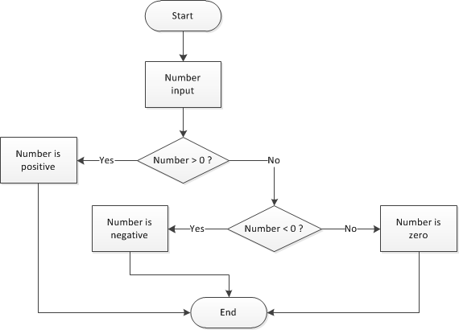

# Add conditions

Up until now, all the code in our programs has been executed chronologically. Let's enrich our code by adding conditional execution!

## TL;DR

* The `if` keyword defines a **conditional statement**, also called a **test**. The associated code block is only run if the **condition** is satisfied (its value is `true`). Thus, a condition is an expression whose evaluation always produces a boolean result (`true` or `false`).

```js
if (condition) {
  // Code to run when the condition is true
}
```

* The code block associated to an `if` is delimited by a pair of opening and closing braces. To improve visibility, its statements are generally **indented** (shifted to the right).

* The **comparison operators** `===`, `!==`, `<`, `<=`, `>` and `>=` are used to compare numbers inside a condition. All of them return a boolean result.

* An `else` statement can be associated to an `if` to express an **alternative**. Depending on the condition value, either the code block associated to the `if` or the one associated to the `else` will be run, but never both. There is no limit to the depth of condition nesting.

```js
if (condition) {
  // Code to run when the condition is true
}
else {
  // Code to run when the condition is false
}
```

* Complex conditions can be created using the **logical operators** `&&` ("and"), `||` ("or") and `!` ("not").

* The `switch` statement is used to kick off the execution of one code block among many, depending on the value of an expression.

```js
switch (expression) {
case value1:
  // Code to run when the expression matches value1
  break;
case value2:
  // Code to run when the expression matches value2
  break;
...
default:
  // Code to run when neither case matches
}
```

## What's a condition?

Suppose we want to write a program that asks the user to enter a number and then displays a message if the number is positive. Here is the corresponding algorithm.

```text
Enter a number
If the number is positive
    Display a message
```

The message should display only if the number is positive; this means it's "subject" to a **condition**.

### The `if` statement

Here's how you translate the program to JavaScript.

```js
const number = Number(prompt("Enter a number:"));
if (number > 0) {
  console.log(`${number} is positive`);
}
```

The `console.log(...)` command is executed only *if* the number is positive. Test this program to see for yourself!

Conditional syntax looks like this:

```js
if (condition) {
  // Code to run when the condition is true
}
```

The pair of opening and closing braces defines the block of code associated with an `if` statement. This statement represents a **test**. It results in the following: "If the condition is true, then execute the instructions contained in the code block".

The condition is always placed in parentheses after the `if`. The statements within the associated code block are shifted to the right. This practice is called **indentation** and helps make your code more readable. As your programs grow in size and complexity, it will become more and more important. The indentation value is often 2 or 4 spaces.

I> When the code block has only one statement, braces may be omitted. As a beginner, you should nonetheless always use braces when writing your first conditions.

### Conditions

A **condition** is an expression that evaluates as a value either true or false: it's called a **boolean** value. When the value of a condition is true, we say that this condition is satisfied.

We have already studied numbers and strings, two types of data in JavaScript. Booleans are another type. This type has only two possible values: `true` and `false`.

Any expression producing a boolean value (either `true` or `false`) can be used as a condition in an `if` statement. If the value of this expression is `true`, the code block associated with it is executed.

```js
if (true) {
  // The condition for this if is always true
  // This block of code will always be executed
}
if (false) {
  // The condition for this if is always false
  // This block of code will never be executed
}
```

Boolean expressions can be created using the comparison operators shown in the following table.

|Operator|Meaning|
|---------|----|
|`===`|Equal|
|`!==`|Not equal to|
|`<`|Less than|
|`<=`|Less than or equal to|
|`>`|Greater than|
|`>=`|Greater than or equal to|

In some other programming languages, equality and inequality operators are `==` and `!=`. They also exist in JavaScript, but it's safer to use `===` and `!==` ([more details](https://developer.mozilla.org/en-US/docs/Web/JavaScript/Equality_comparisons_and_sameness)).

E> It's easy to confuse comparison operators like `===` (or `==`) with the assignment operator `=`. They're very, very different. Be warned!

Now let's modify the example code to replace `>` with `>=` and change the message, then test it with the number 0.

```js
const number = Number(prompt("Enter a number:"));
if (number >= 0) {
  console.log(`${number} is positive or zero`);
}
```

If the user input is 0, the message appears in the console, which means that the condition`(number >= 0)` was satisfied.

## Alternative conditions

You'll often want to have your code execute one way when something's true and another way when something's false.

### The `else` statement

Let's enrich our sample with different messages depending if the number's positive or not.

```js
const number = Number(prompt("Enter a number:"));
if (number > 0) {
  console.log(`${number} is positive`);
}
else {
  console.log(`${number} is negative or zero`);
}
```

Test this code with a positive number, negative number, and zero, while watching the result in the console. The code executes differently depending if the condition `(number > 0)` is true or false.

The syntax for creating an alternative is to add an `else` keyword after an initial `if`.

```js
if (condition) {
  // Code to run when the condition is true
}
else {
  // Code to run when the condition is false
}
```

You can translate an `if`/`else` statement like this: "If the condition is true, then execute this first set of code; otherwise, execute this next set of code". Only one of the two code blocks will be executed.

### Nesting conditions

Let's go to the next level and display a specific message if the entered number is zero. See this example, which has a positive test case, negative test case, and a last resort of the number being zero.

```js
const number = Number(prompt("Enter a number:"));
if (number > 0) {
  console.log(`${number} is positive`);
} else {
  // number <= 0
  if (number < 0) {
    console.log(`${number} is negative`);
  } else {
    // number === 0
    console.log(`${number} is zero`);
  }
}
```

Let's wrap our heads around it. If the code block associated to the first `else` is run, then the number has to be either strictly negative or zero. Inside this block, a second `if` statement checks if the number is negative. If it's not, we know for sure that it's zero.

I> When learning to write nested conditions, you should add descriptive comments to each condition, just like in the previous example.

The execution flow for the previous program can be expressed graphically using a **flow diagram**.



This example shows how essential indentation is for understanding a program's flow. There is no limit to the possible depth of condition nesting, but too many will affect program visibility.

A particular case happens when the only statement in an `else` block is an `if`. In that case, you can write this `else` on the same line as the `if` and without braces. Here's a more concise way to write our example program.

```js
const number = Number(prompt("Enter a number:"));
if (number > 0) {
  console.log(`${number} is positive`);
} else if (number < 0) {
  console.log(`${number} is negative`);
} else {
  console.log(`${number} is zero`);
}
```

## Add additional logic

### "And" operator

Suppose you want to check if a number is between 0 and 100. You're essentially checking if it's "greater than or equal to 0" and "less than or equal to 100". Both sub-conditions must be satisfied at the same time.

I> The expression `0 <= number <= 100` is correct from a mathematical point of view but cannot be written in JavaScript (neither in most other programming languages).

Here's how you'd translate that same check into JS.

```js
if ((number >= 0) && (number <= 100)) {
  console.log(`${number} is between 0 and 100, both included`);
}
```

I> Parentheses between sub-conditions are not mandatory but I advise you to add them anyway, to avoid nasty bugs in some special cases.

The `&&` operator ("logical and") can apply to both types of boolean values. `true` will only be the result of the statement if both conditions are true.

```js
console.log(true && true);   // true
console.log(true && false);  // false
console.log(false && true);  // false
console.log(false && false); // false
```

The previous result is the **truth table** of the `&&` operator.

### "Or" operator

Now imagine you want to check that a number is outside the range of 0 and 100. To meet this requirement, the number should be less than 0 or greater than 100.

Here it is, translated into JavaScript:

```js
if ((number < 0) || (number > 100)) {
  console.log(`${number} is not in between 0 and 100`);
}
```

The `||` operator ("logical or") makes statements `true` if at least one of the statements is true. Here's its truth table:

```js
console.log(true || true);   // true
console.log(true || false);  // true
console.log(false || true);  // true
console.log(false || false); // false
```

### Short-circuit evaluation

As logical expressions are evaluated left to right, they are tested for possible "short-circuit" evaluation using the following rules:

* `false && expr` returns `false`.
* `true || expr` returns `true`.

In both cases, the `expr` expression is not evaluated.

### Usage with non-boolean values

The `&&` and `||` operators can also be applied to non-boolean values. In these cases, they may not return a boolean value.

* `expr1 && expr2` returns `expr1` if this expression can be converted to `false`. Otherwise, it returns `expr2`.
* `expr1 || expr2` returns `expr1` if this expression can be converted to `true`. Otherwise, it returns `expr2`.

In JavaScript, a value or an expression that can be converted to `false` is said to be *falsy*. If, on the contrary, it can be converted to `true`, it is so-called *truthy*. All values are considered *truthy* except for the following *falsy* ones:

* `false` (obviously!)
* `undefined`
* `null`
* `NaN` (*Not A Number*)
* `0`
* `""` or `''`

Here are a few examples illustrating this JS-specific behaviour.

```js
console.log(true && "Hello");      // "Hello"
console.log(false && "Hello");     // false
console.log(undefined && "Hello"); // undefined
console.log("" && "Hello");        // ""
console.log("Hello" && "Goodbye")  // "Goodbye"

console.log(true || "Hello");      // true
console.log(false || "Hello");     // "Hello"
console.log(undefined || "Hello"); // "Hello"
console.log("" || "Hello");        // "Hello"
console.log("Hello" || "Goodbye")  // "Hello"
```

### "Not" operator

There's another operator for when you know what you don't want: the not operator! You'll use a `!` for this.

```js
if (!(number > 100)) {
  console.log(`${number} is less than or equal to 100`);
}
```

Here's the truth table of the `!` operator.

```js
console.log(!true);  // false
console.log(!false); // true
```

## Multiple choices

Let's write some code that helps people decide what to wear based on the weather using `if`/`else`.

```js
const weather = prompt("What's the weather like?");
if (weather === "sunny") {
  console.log("T-shirt time!");
} else if (weather === "windy") {
  console.log("Windbreaker life.");
} else if (weather === "rainy") {
  console.log("Bring that umbrella!");
} else if (weather === "snowy") {
  console.log("Just stay inside!");
} else {
  console.log("Not a valid weather type");
}
```

When a program should trigger a block from several operations depending on the value of an expression, you can write it using the JavaScript statement `switch` to do the same thing.

```js
const weather = prompt("What's the weather like?");
switch (weather) {
  case "sunny":
    console.log("T-shirt time!");
    break;
  case "windy":
    console.log("Windbreaker life.");
    break;
  case "rainy":
    console.log("Bring that umbrella!");
    break;
  case "snowy":
    console.log("Winter is coming! Just stay inside!");
    break;
  default:
    console.log("Not a valid weather type");
}
```

If you test it out, the result will be the same as the previous version.

The `switch` statement kicks off the execution of one code block among many. Only the code block that matches the relevant situation will be executed.

```js
switch (expression) {
  case value1:
    // Code to run when the expression matches value1
    break;
  case value2:
    // Code to run when the expression matches value2
    break;
  // ...
  default:
  // Code to run when neither case matches
}
```

You can set as many cases as you want! The word `default`, which is put at the end of `switch`, is optional. It can let you handle errors or unexpected values.

Adding a `break;` in each block is important so you get out of the switch statement!

```js
const x = "abc";
switch (x) {
  case "abc":
    console.log("x = abc");
  // break omitted: the next block is also run!
  case "def":
    console.log("x = def");
    break;
}
```

The previous example show `"x = abc"` (the correct result) but also `"x = def"`.

## Coding time!

Here are a few pieces of advice about these exercises:

* Keep on choosing your variable names wisely, and respect indentation when creating code blocks associated to `if`, `else` and `switch` statements.

* Try to find alternative solutions. For example, one using an `if` and another using a `switch`.

* Test your programs thoroughly, without fear of finding mistakes. It's a very important skill.

### Following day

Write a program that accepts a day name from the user, then shows the name of the following day. Incorrect inputs must be taken into account.

### Number comparison

Write a program that accepts two numbers, then compares their values and displays an appropriate message in all cases.

### Final values

Take a look at the following program.

```js
let nb1 = Number(prompt("Enter nb1:"));
let nb2 = Number(prompt("Enter nb2:"));
let nb3 = Number(prompt("Enter nb3:"));

if (nb1 > nb2) {
  nb1 = nb3 * 2;
} else {
  nb1++;
  if (nb2 > nb3) {
    nb1 += nb3 * 3;
  } else {
    nb1 = 0;
    nb3 = nb3 * 2 + nb2;
  }
}
console.log(nb1, nb2, nb3);
```

Before executing it, try to guess the final values of variables `nb1`, `nb2` and `nb3` depending on their initial values. Complete the following table.

|Initial values       |`nb1` final value |`nb2` final value|`nb3` final value|
|---------------------|------------------|-----------------|-----------------|
|`nb1=nb2=nb3=4`      |                  |                 |                 |
|`nb1=4,nb2=3,nb3=2`  |                  |                 |                 |
|`nb1=2,nb2=4,nb3=0`  |                  |                 |                 |

Check your predictions by executing the program.

### Number of days in a month

Write a program that accepts a month number (between 1 and 12), then shows the number of days of that month. Leap years are excluded. Incorrect inputs must be taken into account.

### Following second

Write a program that asks for a time under the form of three information (hours, minutes, seconds). The program calculates and shows the time one second after. Incorrect inputs must be taken into account.

> This is not as simple as it seems... Look at the following results to see for yourself:
>
> * 14h17m59s => 14h18m0s
> * 6h59m59s => 7h0m0s
> * 23h59m59s => 0h0m0s (midnight)
