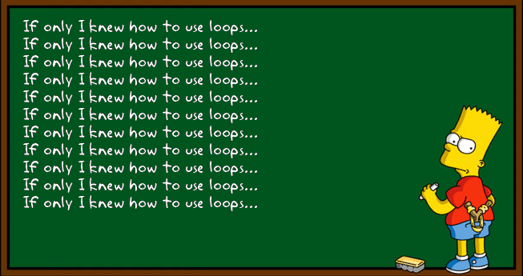
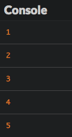
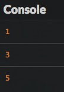

# Repeat statements

In this chapter, we'll look at how to execute code on a repeating basis.

## TL;DR

* **Loops** are used to repeat a series of statements. Each repetition is called an **iteration**. The code block associated with a loop is called its **body**.

* The `while` loop repeats statements *while* a certain condition is true. The `for` loop gives the ability to manage what happens just before the loop starts and after each loop iteration has run.

```js
// While loop
while (condition) {
  // Code to run while the condition is true
}

// For loop
for (initialization; condition; final expression) {
  // code to run while the condition is true
}
```

* The variable associated with the loop condition is called the loop **counter** and often named `i`.

* Beware! The condition of a `while` loop must eventually become false, to avoid the risk of an **infinite loop**. Also, updating the counter of a `for` loop inside its body is a bad idea.

* All loops can be written with `while`, but if you know in advance how many times you want the loop to run, `for` is the best choice.

## Introduction

If you wanted to write code that displayed numbers between 1 and 5, you could do it with what you've already learned:

```js
console.log(1);
console.log(2);
console.log(3);
console.log(4);
console.log(5);
```

This is pretty tiresome though and would be much more complex for lists of numbers between 1 and 1000, for example. How can you accomplish the same thing more simply?

JavaScript lets you write code inside a **loop** that executes repeatedly until it's told to stop. Each time the code runs, it's called an **iteration**.



## The `while` loop

A `while` loop lets you repeat code while a certain condition is true.

### Example

Here's a sample program written with a `while` loop.

```js
let number = 1;
while (number <= 5) {
  console.log(number);
  number++;
}
```

Just like the previous one, this code block shows all integer numbers between 1 and 5.



### How it works

You'll use the following syntax to write a `while` loop.

```js
while (condition) {
  // Code to run while the condition is true
}
```

Before each loop iteration, the condition in parentheses is evaluated to determine whether it's true or not. The code associated with a loop is called its **body**.

* If the condition's value is `true`, the code in the `while` loop's body runs. Afterwards, the condition is re-evaluated to see if it's still true or not. The cycle continues!

* If the condition's value is `false`, the code in the loop stops running or doesn't run.

I> The loop body must be placed within curly braces, except if it's only one statement. For now, always use curly braces for your loops.

## The `for` loop

You'll often need to write loops with conditions that are based on the value of a variable updated in the loop body, like in our example. JavaScript offers another loop type to account for this: the `for` loop.

### Example

Here's the same program as above written instead with a `for` loop.

```js
let number;
for (number = 1; number <= 5; number++) {
  console.log(number);
}
```

It gives exactly the same result.

### How it works

Here's the `for` loop syntax.

```js
for (initialization; condition; final expression) {
  // code to run while the condition is true
}
```

This is a little more complicated than the `while` loop syntax:

* **Initialization** only happens once, when the code first kicks off. It's often used to set the initial value of the variable associated to the loop condition.

* The **condition** is evaluated once before the loop runs each time. If it's true, the code runs. If not, the code doesn't run.

* The **final expression** is evaluated after the loop runs each time. It's often used to update the value of the variable associated with the loop condition, as we saw in the previous example.

### The loop counter

The variable used during initialization, condition, and the final expression of a loop is called a **counter** and is often named `i`. This counter can be declared in the loop initialization to limit its scope to the loop body.

```js
for (let i = 1; i <= 5; i++) {
  console.log(i); // OK
}
console.log(i); // Error: the i variable is not visible here
```

## Common mistakes

### Infinite `while` loop

The main risk with `while` loops is producing an **infinite loop**, meaning the condition is always true, and the code runs forever. This will crash your program! For example, let's say you forget a code line that increments the `number` variable.

```js
let number = 1;
while (number <= 5) {
  console.log(number);
  // The number variable is never updated: the loop condition stays true forever
}
```

To protect yourself from infinite loops, you have to make sure the loop condition will eventually become false.

### Manipulating a `for` loop counter

Imagine that you accidentally modify the loop counter in the loop body, just like in the following example.

```js
for (let i = 1; i <= 5; i++) {
  console.log(i);
  i++; // The i variable is updated in the loop body
}
```

This program produces the following result.



Each time the loop runs, the counter variable is incremented *twice*: once in the body and once in the final expression after the loop runs. When you're using a `for` loop, you'll almost always want to omit anything to do with the counter inside the body of your loop. Just leave it in that first line!

## Which loop should I use?

`For` loops are great because they include the notion of counting by default, avoiding the problem of infinite loops. However, it means you have to know how many times you want the loop to run as soon as you write your code. For situations where you don't already know how many times the code should run, `while` loops make sense. Here's a `while` loop use case in which a user is asked to type letters over and over until entering X:

```js
let letter = "";
while (letter !== "X") {
  letter = prompt("Type a letter or X to exit:");
}
```

You can't know how many times it'll take for the user to enter `X`, so `while` is generally good for loops that depend on user interaction.

Ultimately, choosing which loop to use depends on context. All loops can be written with `while`, but if you know in advance how many times you want the loop to run, `for` is the best choice.

## Coding time!

Try to code each exercise twice, once with a `while` loop and the other with a `for`, to see for yourself which one is the most appropriate.

### Carousel

Write a program that launches a carousel for 10 turns, showing the turn number each time.

When it's done, improve it so that the number of turns is given by the user.

### Parity

Check the following program that shows even numbers (divisible by 2) between 1 and 10.

```js
for (let i = 1; i <= 10; i++) {
  if (i % 2 === 0) {
    console.log(`${i} is even`);
  }
}
```

This program uses the modulo operator `%`, which calculates the remainder after division of one number by another. It's often used to assess number parity.

```js
console.log(10 % 2); // 0 because 10 = 5 * 2 + 0
console.log(11 % 2); // 1 because 11 = 5 * 2 + 1
console.log(18 % 3); // 0 because 18 = 3 * 6 + 0
console.log(19 % 3); // 1 because 19 = 3 * 6 + 1
console.log(20 % 3); // 2 because 20 = 3 * 6 + 2
```

Improve the program so that it also shows odd numbers. Improve it again to replace the initial number `1` by a number given by the user.

> This program must show exactly 10 numbers including the first one, not 11 numbers!

### Input validation

Write a program that continues to ask the user for a number until the entered number is less than or equal to 100.

When you are done with the above, improve the program so that the terminating number is between 50 and 100.

### Multiplication table

Write a program that asks the user for a number, then shows the multiplication table for this number.

When you are done, improve the program so it only accepts numbers between 2 and 9 (use the previous exercise as a blueprint).

### Neither yes nor no

Write a program that plays "neither yes, nor no" with the user. Specifically, the programs asks the user to enter text until either "yes" or "no" is typed, which ends the game.

### FizzBuzz

Write a program that shows all numbers between 1 and 100 with the following exceptions:

* It shows `"Fizz"` instead if the number is divisible by 3.

* It shows `"Buzz"` instead if the number is divisible by 5 and not by 3.

When it's done, improve it so that the program shows `"FizzBuzz"` instead for numbers divisible both by 3 and by 5.

> This exercise has [many, many solutions](http://www.tomdalling.com/blog/software-design/fizzbuzz-in-too-much-detail/). It's a [job interview classic](http://imranontech.com/2007/01/24/using-fizzbuzz-to-find-developers-who-grok-coding/) that a significant number of candidates fail. Try your best!
