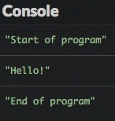
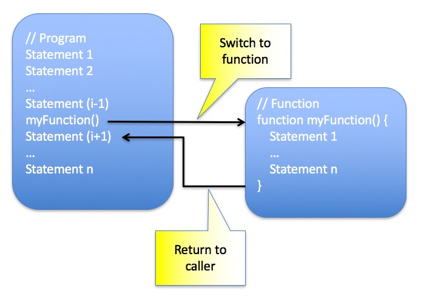

# Write functions

In this chapter, you'll learn how to break down a program into subparts called functions.

## TL;DR

* A **function** is a group of statements that performs a particular task. JavaScript functions are created using the `function` keyword.

* Written as a combination of several short and focused functions, a program will generally be easier to understand and more **modular** than a monolithic one.

* A **function call** triggers the execution of the function code. After it's done, execution resumes at the place where the call was made.

* Variables declared inside a function are limited in scope to the function body. They are called **local variables**.

* A `return` statement inside the function body defines the **return value** of the function. A function can accept zero, one or several **parameters** in order to work. For a particular call, supplied parameter values are called **arguments**.

* There are several ways to create a function in JavaScript. A first one is to use a **function declaration**.

```js
// Function declaration
function myFunction(param1, param2, ...) {
  // Function code using param1, param2, ...
}

// Function call
myFunction(arg1, arg2, ...);
```

* Another way to create a function is to use a **function expression**. A function expression can be assigned to a variable because in JavaScript, a variable's value can be a function. Function expressions are often used to create **anonymous functions** (functions without a name).

```js
// Anonymous function created with a function expression and assigned to a variable
const myFunc = function(param1, param2, ...) {
  // Function code using param1, param2, ...
};

// Function call
myFunc(arg1, arg2, ...);
```

* A third way to create an anonymous function is the more recent **fat arrow syntax**.

```js
// Fat arrow anonymous function assigned to a variable
const myFunc = (param1, param2, ...) => {
  // Function code using param1, param2, ...
};

// Function call
myFunc(arg1, arg2, ...);
```

* No matter how it's created, each function should have a precise **purpose** and a well chosen **name** (often including an action verb). JavaScript offers a lot of **predefined functions** covering various needs.

## Introduction: the role of functions

To understand why functions are important, check out our example from a previous chapter: the burrito algorithm :)

```text
Begin
  Get out the rice cooker
  Fill it with rice
  Fill it with water
  Cook the rice
  Chop the vegetables
  Stir-fry the vegetables
  Taste-test the vegetables
    If the veggies are good
      Remove them from the stove
    If the veggies aren't good
      Add more pepper and spices
    If the veggies aren't cooked enough
      Keep stir-frying the veggies
  Heat the tortilla
  Add rice to the tortilla
  Add vegetables to the tortilla
  Roll tortilla
End
```

Here's the same general idea, written in a different way.

```text
Begin
  Cook rice
  Stir-fry vegetables
  Add fillings
  Roll together
End
```

The first version details all the individual actions that make up the cooking process. The second breaks down the recipe into **broader steps** and introduces concepts that could be re-used for other dishes as well like *cook*, *stir-fry*, *add* and *roll*.

Our programs so far have mimicked the first example, but it's time to start modularizing our code into sub-steps so we can re-use bits and pieces as needed. In JavaScript, these sub-steps are called **functions**!

## Discovering functions

A **function** is a group of statements that performs a particular task.

Here's a basic example of a function.

```js
function sayHello() {
  console.log("Hello!");
}

console.log("Start of program");
sayHello();
console.log("End of program");
```



Let's study what just happened.

### Declaring a function

Check out the first lines of the example above.

```js
function sayHello() {
  console.log("Hello!");
}
```

This creates a function called `sayHello()`. It consists of only one statement that will make a message appear in the console: `"Hello!"`.

This is an example of a function **declaration**.

```js
// Declare a function called myFunction
function myFunction() {
  // Function code
}
```

The declaration of a function is performed using the JavaScript keyword `function`, followed by the function name and a pair of parentheses. Statements that make up the function constitute the **body** of the function. These statements are enclosed in curly braces and indented.

### Calling a function

Functions must be called in order to actually run. Here's the second part of our example program.

```js
console.log("Start of program");
sayHello();
console.log("End of program");
```

The first and third statements explicitly display messages in the console. The second line makes a **call** to the function `sayHello()`.

You can call a function by writing the name of the function followed by a pair of parentheses.

```js
// ...
myFunction(); // Call myFunction
// ...
```

Calling a function triggers the execution of actions listed therein (the code in its body). After it's done, execution resumes at the place where the call was made.



### Usefulness of functions

A complex problem is generally more manageable when broken down into simpler subproblems. Computer programs are no exception to this rule. Written as a combination of several short and focused functions, a program will be easier to understand and to update than a monolithic one. As an added bonus, some functions could be reused in other programs!

Creating functions can also be a solution to the problem of [code duplication](https://en.wikipedia.org/wiki/Duplicate_code); instead of being duplicated in several places, a piece of code can be centralized in a function and called from anywhere when needed.

## Function contents

### Return value

Here is a variation of our example program.

```js
function sayHello() {
  return "Hello!";
}

console.log("Start of program");
const message = sayHello(); // Store the function return value in a variable
console.log(message);       // Show the return value
console.log("End of program");
```

Run this code, and you'll see the same result as before.

In this example, the body of the `sayHello()` function has changed: the statement `console.log("Hello!")` was replaced by `return "Hello!"`.

The keyword `return` indicates that the function will return a value, which is specified immediately after the keyword. This **return value** can be retrieved by the caller.

```js
// Declare myFunction
function myFunction() {
  let returnValue;
  // Calculate return value
  // returnValue = ...
  return returnValue;
}

// Get return value from myFunction
const result = myFunction();
// ...
```

This return value can be of any type (number, string, etc). However, a function can return only one value.

W> Retrieving a function's return value is not mandatory, but in that case the return value is "lost".

If you try to retrieve the return value of a function that does not actually have one, we get the JavaScript value `undefined`.

```js
function myFunction() {
  // ...
  // No return value
}

const result = myFunction();
console.log(result); // undefined
```

W> A function stops running immediately after the `return` statement is executed. Any further statements are never run.

Let's simplify our example a bit by getting rid of the variable that stores the function's return value.

```js
function sayHello() {
  return "Hello!";
}

console.log(sayHello()); // "Hello!"
```

The return value of the `sayHello()` function is directly output through the `console.log()` command.

### Local variables

You can declare variables inside a function, as in the example below.

```js
function sayHello() {
  const message = "Hello!";
  return message;
}

console.log(sayHello()); // "Hello!"
```

The function `sayHello()` declares a variable named `message` and returns its value.

The variables declared in the body of a function are called **local variables**. Their **scope** is limited to the function body (hence their name). If you try to use these local variables outside the function, you won't be able to!

```js
function sayHello() {
  const message = "Hello!";
  return message;
}

console.log(sayHello()); // "Hello!"
console.log(message); // Error: the message variable is not visible here
```

Each function call will redeclare the function's local variables, making the calls perfectly independent from one another.

Not being able to use local variables outside the functions in which they are declared may seem like a limitation. Actually, it's a good thing! This means functions can be designed as autonomous and reusable. Moreover, this prevents **naming conflicts**: allowing variables declared in different functions to have the same name.

### Parameter passing

A **parameter** is information that the function needs in order to work. The function parameters are defined in parentheses immediately following the name of the function. You can then use the parameter value in the body of the function.

You supply the parameter value when calling the function. This value is called an **argument**.

Let's edit the above example to add a personalized greeting:

```js
function sayHello(name) {
  const message = `Hello, ${name}!`;
  return message;
}

console.log(sayHello("Baptiste")); // "Hello, Baptiste!"
console.log(sayHello("Thomas"));   // "Hello, Thomas!"
```

The declaration of the `sayHello()` function now contains a parameter called `name`.

In this example, the first call to `sayHello()` is done with the argument `"Baptiste"` and the second one with the argument `"Thomas"`. In the first call, the value of the `name` parameter is `"Baptiste"`, and `"Thomas"` in the second.

Here's the general syntax of a function declaration with parameters. The number of parameters is not limited, but more than 3 or 4 is rarely useful.

```js
// Declare a function myFunction with parameters
function myFunction(param1, param2, ...) {
  // Statements using param1, param2, ...
}

// Function call
// param1 value is set to arg1, param2 to arg2, ...
myFunction(arg1, arg2, ...);
```

Just like with local variables, parameter scope is limited to the function body. Thus, an external variable used as an argument in a function call may have the same name as a function parameter. The following example is perfectly valid.

```js
function sayHello(name) {
  // Here, "name" is the function parameter
  const message = `Hello, ${name}!`;
  return message;
}

// Here, "name" is a variable used as an argument
let name = "Baptiste";
console.log(sayHello(name)); // "Hello, Baptiste!"
name = "Thomas";
console.log(sayHello(name)); // "Hello, Thomas!"
```

When calling a function, respecting the number and order of parameters is paramount! Check out the following example.

```js
function presentation(name, age) {
  console.log(`Your name is ${name} and you're ${age} years old`);
}

presentation("Garance", 9); // "Your name is Garance and you're 9 years old"
presentation(5, "Prosper"); // "Your name is 5 and you're Prosper years old"
```

The second call arguments are given in reverse order, so `name` gets the value `5` and `age` gets `"Prosper"` for that call.

## Anonymous functions

Declaration is not the only way to create functions in JavaScript. Check out this example.

```js
const hello = function(name) {
  const message = `Hello, ${name}!`;
  return message;
};

console.log(hello("Richard")); // "Hello, Richard!"
```

In this example, the function is assigned to the `hello` variable. The value of this variable is a function. We call the function using that variable. This is an example of a **function expression**. A function expression defines a function as part of a larger expression, typically a variable assignment.

The function created in this example has no name: it is **anonymous**. As you'll soon discover, anonymous functions are heavily used in JavaScript.

Here's how to create an anonymous function and assign it to a variable.

```js
// Assignment of an anonymous function to the myFunc variable
const myFunc = function(param1, param2, ...) {
  // Statements using param1, param2, ...
};

// Anonymous function call
// param1 value is set to arg1, param2 to arg2, ...
myFunc(arg1, arg2, ...);
```

Recent language evolutions have introduced a more concise way to create anonymous functions:

```js
const hello = (name) => {
  const message = `Hello, ${name}!`;
  return message;
};

console.log(hello("William")); // "Hello, William!"
```

Functions created this way are called **fat arrow functions**.

```js
// Assignment of an anonymous function to the myFunc variable
const myFunc = (param1, param2, ...) => {
  // Statements using param1, param2, ...
};

// Anonymous function call
// param1 value is set to arg1, param2 to arg2, ...
myFunc(arg1, arg2, ...);
```

Fat arrow function syntax can be further simplified in some particular cases:

* When there's only one statement in the function body, everything can be written on the same line without curly braces. The `return` statement is omitted and implicit.
* When the function accepts only one parameter, parentheses around it can be omitted.

```js
// Minimalist to the max
const hello = name => `Hello, ${name}!`;

console.log(hello("Kate")); // "Hello, Kate!"
```

Functions are a core part of the JavaScript toolset. You'll use them constantly in your programs.

## Guidelines for programming with functions

### Creating functions wisely

Functions can include everything you can use in a regular program: variables, conditionals, loops, etc. Functions can call one another, giving the programmer an enormous amount of freedom for building programs.

However, not everything deserves to be in its own function. It's better to write short and focused ones, in order to limit dependencies and improve program understanding.

### Leveraging JavaScript predefined functions

We have already used several predefined JavaScript functions like `prompt()` and `alert()`. There are many others in the language specification. Get to know them instead of reinventing the wheel!

Here' an example demonstrating two of the JavaScript mathematical functions.

```js
console.log(Math.min(4.5, 5)); // 4.5
console.log(Math.min(19, 9));  // 9
console.log(Math.min(1, 1));   // 1
console.log(Math.random());    // A random number between 0 and 1
```

The function `Math.min()` returns the minimum number among its arguments. The function `Math.random()` generates a random number between 0 and 1.

This book will introduce many other JavaScript functions.

### Limiting function complexity

A function body must be kept simple, or otherwise split into several sub-functions. As a rule of thumb, 30 lines of code should be a max for non-specific cases.

### Naming functions and parameters well

Function naming is just as important as variable naming. You should choose names that express clearly the function purpose and follow a naming convention. Refer to the appendix for some useful advice.

T> If you have difficulties coming up with a good name for a function, then maybe its purpose is not that clear and you should ask yourself if this function deserves to exist.

## Coding time!

### Improved hello

Complete the following program so that it asks the user for his first and last names, then show the result of the `sayHello()` function.

```js
// Say hello to the user
function sayHello(firstName, lastName) {
  const message = `Hello, ${firstName} ${lastName}!`;
  return message;
}

// TODO: ask user for first and last name
// TODO: call sayHello() and show its result
```

### Number squaring

Complete the following program so that the `square1()` and `square2()` functions work properly.

```js
// Square the given number x
function square1(x) {
  // TODO: complete the function code
}

// Square the given number x
const square2 = x => // TODO: complete the function code

console.log(square1(0)); // Must show 0
console.log(square1(2)); // Must show 4
console.log(square1(5)); // Must show 25

console.log(square2(0)); // Must show 0
console.log(square2(2)); // Must show 4
console.log(square2(5)); // Must show 25
```

When it's done, update the program so that it shows the square of every number between 0 and 10.

> Writing 10 dumb calls to `square()` is forbidden! You know how to repeat statements, don't you? ;)

### Minimum of two numbers

Let's pretend the JavaScript `Math.min()` function doesn't exist. Complete the following program so that the `min()` function returns the minimum of its two received numbers.

```js
// TODO: write the min() function

console.log(min(4.5, 5)); // Must show 4.5
console.log(min(19, 9));  // Must show 9
console.log(min(1, 1));   // Must show 1
```

### Calculator

Complete the following program so that it offers the four basic arithmetical operations: addition, subtraction, multiplication and division. You can use either a function declaration or a function expression.

```js
// TODO: complete program

console.log(calculate(4, "+", 6));  // Must show 10
console.log(calculate(4, "-", 6));  // Must show -2
console.log(calculate(2, "*", 0));  // Must show 0
console.log(calculate(12, "/", 0)); // Must show Infinity
```

### Circumference and area of a circle

Write a program containing two functions to calculate the circumference and area of a circle defined by its radius. Test it using user input.

Here are some tips for solving this exercise:

* Circumference and area calculation formulas should be part of your secondary school memories... Or a Google click away :)
* The value of number π (Pi) is obtained with `Math.PI` in JavaScript.
* You might want to use the [exponentiation operator](https://developer.mozilla.org/en-US/docs/Web/JavaScript/Reference/Operators/Arithmetic_Operators) `**` to perform computations.

```js
console.log(2 ** 3); // 8: 2 * 2 * 2
console.log(3 ** 2); // 9: 3 * 3
```
