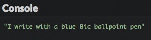
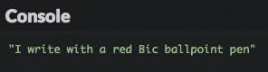
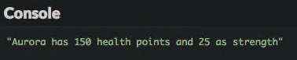
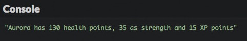
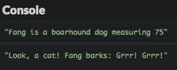

# Create your first objects

This chapter will introduce objects and the way they are created and used in JavaScript.

## TL;DR

* A JavaScript **object** is an entity that has properties. Each property is a key/value pair. The key is the property name.

* The value of a property can be a piece of information (number, string, etc) or a function. In the latter case, the property is called a **method**.

* A JavaScript **object literal** is created by simply setting its properties within a pair of curly braces.

```js
const myObject = {
  property1: value1,
  property2: value2,
  // ... ,
  method1(/* ... */) {
    // ...
  },
  method2(/* ... */) {
    // ...
  }
  // ...
};

myObject.property1 = newValue; // Set the new value of property1 for myObject
console.log(myObject.property1); // Show the value of property1 for myObject
myObject.method1(...);           // Call method1 on myObject
```

* Inside a method, the `this` keyword represents the object on which the method is called.

* The JavaScript language predefines many useful objects like `console` or `Math`.

## Introduction

### What's an object?

Think about objects in the non-programming sense, like a pen. A pen can have different ink colors, be manufactured by different people, have a different tip, and many other properties.

Similarly, an **object** in programming is an **entity that has properties**. Each property defines a characteristic of the object. A property can be a piece of information associated with the object (the color of the pen) or an action (the pen's ability to write).

### What does this have to do with code?

**Object-oriented programming** (OOP for short) is a way to write programs using objects. When using OOP, you write, create, and modify objects, and the objects make up your program.

OOP changes the way a program is written and organized. So far, you've been writing function-based code, sometimes called [procedural programming](https://en.wikipedia.org/wiki/Procedural_programming). Now let's discover how to write object-oriented code.

## JavaScript and objects

Like many other languages, JavaScript supports programming with objects. It provides a number of predefined objects while also letting you create your own.

### Creating an object

Here is the JavaScript representation of a blue Bic ballpoint pen.

```js
const pen = {
  type: "ballpoint",
  color: "blue",
  brand: "Bic"
};
```

As stated earlier, a JavaScript object can be created by simply setting its properties within a pair of curly braces: `{...}`. Each property is a key/value pair. This is called an **object literal**.

W> The semicolon `;` after the closing brace is optional, but it's safer to add it anyway.

The above code defines a variable named `pen` whose value is an object: you can therefore say `pen` is an object. This object has three properties: `type`, `color` and `brand`. Each property has a name and a value and is followed by a comma `,` (except the last one).

### Accessing an object's properties

After creating an object, you can access the value of its properties using **dot notation** such as `myObject.myProperty`.

```js
const pen = {
  type: "ballpoint",
  color: "blue",
  brand: "Bic"
};

console.log(pen.type);  // "ballpoint"
console.log(pen.color); // "blue"
console.log(pen.brand); // "Bic"
```

Accessing an object's property is an **expression** that produces a value. Such an expression can be included in more complex ones. For example, here's how to show our pen properties in one statement.

```js
const pen = {
  type: "ballpoint",
  color: "blue",
  brand: "Bic"
};

console.log(`I write with a ${pen.color} ${pen.brand} ${pen.type} pen`);
```



### Modifying an object

Once an object is created, you can change the value of its properties with the syntax `myObject.myProperty = newValue`.

```js
const pen = {
  type: "ballpoint",
  color: "blue",
  brand: "Bic"
};

pen.color = "red"; // Modify the pen color property

console.log(`I write with a ${pen.color} ${pen.brand} ${pen.type} pen`);
```



JavaScript even offers the ability to dynamically add new properties to an already created object.

```js
const pen = {
  type: "ballpoint",
  color: "blue",
  brand: "Bic"
};

pen.price = "2.5"; // Set the pen price property

console.log(`My pen costs ${pen.price}`);
```


## Programming with objects

Many books and courses teach object-oriented programming through examples involving animals, cars or bank accounts. Let's try something cooler and create a mini-role playing game (RPG) using objects.

In a role-playing game, each character is defined by many attributes like strength, stamina or intelligence. Here's the character screen of a very popular online RPG.


In our simpler example, a character will have three attributes:

* her name,
* her health (number of life points),
* her strength.

### A naive example

Let me introduce you to Aurora, our first RPG character.

```js
const aurora = {
  name: "Aurora",
  health: 150,
  strength: 25
};
```

The `aurora` object has three properties: `name`, `health` and `strength`.

I> As you can see, you can assign numbers, strings, and even other objects to properties!

Aurora is about to start a series of great adventures, some of which will update her attributes. Check out the following example.

```js
const aurora = {
  name: "Aurora",
  health: 150,
  strength: 25
};

console.log(`${aurora.name} has ${aurora.health} health points and ${aurora.strength} as strength`);

// Aurora is harmed by an arrow
aurora.health -= 20;

// Aurora equips a strength necklace
aurora.strength += 10;

console.log(`${aurora.name} has ${aurora.health} health points and ${aurora.strength} as strength`);
```


### Introducing methods

In the above code, we had to write lengthy `console.log` statements each time to show our character state. There's a cleaner way to accomplish this.

#### Adding a method to an object

Observe the following example.

```js
const aurora = {
  name: "Aurora",
  health: 150,
  strength: 25
};

// Return the character description
function describe(character) {
  return `${character.name} has ${character.health} health points and ${character.strength} as strength`;
}

console.log(describe(aurora));
```



The `describe()` function takes an object as a parameter. It accesses that object's properties to create a description string.

Below is an alternative approach, using a `describe()` property *inside* the object.

```js
const aurora = {
  name: "Aurora",
  health: 150,
  strength: 25,

  // Return the character description
  describe() {
    return `${this.name} has ${this.health} health points and ${this
      .strength} as strength`;
  }
};

console.log(aurora.describe());
```


Now our object has a new property available to it: `describe()`. The value of this property is a function that returns a textual description of the object. The execution result is exactly the same as before.

An object property whose value is a function is called a **method**. Methods are used to define **actions** for an object. A method adds some **behavior** to an object.

#### Calling a method on an object

Let's look at the last line of our previous example.

```js
console.log(aurora.describe());
```

To show the character description, we use the `aurora.describe()` expression instead of `describe(aurora)`. It makes a *crucial* difference:

* `describe(aurora)` calls the `describe()` function with the `aurora` object as an argument. The function is external to the object. This is an example of procedural programming.

* `aurora.describe()` calls the `describe()` function on the `aurora` object. The function is one of the object's properties: it is a method. This is an example of object-oriented programming.

To call a method named `myMethod()` on an object `myObject`, the syntax is `myObject.myMethod()`.

W> Remember the parentheses, even if empty, when calling a method!

### The `this` keyword

Now look closely at the body of the `describe()` method on our object.

```js
const aurora = {
  name: "Aurora",
  health: 150,
  strength: 25,

  // Return the character description
  describe() {
    return `${this.name} has ${this.health} health points and ${this
      .strength} as strength`;
  }
};
```

You see a new keyword: `this`. This is automatically set by JavaScript inside a method and represents **the object on which the method was called**.

The `describe()` method doesn't take any parameters. It uses `this` to access the properties of the object on which it is called.

## JavaScript predefined objects

The JavaScript language has many predefined objects serving various purposes. We have already encountered some of them:

* The `console` object gives access to the environment console. `console.log()` is actually a method call.

* The `Math` object contains many mathematical properties. For example, `Math.PI` returns an approximate value of the number π (Pi) and the `Math.random()` function returns a random number between 0 and 1.

## Coding time!

### Adding character experience

Improve our example RPG program to add an experience property named `xp` to the character. Its initial value is 0. Experience must appear in character description.

```js
// TODO: create the character object here

// Aurora is harmed by an arrow
aurora.health -= 20;

// Aurora equips a strength necklace
aurora.strength += 10;

// Aurora learn a new skill
aurora.xp += 15;

console.log(aurora.describe());
```



### Modeling a dog

Complete the following program to add the `dog` object definition.

```js
// TODO: create the dog object here

console.log(`${dog.name} is a ${dog.species} dog measuring ${dog.size}`);
console.log(`Look, a cat! ${dog.name} barks: ${dog.bark()}`);
```



### Modeling a circle

Complete the following program to add the `circle` object definition. Its radius value is input by the user.

```js
const r = Number(prompt("Enter the circle radius:"));

// TODO: create the circle object here

console.log(`Its circumference is ${circle.circumference()}`);
console.log(`Its area is ${circle.area()}`);
```

### Modeling a bank account

Write a program that creates an `account` object with the following characteristics:

* A `name` property set to "Alex".
* A `balance` property set to 0.
* A `credit` method adding the (positive or negative) value passed as an argument to the account balance.
* A `describe` method returning the account description.

Use this object to show its description, crediting 250, debiting 80, then show its description again.


