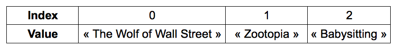

# Store data in arrays

This chapter will introduce you to [arrays]( https://en.wikipedia.org/wiki/Array_data_type ), a type of variable used in many computer programs to store data.

## TL;DR

* An **array** represents a list of elements. A JavaScript array is an object that has special properties, like `length` to access its size (number of elements).

* You can think of an array as a set of boxes, each storing a specific value and associated with a number called its **index**. The first element of an array will be index number 0 - not 1.

* You can access a particular element by passing its index within **square brackets** `[]`.

* To iterate over an array (browsing it element by element), you can use the `for` loop, the `forEach()` method or the newer `for-of` loop.

```js
for (let i = 0; i < myArray.length; i++) {
  // Use myArray[i] to access each array element one by one
}

myArray.forEach(myElement => {
  // Use myElement to access each array element one by one
});

for (const myElement of myArray) {
  // Use myElement to access each array element one by one
}
```

* The `push()` method adds an element at the end of an array. The `unshift()` method adds it at the beginning.

* The `pop()` and `splice()` are used to remove elements from the array.

## Introduction to arrays

Imagine you want to create a list of all the movies you've seen this year.

One solution would be to create several variables:

```js
const movie1 = "The Wolf of Wall Street";
const movie2 = "Zootopia";
const movie3 = "Babysitting";
// ...
```

If you're a movie buff, you may find yourself with too many variables in your program. The worst part is that these variables are completely independent from one another.

Another possibility is to group the movies in an object.

```js
const movies = {
  movie1: "The Wolf of Wall Street",
  movie2: "Zootopia",
  movie3: "Babysitting",
  // ...
};
```

This time, the data is centralized in the object `movies`. The names of its properties (`movie1`, `movie2`, `movie3`...) are, however, unnecessary and repetitive.

You need a solution to store items together without naming them individually!

Luckily, there is indeed a solution: use an array. An **array** is a data type that can store a set of elements.

## Manipulating arrays in JavaScript

In JavaScript, an array is an object that has special properties.

### Creating an array

Here's how to create our list of movies in the form of an array.

```js
const movies = ["The Wolf of Wall Street", "Zootopia", "Babysitting"];
```

An array is created with a pair of square brackets `[]`. Everything within the brackets makes up the array.

You can store different types of elements within an array, including strings, numbers, booleans and even objects.

```js
const elements = ["Hello", 7, { message: "Hi mom" }, true];
```

T> Since an array may contain multiple elements, it's good to name the array plurally (for example, `movies`).

### Obtaining an array's size

The number of elements stored in an array is called its **size**. Here's how to access it.

```js
const movies = ["The Wolf of Wall Street", "Zootopia", "Babysitting"];
console.log(movies.length); // 3
```

You access the size of an array via its `length` property, using the dot notation.

Of course, this `length` property returns 0 in case of an empty array.

```js
const emptyArray = []; // Create an empty array
console.log(emptyArray.length); // 0
```

### Access an element in an array

Each item in an array is identified by a number called its **index** - an integer pointer that identifies an element of the array. We can think of an array as a set of boxes, each storing a specific value and associated with an index. Here's the trick: the first element of an array will be index number 0 - not 1. The second element will be index number 1, and so on. The index of the last array element would be the array's size minus 1.

Here is how you might represent the `movies` array:



You can access a particular element by passing its index within **square brackets** `[]`:

```js
const movies = ["The Wolf of Wall Street", "Zootopia", "Babysitting"];
console.log(movies[0]); // "The Wolf of Wall Street"
console.log(movies[1]); // "Zootopia"
console.log(movies[2]); // "Babysitting"
```

Using an invalid index to access a JavaScript array element returns the value `undefined`.

```js
const movies = ["The Wolf of Wall Street", "Zootopia", "Babysitting"];
console.log(movies[3]); // undefined: last element is at index 2
```

## Iterating over an array

There are several ways to browse an array element by element.

The first is to use a `for` loop as discussed previously.

```js
const movies = ["The Wolf of Wall Street", "Zootopia", "Babysitting"];
for (let i = 0; i < movies.length; i++) {
  console.log(movies[i]);
}
```

The `for` loop runs through each element in the array starting with index 0 all the way up to the length of the array minus 1, which is its last element.

Another way is to call the `forEach()` method on the array. It takes as a parameter a **function** that will be applied to each array element.

```js
myArray.forEach(myElement => {
  // Use myElement to access each array element one by one
});
```

Here's the previous example, rewritten with this method and a fat arrow function.

```js
const movies = ["The Wolf of Wall Street", "Zootopia", "Babysitting"];
movies.forEach(movie => {
  console.log(movie);
});
```

During execution, each array element is passed as a parameter (named `movie` in this example) to the anonymous function associated to `forEach()`.

Lastly, you can use the `for-of` loop, a special kind of loop dealing with [iterable objects](https://developer.mozilla.org/en-US/docs/Web/JavaScript/Reference/Iteration_protocols#iterable) like arrays. Here is its syntax.

```js
for (const myElement of myArray) {
  // Use myElement to access each array element one by one
}
```

Check out the previous example written with a `for-of` loop.

```js
const movies = ["The Wolf of Wall Street", "Zootopia", "Babysitting"];
for (const movie of movies) {
  console.log(movie);
}
```

## Updating an array's content

### Adding an element to an array

Don't lie to me: you've just watched Ghostbusters *yet another time*. Let's add it to the list. Here's how you'd do so.

```js
const movies = ["The Wolf of Wall Street", "Zootopia", "Babysitting"];
movies.push("Ghostbusters");
console.log(movies[3]); // "Ghostbusters"
```

You add a new item to an array with the `push()` method. The new element to be added is passed as a parameter to the method. It is inserted at the end of the array.

To add an element at the beginning of an array, use the `unshift()` method instead of `push()`.

```js
const movies = ["The Wolf of Wall Street", "Zootopia", "Babysitting"];
movies.unshift("Pacific Rim");
console.log(movies[0]); // "Pacific Rim"
```

### Removing an element from an array

You can remove the last element of an array using the `pop()` method.

```js
const movies = ["The Wolf of Wall Street", "Zootopia", "Babysitting"];
movies.pop(); // Remove the last array element
console.log(movies.length); // 2
console.log(movies[2]); // undefined
```

Alternatively, you can use the `splice()` method with two parameters: the first one is the index from which to begin removing, and the second one is the number of elements to remove.

```js
const movies = ["The Wolf of Wall Street", "Zootopia", "Babysitting"];
movies.splice(0, 1); // Remove 1 element starting at index 0
console.log(movies.length); // 2
console.log(movies[0]); // "Zootopia"
console.log(movies[1]); // "Babysitting"
```

## Coding time!

Create all these programs in a generic fashion: the program output should reflect any update in the array's content.

### Musketeers

Write a program that:

* Creates an array named `musketeers` containing values "Athos", "Porthos" and "Aramis".
* Shows each array element using a `for` loop.
* Adds the "D'Artagnan" value to the array.
* Shows each array element using the `forEach()` method.
* Remove poor Aramis.
* Shows each array element using a `for-of` loop.

### Sum of values

Write a program that creates the following array, then calculates and shows the sum of its values (42 in that case).

```js
const values = [3, 11, 7, 2, 9, 10];
```

### Array maximum

Write a program that creates the following array, then calculates and shows the array's maximum value.

```js
const values = [3, 11, 7, 2, 9, 10];
```

### List of words

Write a program that asks the user for a word until the user types `"stop"`. The program then shows each of these words, except `"stop"`.
