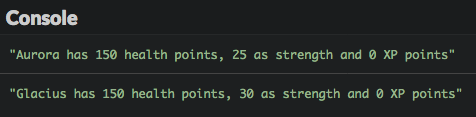
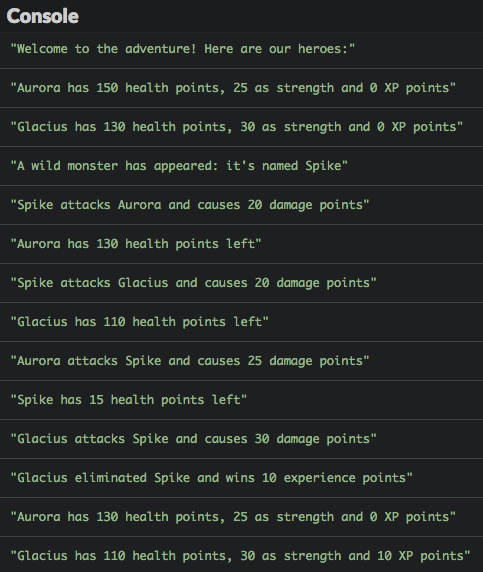
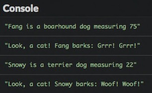
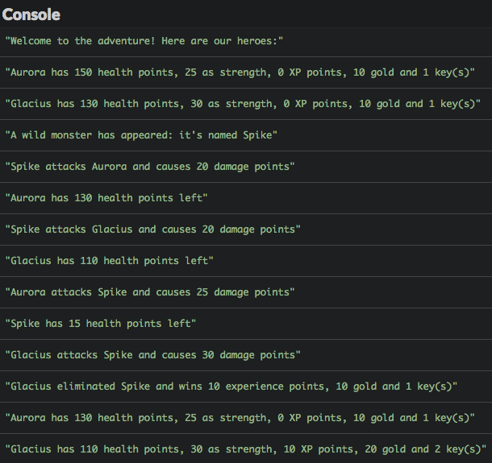
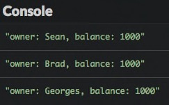

# Understand object-oriented programming

A few chapters ago, you learned how to create your first objects in JavaScript. Now it's time to better understand how to work with them.

## TL;DR

* **Object-oriented programming**, or OOP, is a [programming paradigm](https://en.wikipedia.org/wiki/Programming_paradigm) that uses objects containing both data and behavior to create programs.

* JavaScript's OOP model is based on **prototypes**. Any JavaScript object has an internal property which is a link (a **reference**) to another object; its prototype. Prototypes are used to share properties and delegate behavior between objects.

* When trying to access a property that does not exist in an object, JavaScript tries to find this property in the **prototype chain** of this object: its prototype, then its prototype's own prototype, and so on.

* There are several ways to create and link JavaScript objects through prototypes. One is to use the `Object.create()` method.

```js
// Create an object linked to myPrototypeObject
const myObject = Object.create(myPrototypeObject);
```

* A **factory function** can be used in combination with `Object.create()` to ease object creation and setup.

```js
function createObject(/* ... */) {
    const obj = Object.create(myPrototypeObject);
    // obj init
    return obj;
}

const myObject = createObject(/* ... */);
```

* Another way to create and link objects is to use the `class` keyword to define a **class** (a blueprint for objects). Objects are then created using the `new` operator, which calls the class **constructor** in order to initialize the newly created object.

```js
class MyClass {
    constructor(/* ... */)
    // ...
}

const myObject = new MyClass(/* ... */);
```

* The `class` syntax emulates in JavaScript the class-based OOP model found in many other languages like Java or C#. However, it is just **syntactic sugar** over JavaScript's own prototype-based OOP model. There are no real classes in JavaScript, only objects linked together.

## Context: a multiplayer RPG

As a reminder, here's the code for our minimalist RPG taken from a previous chapter. it creates an object literal named `aurora` with three properties (`name`, `health` and `strength`) and a `describe()` method.

```js
const aurora = {
  name: "Aurora",
  health: 150,
  strength: 25,
  xp: 0,

  // Return the character description
  describe() {
    return `${this.name} has ${this.health} health points, ${this.strength} as strength and ${this.xp} XP points`;
  }
};

// Aurora is harmed by an arrow
aurora.health = aurora.health - 20;

// Aurora equips a strength necklace
aurora.strength = aurora.strength + 10;

// Aurora learn a new skill
aurora.xp = aurora.xp + 15;

console.log(aurora.describe());
```

To make the game more interesting, we'd like to have more characters in it. So here comes Glacius, Aurora's fellow.

```js
const glacius = {
  name: "Glacius",
  health: 139,
  strength: 30,
  xp: 0,

  // Return the character description
  describe() {
    return `${this.name} has ${this.health} health points, ${this.strength} as strength and ${this.xp} XP points`;
  }
};
```

Our two characters are strikingly similar. They share the same properties, with the only difference being some property values.

You should already be aware that code duplication is dangerous and should generally be avoided. We must find a way to share what's common to our characters.

## JavaScript classes

Most object-oriented languages use classes as **abstractions** for the ideas or concepts manipulated by a program. A **class** is used to create objects representing a concept. It offers a convenient syntax to give both **data** and **behavior** to these objects.

JavaScript is no exception and supports programming with classes (but with a twist -- more on that later).

### Creating a class

Our example RPG deals with characters, so let's create a `Character` class to express what a character is.

```js
class Character {
  constructor(name, health, strength) {
    this.name = name;
    this.health = health;
    this.strength = strength;
    this.xp = 0; // XP is always zero for new characters
  }
  // Return the character description
  describe() {
    return `${this.name} has ${this.health} health points, ${this.strength} as strength and ${this.xp} XP points`;
  }
}
```

This example demonstrates several key facts about JavaScript classes:

* A class is created with the `class` keyword, followed by the name of the class (usually starting with a uppercase letter).
* Contrary to object literals, there is no separating punctuation between the elements inside a class.
* A class can only contains **methods**, not data properties.
* Just like with object literals, the `this` keyword is automatically set by JavaScript inside a method and represents **the object on which the method was called**.
* A special method named `constructor()` can be added to a class definition. It is called during object creation and is often used to give it data properties.

### Using a class

Once a class is defined, you can use it to create objects. Check out the rest of the program.

```js
const aurora = new Character("Aurora", 150, 25);
const glacius = new Character("Glacius", 130, 30);

// Aurora is harmed by an arrow
aurora.health = aurora.health - 20;

// Aurora equips a strength necklace
aurora.strength = aurora.strength + 10;

// Aurora learn a new skill
aurora.xp = aurora.xp + 15;

console.log(aurora.describe());
console.log(glacius.describe());
```



The `aurora` and `glacius` objects are created as characters with the `new` operator. This statement calls the class constructor to initialize the newly created object. After creation, an object has access to the properties defined inside the class.

Here's the canonical syntax for creating an object using a class.

```js
class MyClass {
    constructor(/* ... */) {
      // ...
    }
    method1(/* ... */) {
        // ...
    }
    method2(/* ... */) {
        // ...
    }
    // ...
}

const myObject = new MyClass(/* ... */);
myObject.method1(/* ... */);
// ...
```

## Under the hood: objects and prototypes

### JavaScript's object-oriented model

To create relationships between objects, JavaScript uses **prototypes**.

In addition to its own particular properties, any JavaScript object has an internal property which is a link (known as a **reference**) to another object called its **prototype**. When trying to access a property that does not exist in an object, JavaScript tries to find this property in the prototype of this object.

Here's an example (borrowed from Kyle Simpson's great book series [You Don't Know JS](https://github.com/getify/You-Dont-Know-JS/blob/master/this%20%26%20object%20prototypes/ch5.md)).

```js
const anObject = {
    myProp: 2
};

// Create anotherObject using anObject as a prototype
const anotherObject = Object.create(anObject);

console.log(anotherObject.myProp); // 2
```

In this example, the JavaScript statement `Object.create()` is used to create the object `anotherObject` with object `anObject` as its prototype.

```js
// Create an object linked to myPrototypeObject
const myObject = Object.create(myPrototypeObject);
```

When the statement `anotherObject.myProp` is run, the `myProp` property of `anObject` is used since `myProp` doesn't exist in `anotherObject`.

If the prototype of an object does not have a desired property, then research continues in its own prototype until we get to the end of the **prototype chain**. If the end of this chain is reached without having found the property, access to it returns the value `undefined`.

```js
const anObject = {
    myProp: 2
};

// Create anotherObject using anObject as a prototype
const anotherObject = Object.create(anObject);

// Create yetAnotherObject using anotherObject as a prototype
const yetAnotherObject = Object.create(anotherObject);

// myProp is found in yetAnotherObject's prototype chain (in anObject)
console.log(yetAnotherObject.myProp); // 2

// myOtherProp can't be found in yetAnotherObject's prototype chain
console.log(yetAnotherObject.myOtherProp); // undefined
```

This type of relationship between JavaScript objects is called **delegation**: an object delegates part of its operation to its prototype.

### The true nature of JavaScript classes

In *class-based* object-oriented languages like C++, Java and C#, classes are static **blueprints** (templates). When a object is created, the methods and properties of the class are copied into a new entity, called an **instance**. After instantiation, the newly created object has no relation whatsoever with its class.

JavaScript's object-oriented model is based on prototypes, *not* classes, to share properties and delegate behavior between objects. Classes in the Java sense (staic blueprints) don't exist in JavaScript. There are only objects linked together through their prototype. 

The JavaScript `class` syntax is merely a more convenient way to create relationships between objects through prototypes. Classes were introduced to emulate the class-based OOP model above JavaScript's own prototype-based model. It's an example of what programmers call **syntactic sugar**.

> The usefulness of the `class` syntax is a pretty heated debate in the JavaScript community.

## Object-oriented programming

Now back to our RPG, which is still pretty boring. What does it lack? Monsters and fights, of course!

Here's how a fight will be handled: if attacked, a character sees their life points decrease from the strength of the attacker. If its health value fall below zero, the character is considered dead and cannot attack anymore. Its vanquisher receives a fixed number of 10 experience points.

First, let's add the possibility for our characters to fight one another. Since it's a shared ability, we define it as a method named `attack()` in the `Character` class.

```js
class Character {
  constructor(name, health, strength) {
    this.name = name;
    this.health = health;
    this.strength = strength;
    this.xp = 0; // XP is always zero for new characters
  }
  // Attack a target
  attack(target) {
    if (this.health > 0) {
      const damage = this.strength;
      console.log(`${this.name} attacks ${target.name} and causes ${damage} damage points`);
      target.health -= damage;
      if (target.health > 0) {
        console.log(`${target.name} has ${target.health} health points left`);
      } else {
        target.health = 0;
        const bonusXP = 10;
        console.log(`${this.name} eliminated ${target.name} and wins ${bonusXP} experience points`);
        this.xp += bonusXP;
      }
    } else {
      console.log(`${this.name} can't attack (they've been eliminated)`);
    }
  }
  // Return the character description
  describe() {
    return `${this.name} has ${this.health} health points, ${this.strength} as strength and ${this.xp} XP points`;
  }
}
```

Now we can introduce a monster in the game and make it fight our players. Here's the rest of the final code of our RPG.

```js
const aurora = new Character("Aurora", 150, 25);
const glacius = new Character("Glacius", 130, 30);

console.log("Welcome to the adventure! Here are our heroes:");
console.log(aurora.describe());
console.log(glacius.describe());

const monster = new Character("Spike", 40, 20);
console.log("A wild monster has appeared: it's named " + monster.name);

monster.attack(aurora);
monster.attack(glacius);
aurora.attack(monster);
glacius.attack(monster);

console.log(aurora.describe());
console.log(glacius.describe());
```



The previous program is a short example of **object-oriented programming** (in short: OOP), a  
[programming paradigm](https://en.wikipedia.org/wiki/Programming_paradigm) (a programming style) based on objects containing both data and behavior.

## Coding time!

### Dogs

Complete the following program to add the definition of the `Dog` object prototype.

> Dogs taller than 60 make `"Grrr! Grrr!"` when they bark, other ones make `"Woof! Woof!"`.

```js
// TODO: define the Dog prototype object here

// Factory function to create and setup a new dog
function createDog(name, species, size) {
  const dog = Object.create(Dog);
  dog.init(name, species, size);
  return dog;
}

const fang = createDog("Fang", "boarhound", 75);
console.log(`${fang.name} is a ${fang.species} dog measuring ${fang.size}`);
console.log(`Look, a cat! ${fang.name} barks: ${fang.bark()}`);

const snowy = createDog("Snowy", "terrier", 22);
console.log(`${snowy.name} is a ${snowy.species} dog measuring ${snowy.size}`);
console.log(`Look, a cat! ${snowy.name} barks: ${snowy.bark()}`);
```



### Character inventory

Improve the example RPG to add character inventory management according to the following rules:

* A character's inventory contains a number of gold and a number of keys.

* Each character begins with 10 gold and 1 key.

* The character description must show the inventory state.

* When a character slays annother one, the victim's inventory goes to its vanquisher.

Here's the expected execution result.



### Account list

Let's build upon a previous account object exercise. A bank account is still defined by:

* A `name` property.
* A `balance` property, initially set to 0.
* A `credit` method adding the value passed as an argument to the account balance.
* A `describe` method returning the account description.

Write a program that creates three accounts: one belonging to Sean, another to Brad and the third one to Georges. These accounts are stored in an array. Next, the program credits 1000 to each account and shows its description.


