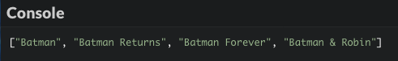
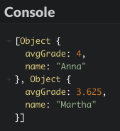

# Discover functional programming

Object-oriented programming, albeit quite popular, is not the only way to create programs. This chapter will introduce you to another important paradigm: functional programming.

## TL;DR

* **Functional programming** is about writing programs by combining functions expressing *what* the program should do, rather than *how* to do it (which is the imperative way).

* The **state** of a program is the value of its **global variables** at a given time. A goal of functional programming is to minimize state **mutations** (changes) that make the code harder to understand. Some possible solutions are declaring variables with `const` instead of `let`, splitting the code into functions, and favoring local over global variables.

* A **pure function** depends solely on its inputs for computing its outputs and has no **side effect**. Pure functions are easier to understand, combine together, and debug. Functional programming favors the use of pure functions whenever possible.

* The `map()`, `filter()` and `reduce()` methods can replace loops for array traversal and let you program with arrays in a functional way.

* JavaScript functions can be passed around just like any other value: they are **first-class citizens**, enabling functional programming. A function that operates on another function (taking it as a parameter or returning it) is called a **higher-order function**.

* JavaScript is a **multi-paradigm** language: you can write programs using an imperative, object-oriented or functional programming style.

## Context: a movie list

In this chapter, we'll start with an example program and improve it little by little, without adding any new functionality. This important programming task is called **refactoring**.

Our initial program is about recent Batman movies. The data comes under the form of an array of objects, with each object describing a movie.

```js
const movieList = [
  {
    title: "Batman",
    year: 1989,
    director: "Tim Burton",
    imdbRating: 7.6
  },
  {
    title: "Batman Returns",
    year: 1992,
    director: "Tim Burton",
    imdbRating: 7.0
  },
  {
    title: "Batman Forever",
    year: 1995,
    director: "Joel Schumacher",
    imdbRating: 5.4
  },
  {
    title: "Batman & Robin",
    year: 1997,
    director: "Joel Schumacher",
    imdbRating: 3.7
  },
  {
    title: "Batman Begins",
    year: 2005,
    director: "Christopher Nolan",
    imdbRating: 8.3
  },
  {
    title: "The Dark Knight",
    year: 2008,
    director: "Christopher Nolan",
    imdbRating: 9.0
  },
  {
    title: "The Dark Knight Rises",
    year: 2012,
    director: "Christopher Nolan",
    imdbRating: 8.5
  }
];
```

And here is the rest of the program that uses this data to show some results about the movies. Check it out, it should be pretty self-explanatory.

```js
// Get movie titles
const titles = [];
for (const movie of movieList) {
  titles.push(movie.title);
}
console.log(titles);

// Count movies by Christopher Nolan
const nolanMovieList = [];
for (const movie of movieList) {
  if (movie.director === "Christopher Nolan") {
    nolanMovieList.push(movie);
  }
}
console.log(nolanMovieList.length);

// Get titles of movies with an IMDB rating greater or equal to 7.5
const bestTitles = [];
for (const movie of movieList) {
  if (movie.imdbRating >= 7.5) {
    bestTitles.push(movie.title);
  }
}
console.log(bestTitles);

// Compute average movie rating of Christopher Nolan's movies
let ratingSum = 0;
let averageRating = 0;
for (const movie of nolanMovieList) {
  ratingSum += movie.imdbRating;
}
averageRating = ratingSum / nolanMovieList.length;
console.log(averageRating);
```


## Program state

The previous program is an example of what is called **imperative programming**. In this paradigm, the programmer gives orders to the computer through a series of statements that modify the program state. Imperative programming focuses on describing *how* a program operates.

The concept of state is an important one. The **state** of a program is the value of its **global variables** (variables accessible everywhere in the code) at a given time. In our example, the values of `movieList`, `titles`, `nolanMovieCount`, `bestTitles`, `ratingSum` and `averageRating` form the state of the program. Any assignment to one of these variables is a state change, often called a **mutation**.

In imperative programming, the state can be modified anywhere in the source code. This is convenient, but can also lead to nasty bugs and maintenance headaches. As a program grows in size and complexity, it becomes easier for the programmer to mutate a part of the state by mistake and harder to monitor state modifications.

### Limiting mutations with `const` variables

In order to decrease the risk of accidental state mutation, a first step is to favor `const` over `let` whenever applicable for variable declarations. A variable declared with the `const` keyword cannot be further reassigned. Array and object content can still be mutated, though. Check the following code for details.

```js
const n = 10;
const fruit = "Banana";
const obj = {
  myProp: 2
};
const animals = ["Elephant", "Turtle"];

obj.myProp = 3; // Mutating a property is OK even for a const object
obj.myOtherProp = "abc"; // Adding a new property is OK even for a const object
animals.push("Gorilla"); // Updating content is OK even for a const array

n++; // Illegal
fruit = "orange"; // Illegal
obj = {}; // Illegal
animals = ["Bee"]; // Illegal
```

### Splitting the program into functions

Another solution is to split the source code into subroutines called procedures or **functions**. This approach is called **procedural programming** and has the benefit of transforming some variables into **local variables**, which are only visible in the subroutine code.

Let's try to introduce some functions in our code.

```js
// Get movie titles
const titles = () => {
  const titles = [];
  for (const movie of movieList) {
    titles.push(movie.title);
  }
  return titles;
};

const nolanMovieList = [];

// Get movies by Christopher Nolan
const nolanMovies = () => {
  for (const movie of movieList) {
    if (movie.director === "Christopher Nolan") {
      nolanMovieList.push(movie);
    }
  }
};

// Get titles of movies with an IMDB rating greater or equal to 7.5
const bestTitles = () => {
  const bestTitles = [];
  for (const movie of movieList) {
    if (movie.imdbRating >= 7.5) {
      bestTitles.push(movie.title);
    }
  }
  return bestTitles;
};

// Compute average rating of Christopher Nolan's movies
const averageNolanRating = () => {
  let ratingSum = 0;
  for (const movie of nolanMovieList) {
    ratingSum += movie.imdbRating;
  }
  return ratingSum / nolanMovieList.length;
};

console.log(titles());
nolanMovies();
console.log(nolanMovieList.length);
console.log(bestTitles());
console.log(averageNolanRating());
```

The state of our program is now limited to two variables: `movieList` and `nolanMovieList` (the latter being necessary in functions `nolanMovies()` and `averageNolanRating()`). The other variables are now local to the functions they are used into, which limits the possibility of an accidental state mutation.

Also, this version of the program is easier to understand than the previous one. Functions with appropriate names help describe a program's behavior. Comments are now less necessary than before.

## Pure functions

Merely introducing some functions in a program is not enough to follow the functional programming paradigm. Whenever possible, we also need to use pure functions.

A **pure function** is a function that has the following characteristics:

* Its outputs depend solely on its inputs.
* It has no side effect.

A **side effect** is a change in program state or an interaction with the outside world. A database access or a `console.log()` statement are examples of side effects.

Given the same data, a pure function will always produce the same result. By design, a pure function is independent from the program state and must not access it. Such a function must accept **parameters** in order to do something useful. The only way for a function without parameters to be pure is to return a constant value.

Pure functions are easier to understand, combine together, and debug: contrary to their *impure* counterparts, there's no need to look outside the function body to reason about it. Still, a number of side effects are necessary in any program, like showing output to the user or updating a database. In functional programming, the name of the game is to create those side effects only in some dedicated and clearly identified parts of the program. The rest of the code should be written as pure functions.

Let's refactor our example code to introduce pure functions.

```js
// Get movie titles
const titles = movies => {
  const titles = [];
  for (const movie of movies) {
    titles.push(movie.title);
  }
  return titles;
};

// Get movies by Christopher Nolan
const nolanMovies = movies => {
  const nolanMovies = [];
  for (const movie of movies) {
    if (movie.director === "Christopher Nolan") {
      nolanMovies.push(movie);
    }
  }
  return nolanMovies;
};

// Get titles of movies with an IMDB rating greater or equal to 7.5
const bestTitles = movies => {
  const bestTitles = [];
  for (const movie of movies) {
    if (movie.imdbRating >= 7.5) {
      bestTitles.push(movie.title);
    }
  }
  return bestTitles;
};

// Compute average rating of a movie list
const averageRating = movies => {
  let ratingSum = 0;
  for (const movie of movies) {
    ratingSum += movie.imdbRating;
  }
  return ratingSum / movies.length;
};

console.log(titles(movieList));
const nolanMovieList = nolanMovies(movieList);
console.log(nolanMovieList.length);
console.log(bestTitles(movieList));
console.log(averageRating(nolanMovieList));
```

Since we only do refactoring, the program output is still the same.

The program state (`movieList` and `nolanMovieList`) hasn't changed. However, all our functions are now pure; instead of accessing the state, they use parameters to achieve their desired behavior. As an added benefit, the function `averageRating()` can now compute the average rating of any movie list; it has become more **generic**.

## Array operations

Functional programming is about writing programs by combining functions expressing *what* the program should do, rather than *how* to do it. JavaScript offers several array-related methods that favor a functional programming style.

### The `map()` method

The `map()` method takes an array as a parameter and creates a new array with the results of calling a provided function on every element in this array. A typical use of `map()` is to replace a loop for array traversal.

Let's see `map()` in action.

```js
const numbers = [1, 5, 10, 15];
// The associated function multiply each array number by 2
const doubles = numbers.map(x => x * 2);

console.log(numbers); // [1, 5, 10, 15] (no change)
console.log(doubles); // [2, 10, 20, 30]
```

Here's how our `titles()` could be rewritten using `map()`. Look how the function code is now more concise and expressive.

```js
// Get movie titles
const titles = movies => {
  /* Previous code
  const titles = [];
  for (const movie of movies) {
    titles.push(movie.title);
  }
  return titles;
  */

  // Return a new array containing only movie titles
  return movies.map(movie => movie.title);
};
```

### The `filter()` method

The `filter()` method offers a way to test every element of an array against a provided function. Only elements that pass this test are added to the returned array.

Here's an example of using `filter()`.

```js
const numbers = [1, 5, 10, 15];
// Keep only the number greater than or equal to 10
const bigOnes = numbers.filter(x => x >= 10);

console.log(numbers); // [1, 5, 10, 15] (no change)
console.log(bigOnes); // [10, 15]
```

We can use this method in the `nolanMovies()` function.

```js
// Get movies by Christopher Nolan
const nolanMovies = movies => {
  /* Previous code
  const nolanMovies = [];
  for (const movie of movies) {
    if (movie.director === "Christopher Nolan") {
      nolanMovies.push(movie);
    }
  }
  return nolanMovies;
  */

  // Return a new array containing only movies by Christopher Nolan
  return movies.filter(movie => movie.director === "Christopher Nolan");
};
```

The `map()` and `filter()` method can be used together to achieve powerful effects. Look at this new version of the `bestTitles()` function.

```js
// Get titles of movies with an IMDB rating greater or equal to 7.5
const bestTitles = movies => {
  /* Previous code
  const bestTitles = [];
  for (const movie of movies) {
    if (movie.imdbRating >= 7.5) {
      bestTitles.push(movie.title);
    }
  }
  return bestTitles;
  */

  // Filter movies by IMDB rating, then creates a movie titles array
  return movies.filter(movie => movie.imdbRating >= 7.5).map(movie => movie.title);
};
```

### The `reduce()` method

The `reduce()` method applies a provided function to each array element in order to *reduce* it to one value. This method is typically used to perform calculations on an array.

Here's an example of reducing an array to the sum of its values.

```js
const numbers = [1, 5, 10, 15];
// Compute the sum of array elements
const sum = numbers.reduce((acc, value) => acc + value, 0);

console.log(numbers); // [1, 5, 10, 15] (no change)
console.log(sum);     // 31
```

The `reduce()` method can take several parameters:

* The first one is the function associated to `reduce()` and called for each array element. It takes two parameters: the first is an **accumulator** which contains the accumulated value previously returned by the last invocation of the function. The other function parameter is the array element.

* The second one is the initial value of the accumulator (often 0).

Here's how to apply `reduce()` to calculate the average rating of a movie list.

```js
// Compute average rating of a movie list
const averageRating = movies => {
  /* Previous code
  let ratingSum = 0;
  for (const movie of movies) {
    ratingSum += movie.imdbRating;
  }
  return ratingSum / movies.length;
  */

  // Compute the sum of all movie IMDB ratings
  const ratingSum = movies.reduce((acc, movie) => acc + movie.imdbRating, 0);
  return ratingSum / movies.length;
};
```

Another possible solution is to compute the rating sum by using `map()` before reducing an array containing only movie ratings.

```js
// ...
// Compute the sum of all movie IMDB ratings
const ratingSum = movies.map(movie => movie.imdbRating).reduce((acc, value) => acc + value, 0);
// ...
```

## Higher-order functions

Throughout this chapter, we have leveraged the fact that JavaScript functions can be passed around just like any other value. We say that functions are **first-class citizens** in JavaScript, which means that they are treated equal to other types.

Thanks to their first-class citizenry, functions can be combined together, rendering programs even more expressive and enabling a truly functional programming style. A function that takes another function as a parameter or returns another function is called a **higher-order function**.

Check out this final version of our example program.

```js
const titles = movies => movies.map(movie => movie.title);
const byNolan = movie => movie.director === "Christopher Nolan";
const filter = (movies, func) => movies.filter(func);
const goodRating = movie => movie.imdbRating >= 7.5;
const ratings = movies => movies.map(movie => movie.imdbRating);
const average = array => array.reduce((sum, value) => sum + value, 0) / array.length;

console.log(titles(movieList));
const nolanMovieList = filter(movieList, byNolan);
console.log(nolanMovieList.length);
console.log(titles(filter(movieList, goodRating)));
console.log(average(ratings(nolanMovieList)));
```

We have defined helper functions that we combine to achieve the desired behaviour. The code is concise and self-describing. Since it takes the filtering function as a parameter, our own `filter()` function is an example of an higher-order function.

## JavaScript: a multi-paradigm language

The JavaScript language is full of paradoxes. It has famously been [invented in ten days](https://www.w3.org/community/webed/wiki/A_Short_History_of_JavaScript), and is now enjoying a popularity almost unique in programming history. Its syntax borrows heavily from mainstream imperative languages like C or Java, but its design principles are closer to functional languages like [Scheme](https://en.wikipedia.org/wiki/Scheme_(programming_language)).

JavaScript's multi-paradigm nature means you can write imperative, object-oriented or functional code, choosing the right tool for the job and leveraging your previous programming experience. As always, diversity is a source of flexibility and ultimately a strength.

## Coding time!

### Older movies

Improve the example movie program from above so that it shows the titles of movies released before year 2000, using functional programming.

```js
const movieList = [
  {
    title: "Batman",
    year: 1989,
    director: "Tim Burton",
    imdbRating: 7.6
  },
  {
    title: "Batman Returns",
    year: 1992,
    director: "Tim Burton",
    imdbRating: 7.0
  },
  {
    title: "Batman Forever",
    year: 1995,
    director: "Joel Schumacher",
    imdbRating: 5.4
  },
  {
    title: "Batman & Robin",
    year: 1997,
    director: "Joel Schumacher",
    imdbRating: 3.7
  },
  {
    title: "Batman Begins",
    year: 2005,
    director: "Christopher Nolan",
    imdbRating: 8.3
  },
  {
    title: "The Dark Knight",
    year: 2008,
    director: "Christopher Nolan",
    imdbRating: 9.0
  },
  {
    title: "The Dark Knight Rises",
    year: 2012,
    director: "Christopher Nolan",
    imdbRating: 8.5
  }
];

// TODO: Make an array of the titles of movies released before 2000

console.log(moviesBefore2000);
```



### Government forms

Complete the following program to compute and show the names of political forms ending with `"cy"`.

```js
const governmentForms = [
  {
    name: "Plutocracy",
    definition: "Rule by the wealthy"
  },
  {
    name: "Oligarchy",
    definition: "Rule by a small number of people"
  },
  {
    name: "Kleptocracy",
    definition: "Rule by the thieves"
  },
  {
    name: "Theocracy",
    definition: "Rule by a religious elite"
  },
  {
    name: "Democracy",
    definition: "Rule by the people"
  },
  {
    name: "Autocracy",
    definition: "Rule by a single person"
  }
];

// TODO: compute the formsEndingWithCy array

// Should show ["Plutocracy", "Kleptocracy", "Theocracy", "Democracy", "Autocracy"]
console.log(formsEndingWithCy);
```

### Arrays sum

Complete the following program to compute and show the total sum of the values in each of the arrays.

```js
const arrays = [[1, 4], [11], [3, 5, 7]];

// TODO: compute the value of the arraysSum variable

console.log(arraysSum); // Should show 31
```

### Student results

Here's a program that shows female students results (name and average grade).

```js
const students = [
  {
    name: "Anna",
    sex: "f",
    grades: [4.5, 3.5, 4]
  },
  {
    name: "Dennis",
    sex: "m",
    country: "Germany",
    grades: [5, 1.5, 4]
  },
  {
    name: "Martha",
    sex: "f",
    grades: [5, 4, 2.5, 3]
  },
  {
    name: "Brock",
    sex: "m",
    grades: [4, 3, 2]
  }
];

// Compute female student results
const femaleStudentsResults = [];
for (const student of students) {
  if (student.sex === "f") {
    let gradesSum = 0;
    for (const grade of student.grades) {
      gradesSum += grade;
    }
    const averageGrade = gradesSum / student.grades.length;
    femaleStudentsResults.push({
      name: student.name,
      avgGrade: averageGrade
    });
  }
}

console.log(femaleStudentsResults);
```

Refactor it using functional programming. Execution result must stay the same.


