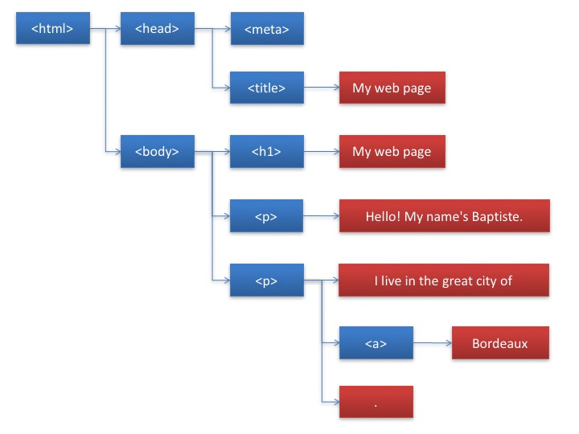
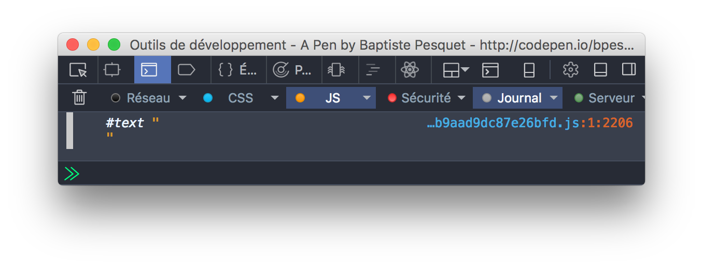
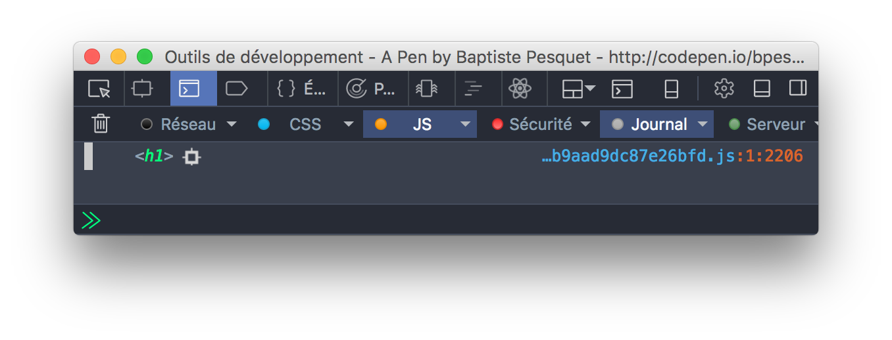

# Discover the DOM

This chapter will help you discover how a web page is shown by a browser.

## TL;DR

* A **web page** is a structured document containing both text and HTML tags. The **DOM**, or *Document Object Model*, is a standardized way to define a web page's structure.

* The DOM is also an **API** allowing programmatical interactions with the web page. With JavaScript, you can access the structure of a page displayed in a browser and modify it.

* The DOM represents a web page as a hierarchy of **objects**, where each object corresponds to a node in the nested HTML element tree.

* The `document` variable provides access to the root of the DOM tree and corresponds to the `<html>` element in the HTML itself.

* DOM objects have **properties** and **methods** that you can manipulate with JavaScript. For example, `nodeType` returns the node type, `childNodes` contains a collection of child nodes, and `parentNode` returns the parent node.

## Introduction to the DOM

You already know that a web page is a document that contains text and tags such as headings, paragraphs, links, etc. This happens in a language called **HTML**.

Let's take this simple web page as an example. Feel free to add your own information!

```html
<!doctype html>
<html>

<head>
    <meta charset="utf-8">
    <title>My web page</title>
</head>

<body>
    <h1>My web page</h1>
    <p>Hello! My name's Baptiste.</p>
    <p>I live in the great city of <a href="https://en.wikipedia.org/wiki/Bordeaux">Bordeaux</a>.</p>
</body>

</html>
```


To create this result, the browser first takes the HTML code and builds a representation of its structure. It then displays this structure in the browser.

The browser also offers *programmatic* access to its structured representation of a displayed web page. Using this interface, you can dynamically update the page by adding or removing elements, changing styles, etc. This is how you create **interactive** web pages.

The structured representation of a web page is called **DOM**, short for *Document Object Model*. The DOM defines the structure of a page and a way to interact with it. This means it's a programming interface, or **API** (*Application Programming Interface*). JavaScript is the language of choice for interacting with the DOM.

> At the dawn of the Web, each browser was using its own DOM, giving headaches to JavaScript developers trying to code web pages. These hard times are over. Through a [World Wide Web Consortium](https://w3c.org) (W3C) effort, the first version of a unified DOM was created in 1998. Nowadays, all recent browsers use a standardized DOM.

## Web page structure

A web page is a set of nested tags. You can represent a web page in a hierarchical form called a **tree**. The `<html>` element sets up your document as HTML and contains two sub-elements, `<head>` and `<body>`, which themselves contain several sub-elements.

Here is the tree corresponding to our example HTML page.



Each entity in the tree is called a **node**. There are two types of nodes:

* Those (in blue here) that correspond to HTML tags like `<body>` or `<p>`. These nodes are called **element nodes** and they can have subnodes, called **child nodes** or children.

* Those (in red) that match the textual content of the page. These nodes are called **text nodes** and do not have children.

## Get started with the DOM in JavaScript

The DOM represents a web page as a hierarchy of objects, where each object corresponds to a node in the nested HTML element tree. DOM objects have **properties** and **methods** that you can manipulate with JavaScript.

### Access the DOM with the `document` variable

When a JavaScript program runs in the context of a web browser, it can access the root of the DOM using the variable `document`. This variable matches the `<html>` element.

`document` is an object that has `head` and `body` properties which allow access to the `<head>` and `<body>` elements of the page.

```js
const h = document.head; // "h" variable contains the contents of the DOM's head
const b = document.body; // "b" variable contains the contents of the DOM's body
```

### Discover a node's type

Each object has a property called `nodeType` which indicates its type. The value of this property is `document.ELEMENT_NODE` for an "element" node (otherwise known as an HTML tag) and `document.TEXT_NODE` for a text node.

```js
if (document.body.nodeType === document.ELEMENT_NODE) {
  console.log("Body is an element node!");
} else {
  console.log("Body is a textual node!");
}
```


As expected, the DOM object `body` is an element node because it's an HTML tag.

### Access a node's children

Each element-typed object in the DOM has a property called `childNodes`. This is an ordered collection containing all its child nodes as DOM objects. You can use this array-like collection to access the different children of a node.

W> The `childNodes` property of an element node is not a real JavaScript array, but rather a [NodeList](https://developer.mozilla.org/en-US/docs/Web/API/NodeList) object. Not all of the standard array methods are applicable to it.

The following code would display the first child of the `body` node.

```js
// Access the first child of the body node
console.log(document.body.childNodes[0]);
```



Q> Wait... Why isn't the first child node `h1`, since that's the first element in the body's HTML?

That's because spaces between tags and line returns in HTML code are considered text nodes by the browser. The node `h1` is therefore the *second* child node of the body. Let's double check that:

```js
// Access the second child of the body node
console.log(document.body.childNodes[1]);
```



To eliminate these text nodes between tags, you could have written the HTML page in a more condensed way.

```html
<body><h1>My web page</h1><!-- ... -->
```

It's better, however, to take the text nodes between tags into account than to sacrifice visibility and code indentation.

### Browse child nodes

To browse a list of child nodes, you can use a classical `for` loop, the `forEach()` method or the newer `for-of` loop as seen below:

```js
// Browse the body node's children using a for loop@
for (let i = 0; i < document.body.childNodes.length; i++) {
  console.log(document.body.childNodes[i]);
}

// Browse the body node's children using the forEach() method
document.body.childNodes.forEach(node => {
  console.log(node);
});

// Browse the body node's children using a for-of loop
for (const node of document.body.childNodes) {
  console.log(node);
}
```

Each of these techniques gives the following result.


Again, spaces and line returns count as text nodes in the DOM.

### Access a node's parent

Each DOM object has a property called `parentNode` that returns its parent node as a DOM object.

> For the DOM root node (`document`), the value of `parentNode` is `null` since it has no parent node.

```js
const h1 = document.body.childNodes[1];
console.log(h1.parentNode);       // Show the body node
console.log(document.parentNode); // Will show null, since body has no parent node
```


> There are other properties that we will not discuss here that let you navigate through the DOM, like `firstChild`, `lastChild` or `nextSibling`.

## Coding time!

### Showing a node's child

Your mission here is to create a `showChild()` function that shows one of the children of a DOM element node. This function takes as parameter the parent node and the child node index. Error cases like a non-element node or an out-of-limits index must be taken into account.

Here's the associated HTML code.

```html
<h1>A title</h1>
<div>Some text with <a href="#">a link</a>.</div>
```

Complete the following program to obtain the expected results.

```js
// Show a DOM object's child node
// "node" is the DOM object
// "index" is the index of the child node
const showChild = (node, index) => {
  // TODO: add code here
};

// Should show the h1 node
showChild(document.body, 1);

// Should show "Incorrect index"
showChild(document.body, -1);

// Should show "Incorrect index"
showChild(document.body, 8);

// Should show "Wrong node type"
showChild(document.body.childNodes[0], 0);
```

> Use `console.error()` rather than `console.log()` to display an error message in the console.
