# Traverse the DOM

In this chapter, you'll see how to use JavaScript to traverse the DOM.

## TL;DR

* Rather than go through the DOM node by node, you can quickly access one or more elements using **selection methods**.

* The `getElementsByTagName()`, `getElementsByClassName()` and `getElementById()` methods respectively search items by **tag name**, **class**, and **ID**. The first two methods return a list, which can further be converted to an array with `Array.from()`. The latter method returns a single item.

* The `querySelectorAll()` and `querySelector()` methods make it possible to search for items using a **CSS selector**. The first method returns all matching items, and the second returns only the first.

* The `innerHTML` property returns the **HTML content** of an element. The `textContent` property returns its **textual content** without any HTML markup.

* The `getAttribute()` and `hasAttribute()` methods allow access to element **attributes**. The `classList` property and its method `contains()` provides access to an element's **classes**.

## Sample web page

Here's the example web page used throughout this chapter.

```html
<h1>Seven wonders of the world</h1>
<p>Do you know the seven wonders of the world?</p>
<div id="content">
    <h2>Wonders from Antiquity</h2>
    <p>This list comes to us from ancient times.</p>
    <ul class="wonders" id="ancient">
        <li class="exists">Great Pyramid of Giza</li>
        <li>Hanging Gardens of Babylon</li>
        <li>Lighthouse of Alexandria</li>
        <li>Statue of Zeus at Olympia</li>
        <li>Temple of Artemis at Ephesus</li>
        <li>Mausoleum at Halicarnassus</li>
        <li>Colossus of Rhodes</li>
    </ul>
    <h2>Modern wonders of the world</h2>
    <p>This list was decided by vote.</p>
    <ul class="wonders" id="new">
        <li class="exists">Petra</li>
        <li class="exists">Great Wall of China</li>
        <Li class="exists">Christ the Redeemer</Li>
        <Li class="exists">Machu Picchu</Li>
        <li class="exists">Chichen Itza</li>
        <li class="exists">Colosseum</li>
        <li class="exists">Taj Mahal</li>
    </ul>
    <h2>References</h2>
    <ul>
        <li><a href="https://en.wikipedia.org/wiki/Seven_Wonders_of_the_Ancient_World">Seven Wonders of the Ancient World</a></li>
        <li><a href="https://en.wikipedia.org/wiki/New7Wonders_of_the_World">New Wonders of the World</a></li>
    </ul>
</div>
```

## Selecting elements

### The limits of node-by-node traversal

In the previous chapter, you saw how to navigate the DOM node structure of a web page beginning with the root node and using the `childNodes` property to move down levels in the structure of the page.

Suppose you want to select the title `"Wonders from Antiquity"` of our web page. Taking into account the text nodes between elements, this node is the second child node of the sixth child node of the `body` element. So you could write something like this.

```js
// Show the "Wonders from Antiquity" h2 element
console.log(document.body.childNodes[5].childNodes[1]);
```

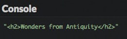

This technique is pretty awkward and error-prone. The code is difficult to read and must be updated if new elements are further inserted in the web page. Fortunately, there are much better solutions.

### Selecting items according to HTML tag

All DOM elements have a method called `getElementsByTagName()`. This returns, under the form of a [NodeList](https://developer.mozilla.org/en-US/docs/Web/API/NodeList) object, a list of items that have the name of the tag that's passed as a parameter. The search happens through all the sub-elements of the node on which the method is called -- not only its direct children.

With the `getElementsByTagName()` method, selecting the first `h2` element becomes super easy:

```js
// Get all h2 elements into an array
const titleElements = document.getElementsByTagName("h2");

console.log(titleElements[0]);     // Show the first h2
console.log(titleElements.length); // 3 (total number of h2 elements in the page)
```

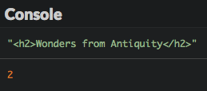

T> Suffixing JavaScript variables associated to DOM element nodes with `Element` (or `Elements` when the variable contains several nodes) is a popular naming convention. We'll stick to it throughout this book.

### Selecting items according to class

DOM elements also feature a method called `getElementsByClassName()`. This method returns a `NodeList` object of elements with the class name as a parameter. Again, the search covers all sub-elements of the node on which the method is called.

It's important to note that `NodeList` objects are *not* real JavaScript arrays, so not all array operations are applicable to them. To turn a `NodeList` object into an array, use the `Array.from()` method.

To select and display all document elements with a class `"exists"`, you can write the following code.

```js
// Show all elements that have the class "exists"
const existingElements = Array.from(document.getElementsByClassName("exists"));
existingElements.forEach(element => {
  console.log(element);
});
```

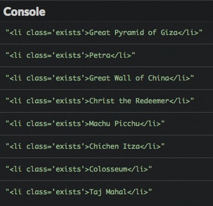

### Selecting an item according to its ID

Lastly, the `document` variable provides a method called `getElementById()` that returns the element with the specified ID among all elements of the document. It returns `null` if no associated element can be found.

The following code selects and displays the list with ID `"new"`.

```js
// Show element with the ID "new"
console.log(document.getElementById("new"));
```

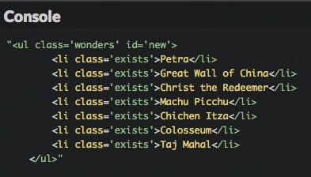

E> Beware: contrary to others, the `getElementById()` method does not contain any `'s'` after the word `"Element"`.

### Selecting elements via CSS selectors

For more complex use cases, you can also use CSS selectors to access DOM elements.

For example, let's say that you want to grab all the `<li>` elements of wonders that are both ancient and still exist.

```js
// All "ancient" wonders that still exist
console.log(document.getElementById("ancient").getElementsByClassName("exists").length); // 1
```

This syntax is a little clunky though. Let's learn two new methods that make finding elements easier.

The first is `querySelectorAll()`, with which you can use CSS selectors to identify elements.

```js
// All paragraphs
console.log(document.querySelectorAll("p").length); // 3

// All paragraphs inside the "content" ID block
console.log(document.querySelectorAll("#content p").length); // 2

// All elements with the "exists" class
console.log(document.querySelectorAll(".exists").length); // 8

// All "ancient" wonders that still exist
console.log(document.querySelectorAll("#ancient > .exists").length); // 1
```

> Check the [Mozilla Developer Network](https://developer.mozilla.org/en-US/docs/Web/CSS/CSS_Selectors) for a primer on the different CSS selectors available.

The second method using CSS selectors is called `querySelector()`. It works the same way as `querySelectorAll()` but only returns the first matching element. It returns `null` if no associated element can be found.

```js
// Show the first paragraph
console.log(document.querySelector("p"));
```

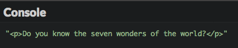

### Choosing a selection method

You just discovered several ways of selecting DOM elements. How do you choose the right one?

Since they use CSS selectors, `querySelectorAll()` and `querySelector()` could cover all your needs, but they might perform [slower](https://jsperf.com/getelementsbyclassname-vs-queryselectorall/195) than the others.

Here are the general rules of thumb that you should follow.

| Number of items to get | Selection criterion | Method to use |
|---|---|---|
| Many | By tag | `getElementsByTagName()` |
| Many | By class | `getElementsByClassName()` |
| Many | Not by class or tag | `querySelectorAll()` |
| Only one | By ID | `getElementById()` |
| Only one (the first) | Not by ID | `querySelector()` |

## Obtaining information about elements

The DOM also provides information on the items you've just selected.

### HTML content

The `innerHTML` property will retrieve the HTML content of your DOM element.

```js
// The HTML content of the DOM element with ID "content"
console.log(document.getElementById("content").innerHTML);
```

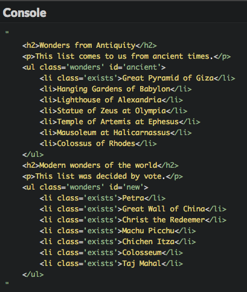

> This property has been introduced by Microsoft and is not part of the W3C DOM specification, but it is nonetheless supported by all major browsers.

### Textual content

The `textContent` property returns all the text content of a DOM element, without any HTML markup.

```js
// The textual content of the DOM element with ID "content"
console.log(document.getElementById("content").textContent);
```

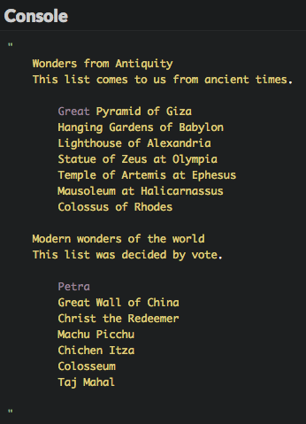

### Attributes

The `getAttribute()` method can be applied to a DOM element and will return the value of a given attribute.

```js
// Show href attribute of the first link
console.log(document.querySelector("a").getAttribute("href"));
```

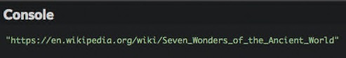

Some attributes are directly accessible as properties. This is true for the `id`, `href`, and `value` attributes.

```js
// Show ID attribute of the first list
console.log(document.querySelector("ul").id);

// Show href attribute of the first link
console.log(document.querySelector("a").href);
```

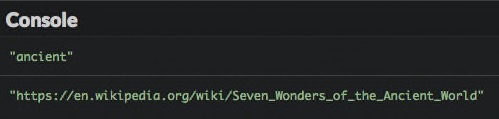

You can check for the existence of an attribute using the `hasAttribute()` method as seen in the example below.

```js
if (document.querySelector("a").hasAttribute("target")) {
  console.log("The first link has a target attribute.");
} else {
  console.log("The first link does not have a target attribute."); // Will be shown
}
```

### Classes

In a web page, a tag can have multiple classes. The `classList` property retrieves a DOM element's list of classes.

```js
// List of classes of the element identified by "ancient"
const classes = document.getElementById("ancient").classList;
console.log(classes.length); // 1 (since the element only has one class)
console.log(classes[0]);     // "wonders"
```

You also have the opportunity to test the presence of a class on an element by calling the `contains()` on the class list, passing the class to test as a parameter.

```js
if (document.getElementById("ancient").classList.contains("wonders")) {
  console.log("The element with ID 'ancient' has the class 'wonders'."); // Will be shown
} else {
  console.log("The element with ID 'ancient' does not have the class 'wonders'.");
}
```

> This is only a part of the DOM traversal API. For more details, check the [Mozilla Developer Network](https://developer.mozilla.org/en-US/docs/Web/API/Element).

## Coding time!

### Counting elements

Here is some HTML code (content is by French poet Paul Verlaine).

```html
<h1>Mon rêve familier</h1>

<p>Je fais souvent ce rêve <span class="adjective">étrange</span> et <span class="adjective">pénétrant</span></p>
<p>D'une <span>femme <span class="adjective">inconnue</span></span>, et que j'aime, et qui m'aime</p>
<p>Et qui n'est, chaque fois, ni tout à fait la même</p>
<p>Ni tout à fait une autre, et m'aime et me comprend.</p>
```

Complete the following program to write the `countElements()` function, that takes a CSS selector as a parameter and returns the number of corresponding elements.

```js
// TODO: write the countElements() function here

console.log(countElements("p"));              // Should show 4
console.log(countElements(".adjective"));     // Should show 3
console.log(countElements("p .adjective"));   // Should show 3
console.log(countElements("p > .adjective")); // Should show 2
```

### Handling attributes

Here is the description of several musical instruments.

```html
<h1>Some musical instruments</h1>
<ul>
  <li id="clarinet" class="wind woodwind">
    The <a href="https://en.wikipedia.org/wiki/Clarinet">clarinet</a>
  </li>
  <li id="saxophone" class="wind woodwind">
    The <a href="https://en.wikipedia.org/wiki/Saxophone">saxophone</a>
  </li>
  <li id="trumpet" class="wind brass">
    The <a href="https://en.wikipedia.org/wiki/Trumpet">trumpet</a>
  </li>
  <li id="violin" class="chordophone">
    The <a href="https://en.wikipedia.org/wiki/Violin">violin</a>
  </li>
</ul>
```

Write a JavaScript program containing a `linkInfo()` function that shows:

* The total number of links.
* The target of the first and last links.

This function should work even if no links are present.

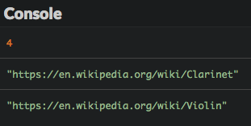

Add the following new instrument at the end of the HTML list, then check your program's new result.

```html
<li id="harpsichord">
  The <a href="https://en.wikipedia.org/wiki/Harpsichord">harpsichord</a>
</li>
```

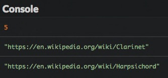

### Handling classes

Improve the previous program to add a `has()` function that tests if an element designated by its ID has a class. The function shows `true`, `false` or an error message if the element can't be found.

```js
// Show if an element has a class
const has = (id, someClass) => {
  // TODO: write the function code
};

has("saxophone", "woodwind");     // Should show true
has("saxophone", "brass");        // Should show false
has("trumpet", "brass");          // Should show true
has("contrabass", "chordophone"); // Should show an error message
```

> Use `console.error()` rather than `console.log()` to display an error message in the console.

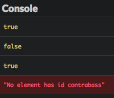
