# Modify page structure

Let's see how to use JavaScript to modify a web page once it's been loaded by the browser! You can thus make your content more dynamic and interactive.

## TL;DR

* The `innerHTML`, `textContent` and `classList` properties, as well as the `setAttribute` method, let you modify a DOM element's information.

* You create new DOM nodes via methods `createTextNode()` (for, well, text nodes) and `createElement()` (for elements themselves).

* The `appendChild()` method lets you insert a new node as the last child of a DOM element.

* The `insertBefore()` and `insertAdjacentHTML()` methods are alternative possibilities for adding content.

* You can replace existing nodes with the `replaceChild()` method or remove them with `removeChild()`.

* The JavaScript `style` property represents the `style` attribute of a DOM node. It lets you modify the element's style by defining values of its CSS properties.

* CSS properties that involve multiple words are written in **camelCase** when dealing with JavaScript. For example, `font-family` becomes `fontFamily`.

* The `style` property is not intended to access an element's style. You should use the `getComputedStyle()` function instead.

* Manipulating the DOM with JavaScript should be done sparingly so that page performance doesn't suffer.

## Modify an existing element

The DOM traversal properties studied in the previous chapter can also be used to update elements in the page.

### Example page

The examples in the next paragraphs use the HTML code below.

```html
<h3 class="beginning">Some languages</h3>
<div id="content">
    <ul id="languages">
        <li id="cpp">C++</li>
        <li id="java">Java</li>
        <li id="csharp">C#</li>
        <li id="php">PHP</li>
    </ul>
</div>
```

### HTML content

The `innerHTML` property can be used to change the content of an element within the DOM.

For example, you can add a new language to our list with the code below. We'll access the `<ul>` tag identified by `"languages"` and then add an entry to the end of the list via an operator (`+=`) and an `<li>`.

```js
// Modifying an HTML element: adding an <li>
document.getElementById("languages").innerHTML += '<li id="c">C</li>';
```

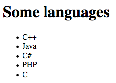

The `innerHTML` property is often used to "empty" content. Try the following example:

```js
// Delete the HTML content of the list, replacing it with nothing
document.getElementById("languages").innerHTML = "";
```

> Before moving on, remove the above line from your JavaScript program. Otherwise, you'll have no content!

T> When using `innerHTML`, you put HTML content into strings. To keep your code readable and avoid mistakes, you should only use `innerHTML` to make small content changes. You'll discover more versatile solutions below.

### Text content

Use the `textContent` property to modify the text content of a DOM element. Here is how to complete the title displayed by our page.

```js
// Modify the title's text content
document.querySelector("h3").textContent += " for programming";
```


### Attributes

The `setAttribute()` method sets the value of an attribute of an element. You pass the name and value of the attribute as parameters.

```js
// Define the id attribute of the first title
document.querySelector("h3").setAttribute("id", "title");
```

As you saw in the previous chapter, some attributes exist as properties and can be directly updated.

```js
// Define the id attribute of the first title
document.querySelector("h3").id = "title";
```

### Classes

You can use the `classList` property to add or remove classes from a DOM element!

```js
const titleElement = document.querySelector("h3"); // Grab the first h3
titleElement.classList.remove("beginning");        // Remove the class "beginning"
titleElement.classList.add("title");               // Add a class called "title"
console.log(titleElement);
```

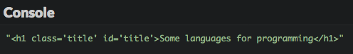

## Adding a new element

Adding a new element to a web page can be broken into three steps:

* Create the new element.
* Set element properties.
* Insert the new element in the DOM.

For example, suppose you want to add the language "Python" to the list of languages on our page. Here's the JavaScript code you'd use to do so.

```js
const pythonElement = document.createElement("li"); // Create an "li" element
pythonElement.id = "python";          // Define element ID
pythonElement.textContent = "Python"; // Define its text content
document.getElementById("languages").appendChild(pythonElement); // Insert the new element into the DOM
```

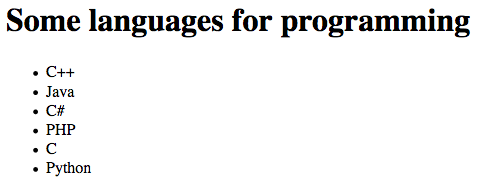

Let's study each of these steps.

### Creating the element

You'd create an element using the `createElement()` method (surprising, isn't it?). This method is used on the document object and takes the tag of the new element as a parameter. This method also returns the element created as an object (here stored in a variable called `pythonElement`).

```js
const pythonElement = document.createElement("li"); // Create an li element
```

### Setting element properties

Once the element is created and stored in a variable, you can add some detail to it (ID, class, text content, etc.) by using the aforementioned DOM properties.

In the example, the element ID becomes `"python"` and its text content becomes `"Python"`.

```js
// ...
pythonElement.id = "python";          // Define element ID
pythonElement.textContent = "Python"; // Define its text content
```

### Inserting the element into the DOM

There are several techniques to insert a new node in the DOM. The most common is to call the `appendChild()` method on the element that will be the future parent of the new node. The new node is added to the end of the list of child nodes of that parent.

In our example, the new item is added as a new child of the `<ul>` tag identified by `"languages"`, after all the other children of this tag.

```js
// ...
document.getElementById("languages").appendChild(pythonElement); // Insert the new element into the DOM
```

## Variations on adding elements

### Adding a textual node

Instead of using the `textContent` property to define the new element's textual content, you can create a textual node with the `createTextNode()` method. This node can then be added to the new element with `appendChild()`.

The following code demonstrates this possibility by inserting the Ruby language at the end of the list.

```js
const rubyElement = document.createElement("li"); // Create an "li" element
rubyElement.id = "ruby"; // Define element ID
rubyElement.appendChild(document.createTextNode("Ruby")); // Define its text content
document.getElementById("languages").appendChild(rubyElement); // Insert the new element into the DOM
```

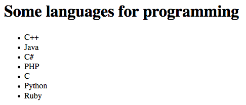

### Adding a node before another one

Sometimes, inserting a new node at the end of its parent's children list is not ideal. In that case, you can use the `insertBefore()` method. Called on the future parent, this method takes as parameters the new node and the node before which the new one will be inserted.

As an example, here's how the Perl language could be inserted before PHP in the list.

```js
const perlElement = document.createElement("li"); // Create an "li" element
perlElement.id = "perl"; // Define element ID
perlElement.textContent = "Perl"; // Define its text content
// Insert the new element before the "PHP" node
document.getElementById("languages").insertBefore(perlElement, document.getElementById("php"));
```

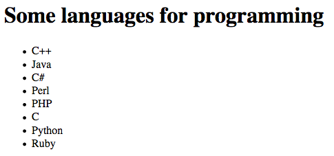

### Determining the exact position of the new node

There is a method to more precisely define the position of inserted elements: `insertAdjacentHTML()`. Call it on an existing element and pass it the position and a string of HTML characters that represent the new content to be added. The new content's position should be either:

* `beforebegin`: before the existing element.
* `afterbegin`: inside the existing element, before its first child.
* `beforeend`: inside the existing element, after its last child.
* `afterend`: after the existing element.

Here's how these positions translate relative to an existing `<p>` tag.

```html
<!-- beforebegin -->
<p>
  <!-- afterbegin -->
  foo
  <!-- beforeend -->
</p>
<!-- afterend -->
```

The following example uses `insertAdjacentHTML()` to add JavaScript at the top of the language list.

```js
// Add an element to the beginning of a list
document.getElementById('languages').insertAdjacentHTML("afterBegin", '<li id="javascript">JavaScript</li>');
```

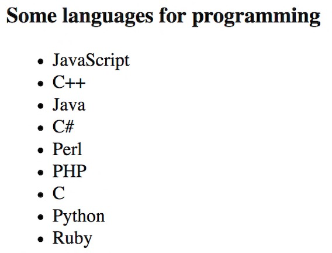

## Replacing or removing nodes

### Replacing a node

A DOM element can be replaced with the `replaceChild()` method. This replaces a child node of the current element with another node. The new node and node-to-be-replaced are passed as parameters (in that order).

The example shows replacing the Perl language with Lisp.

```js
const lispElement = document.createElement("li"); // Create an li element
lispElement.id = "lisp";          // Define its ID
lispElement.textContent = "Lisp"; // Define its text content
// Replace the element identified by "perl" with the new element
document.getElementById("languages").replaceChild(lispElement, document.getElementById("perl"));
```

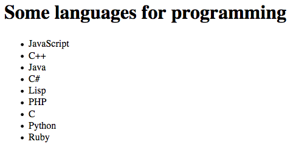

### Removing a node

Lastly, you can delete a node thanks to a method called `removeChild()`, to which you'll pass the node-to-be-removed as a parameter.

```js
// Remove the element with the "lisp" id
document.getElementById("languages").removeChild(document.getElementById("lisp"));
```

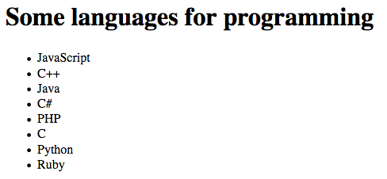

## Styling elements

JavaScript not only lets you interact with your web page structure, but it also lets you change the style of elements. It's time to learn how.

Here is the example HTML content used in the next paragraphs.

```html
<p>First</p>
<p style="color: green;">Second</p>
<p id="para">Third</p>
```

And here is the associated CSS **stylesheet**. The rules in a stylesheet determine the appearance of elements on a page. Here, the one element we're adjusting via CSS is the element with the `para` ID. Its text will be blue and in italics.

```css
#para {
    font-style: italic;
    color: blue;
}
```

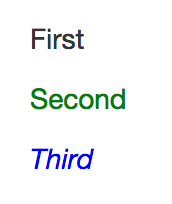

### The `style` property

DOM elements are equipped with a property called `style`, which returns an object representing the HTML element's `style` attribute. This object's properties match up to its CSS properties. By defining these properties with JavaScript, you're actually modifying the element's style.

The code below selects the page's first paragraph and modifies its text color and margins.

```js
const paragraphElement = document.querySelector("p");
paragraphElement.style.color = "red";
paragraphElement.style.margin = "50px";
```

#### Compound CSS properties

Some CSS properties have compound names, meaning they're composed of two words (like `background-color`). To interact with these properties via JavaScript, you have to ditch the hyphen and capitalize the first letter of following words.

This example modifies the same paragraph element's `font-family` and `background-color` properties.

```js
// ...
paragraphElement.style.fontFamily = "Arial";
paragraphElement.style.backgroundColor = "black";
```

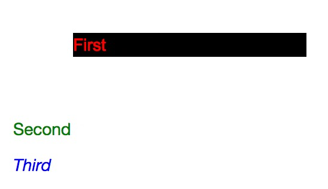

This naming convention, already encountered in previous chapters, is called [camelCase](https://en.wikipedia.org/wiki/Camel_case).

You can see CSS properties and their JavaScript properties on the [Mozilla Developer Network](https://developer.mozilla.org/en-US/docs/Web/CSS/CSS_Properties_Reference).

### The limits of the `style` property

Let's try to display the text color of each of our example paragraphs.

```js
const paragraphElements = document.getElementsByTagName("p");
console.log(paragraphElements[0].style.color); // "red"
console.log(paragraphElements[1].style.color); // "green"
console.log(paragraphElements[2].style.color); // Show an empty string
```

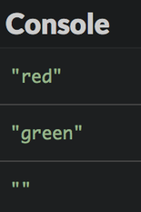

Why is the color of the third paragraph (blue) not showing?

Because the `style` property used in this code only represents the `style` attribute of the element. Using this property, you cannot access style declarations defined elsewhere, for example in a CSS stylesheet. This explains why the third paragraph's style, defined externally, is not shown here.

### Access element styles

A better solution for accessing element styles is to use a function called `getComputedStyle()`. This function takes a DOM node as a parameter and returns an object that represents the element's style. You can then see the different CSS properties of the object.

The following example will show the style properties of the third paragraph:

```js
const paragraphStyle = getComputedStyle(document.getElementById("para"));
console.log(paragraphStyle.fontStyle); // "italic"
console.log(paragraphStyle.color);     // color blue in RGB values
```

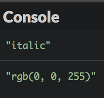

> The blue color is represented as 3 color values: red, green, and blue (RGB). For each of these primary colors, values will always be between or equal to 0 and 255.

## DOM manipulations and performance

Updating the DOM through JavaScript code causes the browser to compute the new page display. Frequent manipulations can lead to slowdowns and sub-par performance. As such, you should keep DOM access and update operations to a minimum.

Creating and setting element properties *before* they're inserted into the DOM is a good way to preserve performance.

```js
// Bad: DOM is updated multiple times
const newNode = document.createElement(...); // Create new element
parentNode.appendChild(newNode); // Add it to the DOM
newNode.id = ...; // Set some element properties
newNode.textContent = "...";
// ...

// Better: DOM is updated only once
const newNode = document.createElement(...); // Create new element
newNode.id = ...; // Set some element properties
newNode.textContent = "...";
// ...
parentNode.appendChild(newNode); // Add it to the DOM
```

## Coding time!

### Adding a paragraph

Improve the languages example to add a paragraph (`<p>` tag) containing a link (`<a>` tag) to the URL <https://en.wikipedia.org/wiki/List_of_programming_languages>.

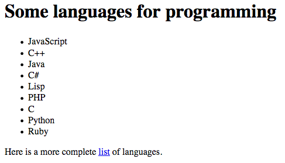

### Newspaper list

Here is the HTML code of a web page.

```html
<h3>Some newspapers</h3>
<div id="content"></div>
```

Write a program that shows on the page a list of newspapers defined in a JavaScript array. Each link must be clickable.

```js
// Newspaper list
const newspapers = ["https://www.nytimes.com", "https://www.washingtonpost.com", "http://www.economist.com"];
```


### Mini-dictionary

Here is the HTML code of a web page.

```html
<h3>A mini-dictionary</h3>
<div id="content"></div>
```

Write a program that shows on the page a list of terms and definitions defined in a JavaScript array.

```js
const words = [{
  term: "Procrastination",
  definition: "Avoidance of doing a task that needs to be accomplished"
}, {
  term: "Tautology",
  definition: "logical argument constructed in such a way that it is logically irrefutable"
}, {
  term: "Oxymoron",
  definition: "figure of speech that juxtaposes elements that appear to be contradictory"
}];
```

Use the HTML `<dl>` tag to create the list ([more on this tag](https://developer.mozilla.org/en-US/docs/Web/HTML/Element/dl)). Each term of the dictionary should be given more importance with a `<strong>` tag.

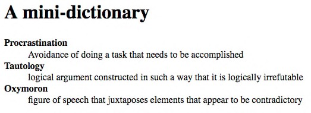

### Updating colors

The following HTML content defines three paragraphs.

```html
<h1>Paragraph 1</h1>
<div>Lorem ipsum dolor sit amet, consectetur adipiscing elit. Donec dignissim fringilla dapibus. Curabitur placerat efficitur molestie. Quisque quis consequat nibh. Aenean feugiat, eros eget aliquam vulputate, leo augue luctus lectus, non lobortis libero quam non sem. Aliquam sit amet tincidunt ex, mollis interdum massa.</div>

<h1>Paragraph 2</h1>
<div>Vivamus at justo blandit, ornare leo id, vehicula urna. Fusce sed felis eget magna viverra feugiat eget nec orci. Duis non massa nibh. Aenean vehicula velit a magna lobortis tempor ut quis felis. Proin vitae dui a eros facilisis fringilla ut ut ante.</div>

<h1>Paragraph 3</h1>
<div>Lorem ipsum dolor sit amet, consectetur adipiscing elit. Duis sit amet pharetra massa. Nulla blandit erat nulla, et scelerisque libero varius ut. Praesent bibendum eu magna ullamcorper venenatis. Sed ut pellentesque leo. Sed ultrices sapien consequat odio posuere gravida.</div>
```

Write a program that asks the user for the new text color, and then asks for the new background color. The page is then updated accordingly.

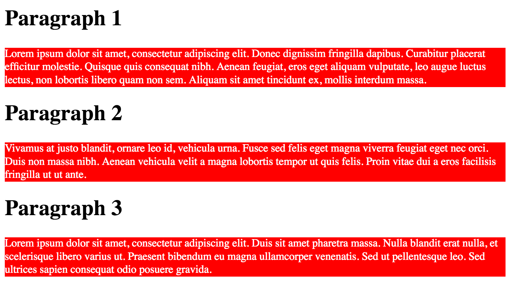

### Information about an element

Here is this exercise's HTML code.

```html
<div id="content">ABC
    <br>Easy as
    <br>One, two, three
</div>
<div id="infos"></div>
```

And the associated CSS stylesheet.

```css
#content {
    float: right;
    margin-top: 100px;
    margin-right: 50px;
}
```

Write a program that adds to the page a list showing the height and width of the element identified by "content".

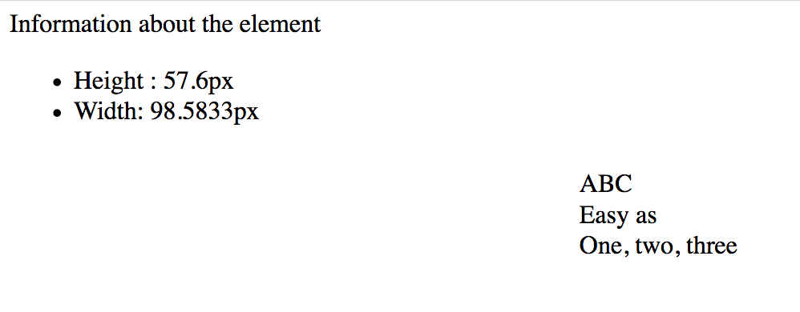
