# React to events

To make a web page interactive, you have to respond to user actions. Let's discover how to do so.

## TL;DR

* You can make a web page interactive by writing JavaScript code tied to **events** within the browser.

* Numerous types of events can be handled. Each event type is associated with an `Event` object that contains properties giving information about the event.

* `keypress`, `keydown` and `keyup` events let you react to keyboard-related events.

* `click`, `mousedown` and `mouseup` events let you react to mouse-related events.

* Page loading and closing are associated with the events `load` and `beforeunload`, respectively.

* An event propagates within the DOM tree from its node of origin up to the document root. This propagation can be interrupted with the `stopPropagation()` method.

* Calling the `preventDefault()` method on an `Event` object cancels the default behavior associated with the action that triggered the event.

## Introduction to events

Up until now, your JavaScript code was executed right from the start. The execution order of statements was determined in advance and the only user interactions were data input through `prompt()` calls.

To add more interactivity, the page should react to the user's actions: clicking on a button, filling a form, etc. In that case, the execution order of statements is not determined in advance anymore, but depends on the user behavior. His actions trigger **events** that can be handled by writing JavaScript code.

This way of writing programs is called **event-driven programming**. It is often used by user interfaces, and more generally anytime a program needs to interact with a user.

### A first example

Here's some starter HTML code.

```html
<button id="myButton">Click me!</button>
```

 And here's the associated JavaScript code.

```js
const showMessage = () => {
  alert("Hello!");
};

// Access the button
const buttonElement = document.getElementById("myButton");
// Listen to the "click" event
buttonElement.addEventListener("click", showMessage);
```

Clicking on the web page button shows an `"Hello!` message.

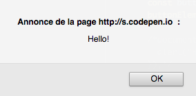

### Adding an event listener

Called on a DOM element, the `addEventListener()` method adds a **handler** for a particular event. This method takes as parameter the **event type** and the associated **function**. This function gets called whenever an event of the corresponding type appears for the DOM element.

The above JavaScript code could be rewritten more concisely using an anonymous function, for an identical result.

```js
// Show a message when the user clicks on the button
document.getElementById("myButton").addEventListener("click", () => {
  alert("Hello!");
});
```

### Removing an event listener

In some particular cases, you might want to stop reacting to an event on a DOM element. To achieve this, call the `removeEventListener()` on the element, passing as a parameter the function which used to handle the event.

> This can only work if the handler function is not anonymous.

```js
// Remove the handler for the click event
buttonElement.removeEventListener("click", showMessage);
```

## The event family

Many types of events can be triggered by DOM elements. Here are the main event categories.

| Category | Examples |
|---|---|
| Keyboard events | Pressing or releasing a key |
| Mouse events | Clicking on a mouse button, pressing or releasing a mouse button, hovering over a zone |
| Window events | Loading or closing a page, resizing, scrolling |
| Form events | Changing focus on a form field, submitting a form |

Every event is associated to an `Event` object which has both **properties** (information about the event) and **methods** (ways to act on the event). This object can be used by the handler function.

Many properties of the `Event` object associated to an event depend on the event type. Some properties are always present, like `type` that returns the event type and `target` that return the event target (the DOM element that is the event source).

The `Event` object is passed as a parameter to the handler function. The following code uses this object to show the event type and target in the console.

```js
// Show event type and target when the user clicks on the button
document.getElementById("myButton").addEventListener("click", e => {
  console.log(`Event type: ${e.type}, target: ${e.target}`);
});
```

> The parameter name chosen for the `Event` object is generally `e` or `event`.

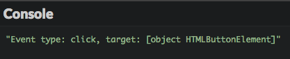

## Reacting to common events

### Key presses

The most common solution for reacting to key presses on a keyboard involves handling `keypress` events that happen on a web page (the DOM `body` element, which corresponds to the global variable called `document` in JavaScript).

The following example shows in the console the character associated to a pressed key. The character info is given by the `charCode` property of the `Event` object associated to the event. This property returns a numerical value (called **Unicode value**) that can be translated to a string value by the `String.FromCharCode()` method.

```js
// Show the pressed character
document.addEventListener("keypress", e => {
  console.log(`You pressed the ${String.fromCharCode(e.charCode)} key`);
});
```

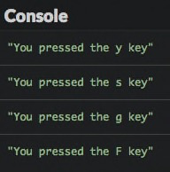

To manage the press and release of any key (not only the ones producing characters), you'll use the `keydown` and `keyup` events. This example uses the same function to manage two events. This time, the key's code is accessible in the `keyCode` property of the `Event` object.

```js
// Show information on a keyboard event
const keyboardInfo = e => {
  console.log(`Keyboard event: ${e.type}, key: ${e.keyCode}`);
};

// Integrate this function into key press and release:
document.addEventListener("keydown", keyboardInfo);
document.addEventListener("keyup", keyboardInfo);
```


This results demonstrates that the launch order of keyboard-related events is as follows: `keydown` -> `keypress` -> `keyup`.

> The `keydown` is fired several times when a key is kept pressed.

### Mouse clicks

Mouse clicks on any DOM element produce a event of the `click` type. Tactile interfaces like smartphones and tablets also have `click` events associated with buttons, which are kicked off by actually pressing a finger on the button.

The `Event` object associated with a `click` event has a `button` property which lets you know the mouse button used, as well as `clientX` and `clientY` properties that return the horizontal and vertical coordinates of the place where the click happened. These coordinates are defined relative to the page zone currently shown by the browser.

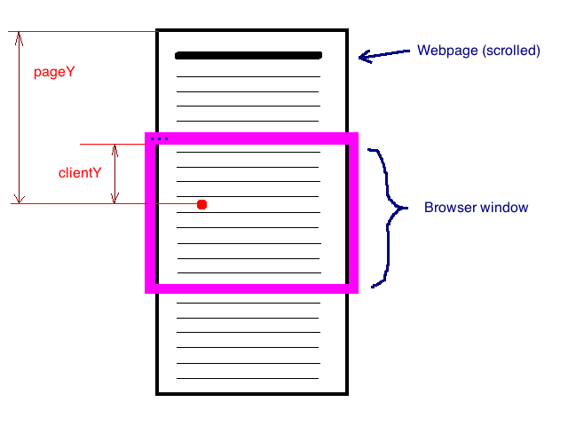

The below code shows information on all click events that happen on a web page. The `mouseInfo()` function associated to the event uses another function, called `getMouseButton()`, to retrieve the clicked mouse button.

```js
// Return the name of the mouse button
const getMouseButton = code => {
  let button = "unknown";
  switch (code) {
    case 0: // 0 is the code for the left mouse button
      button = "left";
      break;
    case 1: // 1 is the code for the middle mouse button
      button = "middle";
      break;
    case 2: // 2 is the code for the right button
      button = "right";
      break;
  }
  return button;
};

// Show info about mouse event
const mouseInfo = e => {
  console.log(
    `Mouse event: ${e.type}, button: ${getMouseButton(
      e.button
    )}, X: ${e.clientX}, Y: ${e.clientY}`
  );
};

// Add mouse click event listener
document.addEventListener("click", mouseInfo);
```

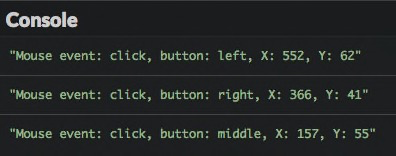

You can use `mousedown` and `mouseup` events similarly to `keydown` and `keyup` to deal with mouse buttons' press and release events. The code below associates the same handler to these two events.

```js
// Handle mouse button press and release
document.addEventListener("mousedown", mouseInfo);
document.addEventListener("mouseup", mouseInfo);
```

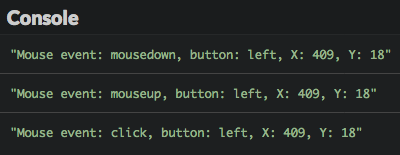

The appearance order for mouse-related events is: `mousedown` -> `mouseup` -> `click`.

### Page loading

Depending on how complex it is, a web page can take time to be entirely loaded by the browser. You can add an event listener on the `load` event produced by the `window` object (which represents the browser window) to know when this happens. This avoids messy situations where JavaScript interacts with pages that aren't fully loaded.

The following code displays a message in the console once the page is fully loaded.

```js
// Web page loading event
window.addEventListener("load", e => {
  console.log("The page has been loaded!");
});
```

### Page closing

You sometimes want to react to page closing. Closing happens when the user closes the tab displaying the page or navigates to another page in this tab. A frequent use case consists of showing a confirmation dialog to the user. Handling page closing is done by adding a handler for the `beforeunload` event on the `window` object.

```js
// Handle page closing
window.addEventListener("beforeunload", e => {
  const message = "Should you stay or should you go?";
  // Standard way of showing a confirmation dialog
  e.returnValue = message;
  // Browser-specific way of showing a confirmation dialog
  return message;
});
```

> Setting the value of the `returnValue` property on the `Event` object is the standard way of triggering a confirmation dialog showing this value. However, some browsers use the return value of the event listener instead. The previous code associate the two techniques to be universal.

## Go farther with events

### Event propagation

The DOM represents a web page as a hierarchy of nodes. Events triggered on a child node are going to get triggered on the parent node, then the parent node of the parent node, up until the root of the DOM (the `document` variable). This is called **event propagation**.

To see propagation in action, use this HTML code to create a small DOM hierarchy.

```html
<p id="para">A paragraph with a <button id="propa">button</button> inside</p>
```

Here's the complementary JavaScript code. It adds `click` event handlers on the button, its parent (the paragraph), and the parent of that too (the root of the DOM).

```js
// Click handler on the document
document.addEventListener("click", e => {
  console.log("Document handler");
});
// Click handler on the paragraph
document.getElementById("para").addEventListener("click", e => {
  console.log("Paragraph handler");
});
// Click handler on the button
document.getElementById("propa").addEventListener("click", e => {
  console.log("Button handler");
});
```

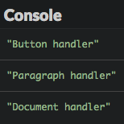

The result in the browser console demonstrates the propagation of `click` events from the button up to the document level. You clicked the button, which means you also clicked the paragraph, which means you also clicked the document.

But maybe you only want an event to kick off once the button is clicked and not count its larger ecosystem? Event propagation can be interrupted at any moment by calling the `stopPropagation()` method on the `Event` object from an event handler. This is useful to avoid the same event being handled multiple times.

Adding a line in the button's click handler prevents the `click` event from propagating everywhere in the DOM tree.

```js
// Click handler on the button
document.getElementById("propa").addEventListener("click", e => {
  console.log("Button handler");
  e.stopPropagation(); // Stop the event propagation
});
```

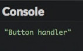

### Cancelling the default behavior of an action

Most of the user actions on a page are associated to a default behavior. Clicking on a link navigates to the link target, clicking anywhere with the right mouse button show a contextual menu, etc. Cancelling a default behavior is possible by calling the `preventDefault()` method on the `Event` object in an event handler.

Let's use the following HTML code to see this possibility in action.

```html
<p>Time on your hands? <a id="forbidden" href="https://9gag.com/">Click here</a></p>
```

```js
// Handling clicking on the forbidden link
document.getElementById("forbidden").addEventListener("click", e => {
  alert("Yes... But no.");
  e.preventDefault(); // Cancels the default behavior
});
```

Now clicking on the links shows a dialog instead of navigating to its target.

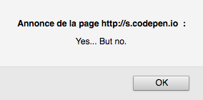

## Coding time!

### Counting clicks

Start with the following HTML content.

```html
<button id="myButton">Click me!</button>
<p>You clicked on the button <span id="clickCount">0</span> times</p>
<button id="deactivate">Désactivate counting</button>
```

Write the JavaScript code that counts the number of clicks on the `myButton` button by updating the `clickCount` element. The `deactivate` button stops the counting.

### Changing colors

Here is some HTML content to start with.

```html
<p>Press the R (red), Y (yellow), G (green) or B (blue) key to change paragraph colors accordingly.</p>

<h1>Paragraph 1</h1>
<div>Lorem ipsum dolor sit amet, consectetur adipiscing elit. Donec dignissim fringilla dapibus. Curabitur placerat efficitur molestie. Quisque quis consequat nibh. Aenean feugiat, eros eget aliquam vulputate, leo augue luctus lectus, non lobortis libero quam non sem. Aliquam sit amet tincidunt ex, mollis interdum massa.</div>

<h1>Paragraph 2</h1>
<div>Vivamus at justo blandit, ornare leo id, vehicula urna. Fusce sed felis eget magna viverra feugiat eget nec orci. Duis non massa nibh. Aenean vehicula velit a magna lobortis tempor ut quis felis. Proin vitae dui a eros facilisis fringilla ut ut ante.</div>

<h1>Paragraph 3</h1>
<div>Lorem ipsum dolor sit amet, consectetur adipiscing elit. Duis sit amet pharetra massa. Nulla blandit erat nulla, et scelerisque libero varius ut. Praesent bibendum eu magna ullamcorper venenatis. Sed ut pellentesque leo. Sed ultrices sapien consequat odio posuere gravida.</div>
```

Write the associated JavaScript code that updates the background color of all `div` tags according to the key (R, Y, G or B) pressed by the user.

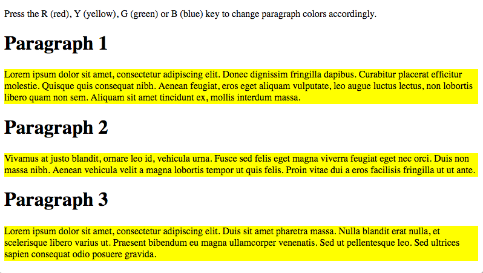

### A dessert list

The following HTML code defines a list of desserts, empty for now.

```html
<h1>My favourite desserts</h1>

<ul id="desserts">
</ul>

<button id="addButton">Add a dessert</button>
```

Write the JavaScript code that adds a new dessert to the list when the user clicks on the button. The dessert name is chosen by the user.

Bonus points for adding the possibility of changing a dessert's name when clicking on it.

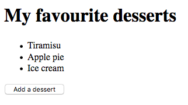

### Interactive quiz

Here is the starter HTML code.

```html
<div id="content"></div>
```

And the associated JavaScript code that defines a question list.

```js
// List of questions (statement + answer)
const questions = [
  {
    statement: "2+2?",
    answer: "2+2 = 4"
  },
  {
    statement: "In which year did Christopher Columbus discover America?",
    answer: "1492"
  },
  {
    statement:
      "What occurs twice in a lifetime, but once in every year, twice in a week but never in a day?",
    answer: "The E letter"
  }
];
```

Complete this code to display the questions in the `<div>` element of the page, with a `"Show the answer"` button next to each question. Clicking this button replaces it with the answer for this question.

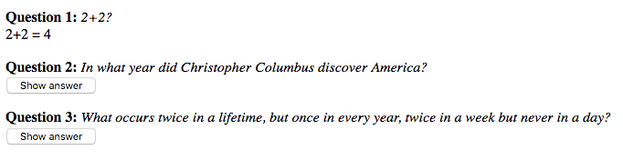
