# Manipulate forms

JavaScript lets you manage forms defined within your web page, in order to further improve interactivity.

## TL;DR

* A **form** lets users input data through a web page. Inputted data is usually sent to a **web server**. Before data gets sent off, you can use JavaScript to interact with the form data and validate it.

* Text zones (`input type="text">` or `<textarea>`) each have a `value` property to access the inputted value.

* When a text field becomes the input target, this field has the **focus**. The `focus` and `blur` events are triggered when the field gets or loses the focus, respectively. The `focus()` and `blur()` methods can update the focus target programmatically.

* Checkboxes, radio buttons, and dropdown lists generate `change` events whenever a user modifies their choice.

* The DOM element that corresponds to the form has an `elements` property that lets you access its input fields programmatically.

* Submitting a form triggers a `submit` event on the form DOM element. You can prevent the sending of form data to the server by using the `preventDefault()` method on the associated `Event` object.

* Any modification of a text field triggers an `input` event, which can be used to validate its data as the user enters it.

* A **regular expression** is a pattern to which strings can be compared. Regular expressions are often used to perform fine-grained validations of form data.

## JavaScript and forms

### Form recap

Forms enhance web pages by allowing users to input information through text fields, check boxes, dropdown menus, and more. Inside a web page, a form is defined with a `<form>` HTML tag, and within this tag, you have your different `<input>` tags, `<select>` tags, or `<textarea>` tags.

> If forms are totally new to you, the Mozilla Developer Network has a great intro aptly named [Your first HTML form](https://developer.mozilla.org/en-US/docs/Learn/HTML/Forms/Your_first_HTML_form). For a more general recap on forms, check out this [course chapter]( https://openclassrooms.com/courses/build-your-website-with-html5-and-css3/forms) on OpenClassrooms.

### Handling forms with JavaScript

Data entered into a form by users is normally sent via a network to a **web server** that processes and sends a response to the browser as a new web page. To do this, web servers use backend programming languages like PHP or Ruby.

Thanks to JavaScript, you can manage forms (and their data) directly within the browser *before* sending them to an external server. You can notify users of incorrect input data, make suggestions on what they type, and more. Who said forms were boring?

## Form fields

### Example form

Let's start with a simple form that allows users to sign up for a service.

```html
<form>
  <h1>Signup form</h1>
  <p>
    <label for="username">Username</label>:
    <input type="text" name="username" id="username" required>
    <span id="usernameHelp"></span>
  </p>
  <p>
    <label for="password">Password</label>:
    <input type="password" name="password" id="password" required>
    <span id="passwordHelp"></span>
  </p>
  <p>
    <label for="emailAddress">Email address</label>:
    <input type="email" name="emailAddress" id="emailAddress" required placeholder="user@domain">
    <span id="emailHelp"></span>
  </p>
  <p>
    <input type="checkbox" name="confirmation" id="confirmation">
    <label for="confirmation">Send me a confirmation email</label>
  </p>
  <p>
    <input type="radio" name="subscription" id="newsroom" value="newspromo">
    <label for="newsroom">Subscribe me to newsletters and promotions</label>
    <br>
    <input type="radio" name="subscription" id="news" value="news">
    <label for="news">Subscribe me only to the newsletter</label>
    <br>
    <input type="radio" name="subscription" id="no" value="no" checked>
    <label for="no">No subscriptions</label>
    <br>
  </p>
  <p>
    <label for="nationality">Nationality</label>:
    <select name="nationality" id="nationality">
      <option value="US" selected>American</option>
      <option value="FR">French</option>
      <option value="ES">Spanish</option>
      <option value="XX">Other</option>
    </select>
  </p>

  <input type="submit" value="Submit">
  <input type="reset" value="Cancel">
</form>
```

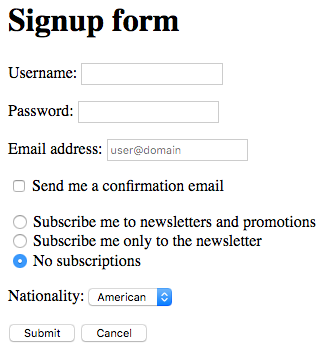

This example contains multiple input zones: text, checkboxes, radio buttons, a dropdown menu, as well as submit and cancel buttons. We'll learn how to deal with each of these elements with JavaScript.

> You might have noticed that the `<form>` tag doesn't have the usual `action` and `method` attributes. These attributes allow you to define the requested server resource when the form is submitted by the user. Since our form will only be handled by JavaScript in the browser, they're not necessary.

### Text zones

#### Access input values

A **text field** allows a user to input text on single or multiple lines. You have two options for defining text fields: a single-line text field is defined in HTML as `<input type="text">`, and a multi-line text input field will be defined via `<textarea>` instead.

Here's the extract from the above code that lets users input a username.

```html
<label for="username">Username</label>:
<input type="text" name="username" id="username" required>
<span id="usernameHelp"></span>
```

In JavaScript, you can access the value of a text field by using the `value` property of the corresponding DOM element. By setting a new value for this property, you'll modify the value shown in the text field.

The following example adds the value "MyCoolUsername" to the text field.

```js
// Define the value of the "username" input field
const usernameElement = document.getElementById("username");
usernameElement.value = "MyCoolUsername";
```

#### Handling focus

When a text zone is selected, it becomes the focused area of the form. You may have noticed field borders turning blue or other effects when you're accessing a particular input area. This helps you know where you are in the form. A user clicking on a text field (or tabbing down into it) kicks off a `focus` event. Additionally, a `focus` event triggers a `blur` event on the field that previously had the focus.

You can use these events to show the user tips related to the current text field, as in the following example:

```js
// Show a tip associated with a selected text area
usernameElement.addEventListener("focus", e => {
  document.getElementById("usernameHelp").textContent = "Enter a unique username!";
});
// Hide the advice when the user moves onto a different field
usernameElement.addEventListener("blur", e => {
  document.getElementById("usernameHelp").textContent = "";
});
```

By selecting the `username` input field, you'll see a helpful message in the HTML `<span>` defined specifically for that purpose and initially empty.


From JavaScript code, you can modify the input target by calling the `focus()` (to give focus) and `blur()` methods (to remove it) on a DOM element.

```js
// Give focus to the "username" input field
usernameElement.focus();
```

Multi-line text fields (`<textarea>` tags) work similarly to `<input>` tags.

> You'll learn how to validate text that a user inputs (to make sure it fits certain criteria) later in this chapter.

### Choice elements

You often see form elements that allow users to make a choice among multiple possibilities. A `change` event will be kicked off once a user changes their choice.

#### Checkboxes

You can add checkboxes to your HTML form by using the tag `<input type="checkbox">`.

Here's the code from the example form that offers a user the choice to receive a confirmation email (or not).

```html
<input type="checkbox" name="confirmation" id="confirmation">
<label for="confirmation">Send me a confirmation email</label>
```

Whenever the box is checked or unchecked by the user, a `change` event is kicked off. The `Event` object associated to this event has a `checked` boolean property that gives the new state of the field (checked or not checked).

The below code handles the `change` event on the checkbox to show a message in the console.

```js
// Show if the email confirmation checkbox is checked
document.getElementById("confirmation").addEventListener("change", e => {
  console.log(`Email confirmation request: ${e.target.checked}`);
});
```

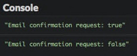

#### Radio buttons

Radio buttons allow users to make a choice out of multiple possibilities. You create radio buttons with `<input type="radio">` tags, which have the same `name` attribute and different `value` attributes.

Here's the extract from the example form that lets a user select between three radio buttons, each representing a subscription option.

```html
<input type="radio" name="subscription" id="newsroom" value="newspromo">
<label for="newsroom">Subscribe me to newsletters and promotions</label>
<br>
<input type="radio" name="subscription" id="news" value="news">
<label for="news">Subscribe me only to the newsletter</label>
<br>
<input type="radio" name="subscription" id="no" value="no" checked>
<label for="no">No subscriptions</label>
<br>
```

The following JavaScript code adds a message to the console when the radio button selection changes.

```js
// Show the subscription type selected via radio button
const subscriptionElements = Array.from(document.getElementsByName("subscription"));
subscriptionElements.forEach(element => {
  element.addEventListener("change", e => {
    console.log(`Selected subscription: ${e.target.value}`);
  });
});
```

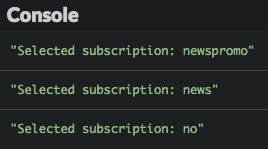

The `target.value` property of the `change` event matches the `value` attribute of the newly selected `<input>` tag.

#### Dropdown lists

A dropdown list is created using the `<select>` tag (for the menu overall) in which you can add `<option>` tags for possible choices.

Here's the code extract from above that lets users choose a nationality:

```html
<label for="nationality">Nationality</label>:
<select name="nationality" id="nationality">
  <option value="US" selected>American</option>
  <option value="FR">French</option>
  <option value="ES">Spanish</option>
  <option value="XX">Other</option>
</select>
```

The following code uses the `change` event triggered on the dropdown list to show the new choice made by the user.

```js
// Show the selected nationality
document.getElementById("nationality").addEventListener("change", e => {
  console.log("Nationality code: " + e.target.value);
});
```

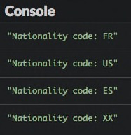

Like with radio buttons, the `target.value` property of the `change` event matches the `value` attribute of the `<option>` tag associated with the new choice -- not the text shown in the dropdown list!

## Forms as DOM elements

### Accessing form fields

A `<form>` tag corresponds to a DOM element. This element has an `elements` property that pulls together all the form input fields. You can use this property to access a field via its `name` attribute or by its index (order of appearance in the form).

The below example shows some information on the input fields of our example form.

```js
// Show some info about the first form element
const formElement = document.querySelector("form");
console.log(`Number of fields: ${formElement.elements.length}`); // 10
console.log(formElement.elements[0].name);       // "username"
console.log(formElement.elements.password.type); // "password"
```

### Submitting a form

A form will be submitted when a user clicks on the submit button, which will have an `<input type="submit">` tag. An `<input type="reset">` tag shows a button that resets the form data.

Here are the two buttons from the sample form.

```html
<input type="submit" value="Submit">
<input type="reset" value="Cancel">
```

When a user submits a form, the default behavior of the browser is to contact a web server and request the resource identified by the `action` attribute of the `<form>` tag, sending form data along the way. Prior to this, a `submit` event is triggered on the DOM element corresponding to the form. By adding a handler for this type of event, you can access form data before it gets sent. You can cancel the request to the server by calling the `preventDefault()` method on the `Event` object associated to the event.

The following code shows in the console all user input in the form, then cancels the request to the server.

```js
// Shows all user input and cancels form data sending
formElement.addEventListener("submit", e => {
  const username = e.target.elements.username.value;
  const password = e.target.elements.password.value;
  const email = e.target.elements.emailAddress.value;
  console.log(`Username: ${username}, password: ${password}, email: ${email}`);

  if (e.target.elements.confirmation.checked) {
    console.log("You asked for email confirmation");
  } else {
    console.log("You didn't asked for email confirmation");
  }
  switch (e.target.elements.subscription.value) {
    case "newspromo":
      console.log("You are subscribed to newsletters and promotions");
      break;
    case "news":
      console.log("You are subscribed to newsletters only");
      break;
    case "no":
      console.log("You are not subscribed to anything");
      break;
    default:
      console.error("Unknown subscription code");
  }
  switch (e.target.elements.nationality.value) {
    case "US":
      console.log("Hello! You are a US citizen");
      break;
    case "FR":
      console.log("Bonjour! You are a French citizen");
      break;
    case "ES":
      console.log("Hola! You are a Spanish citizen");
      break;
    default:
      console.log("Your nationality is unknown");
  }
  e.preventDefault(); // Cancel form data sending
});
```

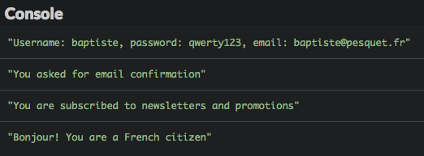

## Form validation

Checking data inputted by users before it gets sent to a server is a major use of JavaScript with web forms. Using form validation, you can improve the user's experience by immediately alerting him on problems with their input. This is also an efficient way to prevent useless server requests with wrong data.

Validation can happen in several ways:

* as input is being entered;
* after input is entered;
* when the user submits the form.

This last technique only involves adding validation in the `submit` event handler for the form: you already know how to do that.  We'll look at the other two techniques one at a time, using the same example form as before.

### Instant validation

Validation while a user is inputting information is based on `input` events, which are triggered on an input zone each time its value changes.

The following code example adds an input event handler on the password field. This handler checks the length (number of characters) of the password being typed and shows a message to the user with specific content and color.

```js
// Validate password length
document.getElementById("password").addEventListener("input", e => {
  const password = e.target.value; // Value of the password field
  let passwordLength = "too short";
  let messageColor = "red"; // Short password => red
  if (password.length >= 8) {
    passwordLength = "adequate";
    messageColor = "green"; // Long password => green
  } else if (password.length >= 4) {
    passwordLength = "moderate";
    messageColor = "orange"; // Moderate password => orange
  }
  const passwordHelpElement = document.getElementById("passwordHelp");
  passwordHelpElement.textContent = `Length: ${passwordLength}`; // helper text
  passwordHelpElement.style.color = messageColor; // helper text color
});
```

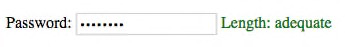

### Post-input validation

A text zone's input is considered finished once focus is lost on the zone, which kicks off a `blur` event that you can use to trigger validation.

Let's imagine that you want to validate the presence of an `@` character in the email address entered by a user. Here's the JavaScript code which shows this validation.

```js
// Checking an email address once it's entered
document.getElementById("emailAddress").addEventListener("blur", e => {
  let emailAddressValidity = "";
  if (e.target.value.indexOf("@") === -1) {
    // the email address doesn't contain @
    emailAddressValidity = "Invalid address";
  }
  document.getElementById("emailHelp").textContent = emailAddressValidity;
});
```

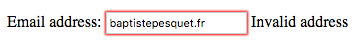

### Regular expressions

The previous validations were quite primitive: many strings containing a `@` character are not valid email addresses. To perform more advanced checks, you can use a powerful tool: **regular expressions**.

A regular expression defines a **pattern** to which strings are compared, searching for matches. Many programming languages support them. A powerful addition to a programmer's toolbelt, they can nonetheless take quite a bit of time to be comfortable with. What follows is just an introduction to the vast domain of regular expression.

Let's get started by trying to create a regular expression checking for the presence of an `@` character inside a string. Here's the associated JavaScript code.

```js
const regex = /@/; // String must contain @
console.log(regex.test(""));  // false
console.log(regex.test("@")); // true
console.log(regex.test("sophie&mail.fr")); // false
console.log(regex.test("sophie@mail.fr")); // true
```

A JavaScript regular expression is defined by placing its pattern between a pair of `/` characters. It's an object whose `test()` method checks matches between the pattern and the string passed as a parameter. If a match is detected, this method returns `true`, and `false` otherwise.

The following table presents some of the numerous possibilities offered by regular expressions.

| Pattern | Matches if | Match  | No match |
|---|---|---|---|
| `abc` | String contains `"abc"` | `"abc"`, `"abcdef"`, `"123abc456"` | `"abdc"`, `"1bca"`, `"adbc"`, `"ABC"` |
| `[abc]` | String contains either `"a"`, `"b"` or `"c"` | `"abc"`, `"daef"`, `"bbb"`, `"12c34"` | `"def"`, `"xyz"`, `"123456"`, `"BBB"` |
| `[a-z]` | String contains a lowercase letter | `"abc"`, `"12f43"`, `"_r_"` | `"123"`, `"ABC"`, `"_-_"` |
| `[0-9]` or `\d` | String contains a digit | `"123"`, `"ab4c"`, `"a56"` | `"abc"` |
| `a.c` | String contains `"a"`, followed by any character, followed by `"c"`  | `"abc"`, `"acc"`, `"12a.c34"` | `"ac"`, `"abbc"`, `"ABC"` |
| `a\.c` | String contains `"a.c"` | `"a.c"`, `"a.cdef"`, `"12a.c34"` | `"ac"`, `"abc"` |
| `a.+c` | String contains `"a"`, followed by at least one character, followed by `"c"` | `"abc"`, `"abbc"`, `"12a$ùc34"` | `"ac"`, `"bbc"` |
| `a.*c` | String contains `"a"`, followed by zero or more characters, followed by `"c"`  | `"abc"`, `"abbc"`, `"ac"` | `"ABC"`, `"bbc"` |

Observing these examples leads us to the following rules:

* Brackets `[]` define a character interval. Any string with at least a character in this interval will match the pattern.

* The `[a-z]` and `[A-Z]` patterns are used to search for the presence of any letter, respectively lowercase and uppercase.

* The `[0-9]` and `\d` patterns are essentially identical and match a digit in a string.

* The `.` character replaces any one character.

* The `\` (*backslash*) character indicates that the following character should be searched as-if. . For example, `\.` is used to match the `.` character itself.

* The `+` character matches one or several instances of the preceding expression.

* The `*` character matches zero, one, or several instances of the preceding expression.

T> The site <https://regex101.com> is useful to understand, test and debug regular expressions.

Let's get back to our example and check the email address field. Here's a possible regular expression (among many others) to test it against: `/.+@.+\..+/`.

Q> Before reading further, can you decode this pattern to understand what conditions a string must respect to match it?

OK, here is the answer. This pattern matches a string that:

* Starts with one or several characters (`.+`).
* Next, contains the `@` character (`@`).
* Next, contains one or several characters (`.+`).
* Next, contains the `.` character (`\.`).
* Finishes with one or several characters (`.+`).

In other words, any string of the form `xxx@yyy.zzz` will match this pattern. This is not the end-all, be-all way to validate an email address, but it's a start.

Check out how to put this solution into practice.

```js
// Check email validity when field loses focus
document.getElementById("emailAddress").addEventListener("blur", e => {
  // Match a string of the form xxx@yyy.zzz
  const emailRegex = /.+@.+\..+/;
  let validityMessage = "";
  if (!emailRegex.test(e.target.value)) {
    validityMessage = "Invalid address";
  }
  document.getElementById("emailHelp").textContent = validityMessage;
});
```

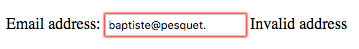

## Coding time!

### Password checker

Start with the following HTML code.

```html
<form>
  <p>
    <label for="password1">Enter the password</label>:
    <input type="password" name="password1" id="password1" required>
  </p>
  <p>
    <label for="password2">Confirm the password</label>:
    <input type="password" name="password2" id="password2" required>
  </p>

  <input type="submit" value="Send">
</form>

<p id="passwordHelp"></p>
```

Write the JavaScript code that validates the password when the user submits the form. The validation rules are as follow:

* The two inputted passwords must be identical.
* The minimal password length is 6 characters.
* The password must contain at least one digit.

The validation result must be shown on the page with an appropriate message in each case.

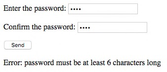

### Character list

The TV show Game of Thrones is about the struggle for power between several noble families. In this exercise, you'll have to show characters belonging to the house selected by the user.

Here is the associated HTML code.

```html
<h1>A few of the Game of Thrones characters</h1>
<form>
  <label for="house">House</label>:
  <select name="house" id="house">
      <option value="" selected>Select a house</option>
  </select>
</form>

<p>
  <ul id="characters"></ul>
</p>
```

The starter JavaScript code is as follows.

```js
// Character list. Each house has a name and a code
const houses = [
  {
    code: "ST",
    name: "Stark"
  },
  {
    code: "LA",
    name: "Lannister"
  },
  {
    code: "BA",
    name: "Baratheon"
  },
  {
    code: "TA",
    name: "Targaryen"
  }
];

// Return an array of characters belonging to a house
const getCharacters = houseCode => {
  switch (houseCode) {
    case "ST":
      return ["Eddard", "Catelyn", "Robb", "Sansa", "Arya", "Jon Snow"];
    case "LA":
      return ["Tywin", "Cersei", "Jaime", "Tyrion"];
    case "BA":
      return ["Robert", "Stannis", "Renly"];
    case "TA":
      return ["Aerys", "Daenerys", "Viserys"];
    default:
      return []; // Empty array
  }
};
```

Complete this code so that:

* The house dropdown list is filled during page load.
* The list of characters is shown whenever the user selects a new house in the list.

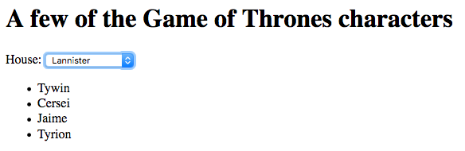

### Autocomplete

In this exercise, you'll have to assist the user in selecting a country. As he enters the country name in an input box, the page shows a list of corresponding countries. Clicking on a suggested country replaces the value in the input box.

> To keep things simple, only countries starting with a `"A"` letter are taken into account.

Here is the HTML code that creates the input box.

```html
<label for="country">Enter a country name</label>:
<input type="text" id="country">
<div id="suggestions"></div>
```

The following CSS code improves the page presentation.

```css
/* Add spacing between each country suggestion */
.suggestion {
    padding-left: 2px;
    padding-right: 2px;
}

/* Change suggestion color when hovering it with the mouse */
.suggestion:hover {
    background-color: #adf;
    cursor: pointer;
}

/* Position the suggestion list just below the input box */
#suggestions {
    position: absolute;
    border: 1px solid black;
    left: 155px;
}
```

At last, the starter JavaScript code defines the list of countries.

```js
// Country list
const countryList = [
  "Afghanistan",
  "Albania",
  "Algeria",
  "Andorra",
  "Angola",
  "Anguilla",
  "Antarctica",
  "Antigua-and-Barbuda",
  "Argentina",
  "Armenia",
  "Aruba",
  "Australia",
  "Autria",
  "Azerbaïjan"
];
```

Complete this code to implement country autocompletion.

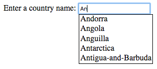
