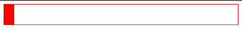
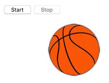

# Animate elements

This chapter will get you started with JavaScript for animations! We'll see how to kick off animations that should run repeatedly or should stop at a certain point.

## TL;DR

* The `setInterval()` function kicks off a repeated action and is called at regular intervals. The `clearInterval()` function stops a repeated action that was launched with `setInterval()`.

* The `setTimeout()` function executes an action once after a certain delay.

* The `requestAnimationFrame()` function asks the browser to execute a function that updates the animation as soon as possible. This works well for real-time animations. The `cancelAnimationFrame()` function stops an in-progress animation that was launched with `requestAnimationFrame()`.

* You can also create web animations via **CSS**.

## Repeat an action at regular intervals

Let's get started with animations by learning how to repeatedly modify an element's content. Here is the associated HTML code.

```html
<h1 id="title">This page will self-destruct in <span id="counter">10</span> second(s)...</h1>
```

And now for the corresponding JavaScript code.

```js
// Count down the counter
const decreaseCounter = () => {
  // Convert counter text to a number
  const counter = Number(counterElement.textContent);
  // Decrease counter by one
  counterElement.textContent = counter - 1;
};

const counterElement = document.getElementById("counter");

// Call the decreaseCounter function every second (1000 milliseconds)
setInterval(decreaseCounter, 1000);
```

[Click here](https://codepen.io/bpesquet/pen/RVWLeY?editors=1010) to see it in action. It works as expected... Kind of: the countdown never stops. We'll fix this a little later.

### Kick off a repeated action

How did the previous example work? The JavaScript code defines a function called `decreaseCounter()` that accesses and then decreases one by one the value of the HTML element named `counter`.

> Calling `Number()` in the function code is mandatory: it converts the counter string into a number, which endows it with subtraction functionality.

The call to `setInterval()` triggers a repeated action. This function lets you call a function at regular intervals. Its parameters are the function to call and the time in milliseconds between each call. The returned value is an ID for the repeated action, which can be used to further modify it.

```js
// Set up a repeated action
const intervalId = setInterval(callbackFunction, timeBetweenEachCall);
```

### Stop a repeated action

Let's try to stop the counter once the countdown is complete. We'll also modify the text of the page. Here's the JavaScript code for our example, updated to produce our desired result:

```js
// Count down the counter until 0
const decreaseCounter = () => {
  // Convert counter text to a number
  const counter = Number(counterElement.textContent);
  if (counter > 1) {
    // Decrease counter by one
    counterElement.textContent = counter - 1;
  }
  else {
    // Cancel the repeated execution
    clearInterval(intervalId);
    // Modify the page title
    const title = document.getElementById("title");
    title.textContent = "BOOM!!";
  }
};

const counterElement = document.getElementById("counter");

// Call the decreaseCounter function every second (1000 milliseconds)
const intervalId = setInterval(decreaseCounter, 1000);
```

[Click here](https://codepen.io/bpesquet/pen/zwvEVz?editors=1010) to see it in action.

In the `decreaseCounter()` function, we only decrease the counter if the current value is higher than 1. If not, we call the function `clearInterval()` and then modify the title of the page.

The `clearInterval()` function lets you cut off repeated code execution. It takes as a parameter the ID of the action set by the call to `setInterval()`.

```js
// Cancel a repeated action set up with setInterval()
clearInterval(intervalId);
```

## Trigger an action after a delay

Imagine that you want to modify the page text after its "explosion" in the previous example. You'd modify our example as follows:

```js
// Count down the counter until 0
const decreaseCounter = () => {
  // Convert counter text to a number
  const counter = Number(counterElement.textContent);
  if (counter > 1) {
    // Decrease counter by one
    counterElement.textContent = counter - 1;
  }
  else {
    // Cancel the repeated execution
    clearInterval(intervalId);
    // Modify the page title
    const titleElement = document.getElementById("title");
    titleElement.textContent = "BOOM!!";
    // Modify the title after 2 seconds
    setTimeout(() => {
      titleElement.textContent = "Everything's broken now :(";
    }, 2000);
  }
};

const counterElement = document.getElementById("counter");

// Call the decreaseCounter function every second (1000 milliseconds)
const intervalId = setInterval(decreaseCounter, 1000);
```

[Click here](https://codepen.io/bpesquet/pen/ybYPbb?editors=1010) to see it in action.

Once the countdown has finished, we call the `setTimeout()` function to set a new page title after a 2 second (2000 millisecond) delay.

The `setTimeout()` function lets you execute a function once after a particular delay, expressed in milliseconds.

```js
// Execute an action once, after a delay
setTimeout(callbackFunction, timeBeforeCall);
```

## Animate page elements

The previous solutions were convenient for making our pages a bit more dynamic, but weren't enough for adding real-time animation. Let's look at a better-performing solution.

Take, for example, the movement of a `<div>` type element from left to right on the page. We start with the following HTML and CSS code that display a red block on the page.

```html
<div id="frame">
  <div id="block"></div>
</div>
```

```css
#frame {
  border: 1px solid red;
}

#block {
  width: 20px;
  height: 40px;
  background: red;
  position: relative;
}
```



And here is the JavaScript code that lets you move the red block.

```js
// Move the block to the left
const moveBlock = () => {
  // Convert the left position of the block (value of the form "XXpx") to a number
  const xBlock = parseFloat(getComputedStyle(blockElement).left);
  // Move the block to the right
  blockElement.style.left = (xBlock + movement) + "px";
  // Have the browser call moveBlock as soon as possible
  requestAnimationFrame(moveBlock);
};

const blockElement = document.getElementById("block");

// Movement value in pixels
const movement = 7;

// Start the animation
requestAnimationFrame(moveBlock);
```

[Click here](https://codepen.io/bpesquet/pen/RVWxbW) to see it in action.

Upon page load, the red block moves (indefinitely) from left to right.

### Start an animation

The example code defines a function called `moveBlock()` which moves the block horizontally to the right. It grabs the current position of the block's left border than adds the value contained in the `movement` variable. Next, the code calls the `requestAnimationFrame()` method to keep the animation going.

Position values are written in pixels. These are the strings you saw that resemble "XXpx," which requires the use of the JavaScript `parseFloat()` function to convert numeric values before making calculations.

> Don't use `Number()` to convert a string with `"px"` into a numerical value. This won't work, and you'll get a `NaN` value (*Not a Number*) as a result!

The `requestAnimationFrame()` function lets you ask the browser to execute a function as soon as possible, which updates the animation. It's the browser's job to make the animation as smooth as possible. The returned value of `requestAnimationFrame()` is an ID for the animation, which can be used to further modify it.

Here is how `requestAnimationFrame()` is used in combination with an animation function.

```js
const animate = () => {
    // Animation code
    // ...
    // At end of animation, request another one
    animationId = requestAnimationFrame(animate);
};

// Animation start
let animationId = requestAnimationFrame(animate);
```

### Stop an animation

Let's now see how to stop the block before it reaches the border of the frame that contains it. We'll have to verify that the left border position is less than the width of the frame, bearing in mind the thickness of the block itself.

Here's the updated JavaScript code.

```js
// Move the block to the right, all the way to the end of the frame
const moveBlock = () => {
  // Convert the left position of the block (value of the form "XXpx") to a number
  const xBlock = parseFloat(getComputedStyle(blockElement).left);
  // Convert the width of the frame (value of the form "XXpx") to a number
  const xMax = parseFloat(getComputedStyle(frame).width);
  // If the block isn't already to the end of the frame
  if (xBlock + blockWidth <= xMax) {
    // Block movement
    blockElement.style.left = (xBlock + movement) + "px";
    animationId = requestAnimationFrame(moveBlock);
  }
  else {
    // Cancel the animation
    cancelAnimationFrame(animationId);
  }
};

const blockElement = document.getElementById("block");
// Convert the block width (value of the form "XXpx") to a number
const blockWidth = parseFloat(getComputedStyle(block).width);

// Movement value in pixels
const movement = 7;

// Start the animation
let animationId = requestAnimationFrame(moveBlock);
```

[Click here](https://codepen.io/bpesquet/pen/rmOpZE) to see it in action.

The new `moveBlock()` function checks that the block has arrived at the end of the frame before moving. If that's the case, the animation stops via a call to `cancelAnimationFrame()`.

The `cancelAnimationFrame()` functions stops the animation and takes the ID of the animation set by a prior call to `requestAnimationFrame()`.

```js
// Stop an animation
cancelAnimationFrame(animationID);
```

### An alternative: CSS animations

You just learned about the different possibilities that JavaScript offers for animating web pages. Just bear in mind there's another alternative: CSS.

> This paragraph barely scratches the surface of CSS animations.

Let's check out how to get a similar effect as the previous example by using CSS instead of JavaScript. Remove any JavaScript code from your example and modify your CSS code as follows.

```css
#frame {
  border: 1px solid red;
}

#block {
  width: 20px;
  height: 40px;
  background: red;
  position: relative;
  margin-left: -20px; /* Negative margin to simplify position calculations */
  animation-name: moveBlock; /* Name of animation */
  animation-duration: 6s; /* Length of animation */
  animation-fill-mode: forwards; /* Let the block in its final position */
}

@keyframes moveBlock {
  from {
    /* Initial position: to the left of the frame (taking negative margin into account) */
    left: 20px;
  }
  to {
    /* Final position: within the right side of the frame (taking negative margin into account) */
    left: 100%;
  }
}
```

[Click here](https://codepen.io/bpesquet/pen/wdKyQb?editors=1100) to see it in action.

This code defines a CSS animation named `moveBlock()`, which moves the block from the left to the right side of its containing frame. The result is virtually identical to the JavaScript version.

## Choosing the right animation technique

Now, decision time. How should you choose between `setInterval()`, `requestAnimationFrame()`, or CSS to animate your page? The answer depends on how complex your animation is. In theory, CSS animations are more efficient performance-wise, but you can't do everything with them.

Here's how you might want to approach your decision:

* Use `setInterval()` if the animation isn't in real-time and should just happen at regular intervals.
* Favor CSS if the animation happens in real-time and can be managed with it.
* Use `requestAnimationFrame()` for any other case.

## Coding time!

### Chronometer

Write an interactive web page with a button to start and stop a chronometer counting the number of elapsed seconds.

### Bouncing ball

The goal of this exercise is to make a basketball bounce across the screen. You can download the ball image [here](https://raw.githubusercontent.com/bpesquet/thejsway/master/resources/basketball.jpg).

Start with the following HTML and CSS content.

```html
<p>
  <button id="start">Start</button>
  <button id="stop" disabled>Stop</button>
</p>

<div id="frame">
  <!-- Update the "src" attribute if you downloaded the image locally -->
  
</div>
```

```css
#ball {
    position: relative;
    left: 0px;
}
```

Write the JavaScript code that makes the ball bounce horizontally.



With your solution, create a variable with values 1 or -1 that dictates the direction in which the ball should move.
