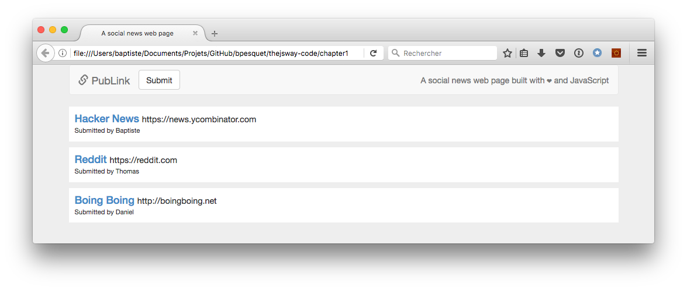
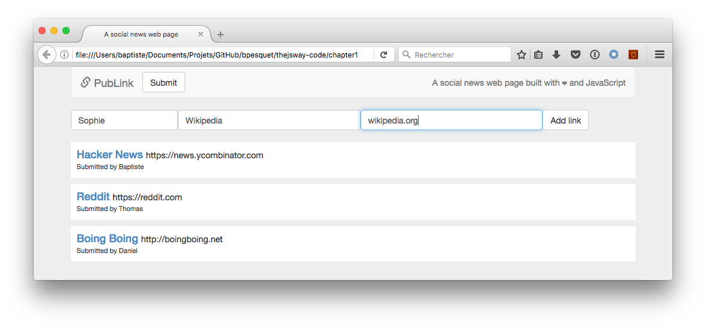
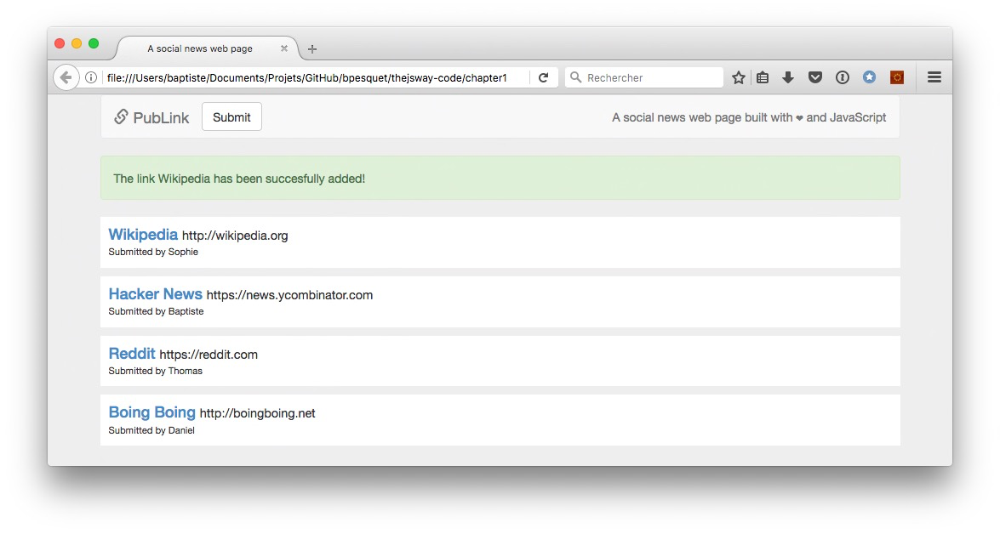
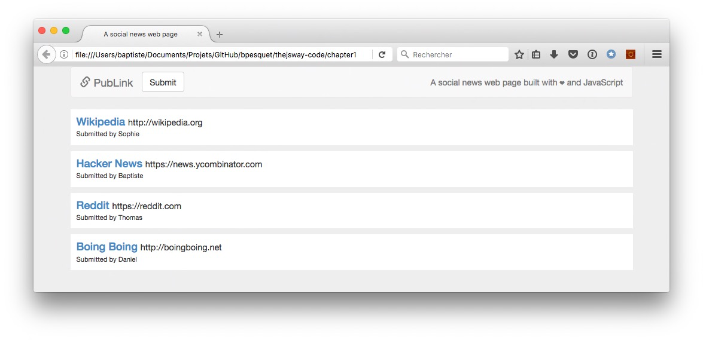

# Project: a social news web page

You know now enough JavaScript and DOM to go ahead and create interactive web pages for real!

## Objective

This project builds upon the social news program you created previously. This time, the objective is to make a social news web page.

> The general idea and page layout for this project are inspired by the [Discover Meteor book](https://www.discovermeteor.com/)'s example application.

## Functional requirements

* A link is defined by its title, its URL and its author (submitter).
* If a new link URL does not start with `"http://"` or `"https://"`, `"http://"` is automatically added at its beginning.
* The web page displays a list of at least three already existing links.
* A button exists for the user to submit a new link. When clicked, a form appears before the link list to input the new link properties (author, title and URL).
* In this form, all link fields are mandatory.
* When the new link is validated by the user, it is displayed at the top of the link list, replacing the form. A message indicates the success of the operation, then disappears after two seconds.

## Technical requirements

* You should reuse any useful code from the previous project.
* All your code should be correctly indented.
* Names should be wisely chosen and adhere to the camelCase convention.
* Code duplication should be avoided.

## Starter code

Because this is first and foremost a JavaScript project, here is the complete HTML/CSS code of the web page. It is also online as a [CodePen](https://codepen.io/bpesquet/pen/pPyxLG/).

> This web page uses the [Bootstrap](http://getbootstrap.com/) framework to improve presentation and make it responsive. However, Bootstrap knowledge is not mandatory to achieve the desired result. You can pretty much ignore it and code ahead.

```html
<!doctype html>
<html>

<head>
  <meta charset="utf-8">
  <!-- Latest compiled and minified CSS -->
  <link rel="stylesheet" href="https://maxcdn.bootstrapcdn.com/bootstrap/3.3.7/css/bootstrap.min.css">
  <link href="../css/publink.css" rel="stylesheet" type="text/css">
  <title>A social news web page</title>
</head>

<body>
  <div class="container">

    <!-- Bootstrap navigation bar -->
    <nav class="navbar navbar-default">
      <div class="container-fluid">
        <div class="navbar-header">
          <button type="button" class="navbar-toggle collapsed" data-toggle="collapse" data-target="#bs-example-navbar-collapse-1" aria-expanded="false">
            <span class="sr-only">Toggle navigation</span>
            <span class="icon-bar"></span>
            <span class="icon-bar"></span>
            <span class="icon-bar"></span>
        </button>
          <a class="navbar-brand" href="#"><span class="glyphicon glyphicon-link" aria-hidden="true"></span> PubLink</a>
        </div>
        <div class="collapse navbar-collapse" id="bs-example-navbar-collapse-1">
          <button type="button" id="submitButton" class="btn btn-default navbar-btn">Submit</button>
          <p class="navbar-text navbar-right">A social news web page built with ❤ and JavaScript</p>
        </div>
      </div>
    </nav>

    <div id="content">
      <!-- Dynamic content goes here -->
    </div>

  </div>

  <!-- JavaScript code goes into this file -->
  <script src="../js/publink.js"></script>

  <!-- jQuery (necessary for Bootstrap's JavaScript plugins) -->
  <script src="https://ajax.googleapis.com/ajax/libs/jquery/1.12.4/jquery.min.js"></script>
  <!-- Include all compiled plugins (below), or include individual files as needed -->
  <script src="https://maxcdn.bootstrapcdn.com/bootstrap/3.3.7/js/bootstrap.min.js"></script>
</body>

</html>
```

```css
body {
  background-color: #eee;
}

/* Main link element (<div> tag) */
.link {
  background: white;
  padding: 10px;
  margin-bottom: 10px;
}

/* Link title (<a> tag) */
.linkTitle {
  color: #428bca;
  text-decoration: none;
  margin-right: 5px;
}
.linkTitle:hover {
  text-decoration: none;
}

/* Link URL (<span> tag) */
.linkUrl {
  font-weight: normal;
  font-size: 80%;
}

/* Link headline containing title & URL (<h4> tag) */
.linkHeadline {
  margin: 0;
}

/* Link author (<span> tag) */
.linkAuthor {
  font-weight: normal;
  font-size: 80%;
}

.linkForm {
  margin-bottom: 20px;
}
```

## Expected result

Here are a few screenshots of the expected result.








