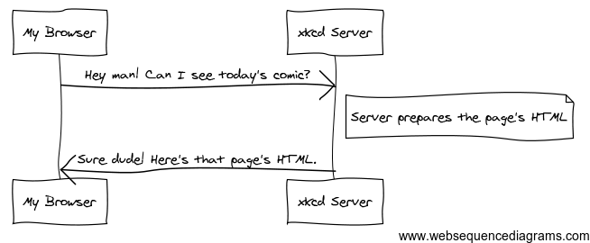
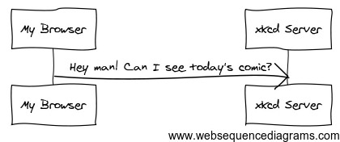

# Web development essentials

Understanding how clients and servers exchange data is crucial for every web developer.

## TL;DR

## How the Web works

Surfing the web is easy as pie. Let's say you want to read today's comic from the popular web site [xkcd](https://xkcd.com). You type the text `"xkcd.com"` in your browser's address bar and voila, the comic appears (assuming no network issues).

Let's try to understand what's going on behind the scene.

### Web servers

To be online, a web site has to be published on a **server**. This is a special kind of machine whose task is to listen and answer to the demands of clients. A server that publishes resources on the Web is logically called a **web server**.

More precisely, a web server machine runs a particular software program (also called a web server) able to publish web sites. The most popular ones are [Apache](http://httpd.apache.org/), [Microsoft IIS](http://www.iis.net/) and [nginx](http://nginx.org).

### Web clients

The machine asking a server for a resource is called a **web client**. Actually, the real client is a software program running on the machine. a well-known type of web client is the **browser**, a program specialized in displaying web pages. Famous web browsers include [Mozilla Firefox](https://www.mozilla.org/firefox), [Chrome](https://www.google.com/chrome/browser/), [Safari](https://www.apple.com/safari/) and [Opera](http://www.opera.com/fr).

Not all web clients are browsers, through. For example, search engines robots and mobile applications also contact servers and ask them for content.

### Communications between clients and servers

Data exchanges on the Web follow a **request/response** paradigm.



1. Th exchange is started by the client, which sends a **request** to the server to access a particuler web resource.
1. The server prepares a result for the request.
1. The server send backs this result to the client.

To understand each other, web clients and servers use a common protocol: HTTP.

## HTTP, the web protocol

HTTP, which stands for **HyperText Transfer Protocol**, is the technical foundation of the World Wide Web. It is a **protocal**, a language that allows two machines to communicate with each other.

> HTTPS is the secured version of HTTP.

Technically speaking, HTTP is a pretty simple procotol based on **textual commands**.

### Anatomy of an HTTP request

Let's study the first part of the web exchange described previously: the request.



This HTTP request comes under the form as a multi-line piece of text similar to the following one.

```http
GET / HTTP/1.1
Host: xkcd.com
Accept: text/html
User-Agent: Mozilla/5.0 (Macintosh)
...
```

The most important line is the first one. It contains:

* The HTTP **method** (the request type, also named **command**). Here, the `GET` method indicates a resource access request.
* The requested **resource**. Here, `/` (root symbol) indicates a request for the default document.
* The HTTP protocal **version**, here 1.1.

The other lines of text are called **header fields**. They give more information about the client request: server name (`Host`), accepted content types (`Accept`), client software details (`User-Agent`). They are many other possible header fields.

The main HTTP methods are `GET` to access a resource and `POST` to push some information on the server. Other ones exist, such as `HEAD`, `PUT` or `DELETE`.

### Anatomy of an HTTP response

When receiving an HTTP request, the server looks inside for information. It then builds an appropriate answer and sends it back.


The HTTP response sent by the server looks something like this.

```http
HTTP/1.1 200 OK
Date: Fri, 22 Apr 2017 18:05:05 GMT
Server: Apache/2.2
Content-Type: text/html

<html>
<!-- HTML code of the page -->
<!-- ... -->
</html>
```

The first line contains the response **status**: a three-digit number indicating the request result. Other lines are **header fields** (`Date`, `Content-Type`, etc) giving additional info about the response.

An HTTP response might also include data. In this example, it contains the HTML code of the web page corresponding to the requested resource.

### HTTP status codes

The HTTP status codes belong to different families, depending on their first digit.

Family | Meaning | Examples
--------|---------------|---------
**1xx** | Information |
**2xx** | Success | 200: request handled successfully
**3xx** | Redirection |
**4xx** | Client error | 404: resource not found
**5xx** | Server error | 500: internal server error

> For a more in-depth prsentation of the HTTP protocol, head over to the [Mozilla Developer Network](https://developer.mozilla.org/en-US/docs/Web/HTTP/Overview).

### Addressing a resource with an URL

Web sites are ususally accessed using their address, a piece of text of the form `http://www.mywebsite.com/myresourcepath/myresource`. This addresse can be plsit into several subparts

* `http://` means an access through the HTTP protocal.
* `www.mywebsite.com` is the **domain name** of the web site.
* `/myresourcepath/myresource` is the **path** of the requested resource.

An address like this one is called an URL, or **Uniform Resource Locator**. An URL uniquely describes a web resource and the way to request it.

## From web sites to web apps

### The web development models

In a traditional web development scenario, when you click a link or submit a form, your browser sends to the server a request that returns a full new web page tailored to your request. This model is subject to longer load times and limited interactivity.

Another web development model aims to avoid transmitting a whole new page for each user action. Here's how things works in that model:

* User actions on the page are intercepted through JavaScript event handlers.
* HTTP requests are sent to the server without interrupting the navigation on the page.
* Only the needed portions of the page are updated with the requests' results.

Albeit more challenging, this web development model can lead to limited resource loads, improved interactivity and an user experience nearly on par with native applications.

The set of technologies enabling the creation of web applications is codenamed **AJAX** (*Aynchronous JavaScript and XML*). An AJAX call is an asynchronous HTTP request made to retrieve or send data from/to a server.

### Synchronous Vs asynchronous requests

In a **synchronous** exchange, the asker waits until he gets the needed info. A telephone call is an example of a synchronous exchange.

On the contrary, the asker in an **asynchronous** exchange can do something else while waiting for the completion of his request. Email is an example of such an exchange.

The traditional web development model uses synchronous requests: the web client is blocked while waiting for the server to complete its request. The AJAX model uses asynchronous requests to improve the user experience.

### Cross-domain requests

## JSON, a data format for the web
