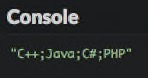
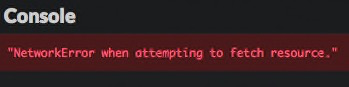
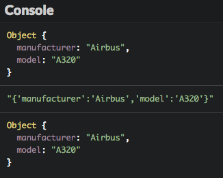
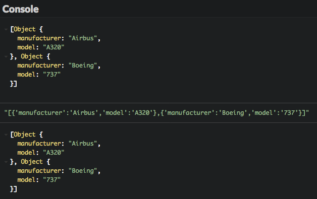
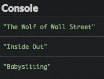
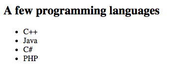
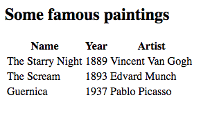

# Query a web server

This chapter will teach you how to retrieve data from a web server through HTTP requests.

## TL;DR

* HTTP requests sent to a web server need to be **asynchronous** to prevent blocking the client application while waiting for the server's response.

* The JavaScript `fetch()` method is replacing `XMLHttpRequest` as the go-to way of creating an asynchronous request. Its `then()` and `catch()` methods respectively handle the success and failure of the request.

```js
// Sends an asynchronous HTTP request to the target url
fetch(url)
  .then(() => {
    // Code called in the future when the request ends successfully
  })
  .catch(() => {
    // Code called in the future when an errors occurs during the request
  });
```

* The `fetch()` method demonstrates the use of **promises** to write asynchronous code in JavaScript. A promise is a wrapper for an operation whose result might be available in the future. It is either *pending* (initial state),  *fulfilled* (operation completed successfully) or *rejected* (operation failed).

* JavaScript deals with JSON content with the `JSON.parse()` (to transform a JSON text into an object) and `JSON.stringify()` method (to do the opposite).

* The result of a call to `fetch()` is an HTTP `Response` object. Its `text()` and `json()` methods are used to read content as plain text or JSON data. These two methods return a promise that resolves either as a string or as JSON.

## Creating asynchronous HTTP requests in JavaScript

In the previous chapter, we discussed synchronous vs asynchronous requests. Since synchronous requests block the calling process until their result is received, only asynchronous HTTP requests should be used when building a web application. However, asynchronous code can be tricky to write and to understand, since statements won't be executed in a linear and sequential fashion like with synchronous operations.

### The `fetch()` method

The best way to send asynchronous HTTP requests in JavaScript is to use the `fetch()` method. Here is its general usage form.

```js
// Sends an asynchronous HTTP request to the target url
fetch(url)
  .then(() => {
    // Code called in the future when the request ends successfully
  })
  .catch(() => {
    // Code called in the future when an errors occurs during the request
  });
```

> You might encounter JavaScript code that uses an object called `XMLHttpRequest` to perform HTTP operations. This is a more ancient technique now replaced by `fetch()`.

### Under the hood: promises

When the `fetch()` method is executed, it immediately returns a **promise**, which is a wrapper for an operation whose result might be available in the future. A promise is in one of these states:

* *pending*: initial state, not fulfilled or rejected.
* *fulfilled*: meaning that the operation completed successfully.
* *rejected*: meaning that the operation failed.

A JavaScript promise is an object with `then()` and `catch()` methods. `then()` is called when the promise is **fulfilled**. It takes the operation result as a parameter. On the contrary, `catch()` is called when the promise is **rejected**.

What's great about promises is that they can be chained together. Here's how you could perform a series of asynchronous operations in JavaScript.

```js
getData()
  .then(a => filterData(a)) // Called asynchronously when getData() returns
  .then(b => processData(b)) // Called asynchronously when filterData() returns
  .then(c => displayData(c)) // Called asynchronously when processData() returns
  // ...
```

### Example: retrieving a text file

Let's start with a very basic example: displaying the content of a text file located on a web server. The file is [hosted on GitHub](https://raw.githubusercontent.com/bpesquet/thejsway/master/resources/languages.txt) and it has the following content.

```text
C++;Java;C#;PHP
```

Here's how to do this in JavaScript using `fetch()`.

```js
fetch(
  "https://raw.githubusercontent.com/bpesquet/thejsway/master/resources/languages.txt"
)
  .then(response => response.text()) // Access and return response's text content
  .then(text => {
    console.log(text); // Display file content in the console
  });

```



The result of the asynchronous HTTP request created by `fetch()` comes under the the form of a `Response` object. This object has several methods to deal with the response of the HTTP call. The `text()` method used in this example reads the response's text content and returns another promise. Its result is managed by the second `then()` method, which simply displays the file's textual content in the console.

To learn more about the `Response` object, consult, as usual, the [Mozilla Developer Network](https://developer.mozilla.org/en-US/docs/Web/API/Response).

### Dealing with errors

By nature, external HTTP requests are subject to errors: network failure, missing resource, etc. Handling these errors is done by adding a `catch()` method to the `fetch()` call. A basic level of error handling is to log the error message in the console.

```js
fetch("http://non-existent-resource")
  .catch(err => {
    console.error(err.message);
  });
```



## Handling JSON data

Let's advance to a more interesting and realistic scenario. Very often, data available on web servers are published under the JSON format.

### JSON and JavaScript

The JavaScript language offers native support for the JSON format:

* The `JSON.parse()` method transforms a JSON string into a JavaScript object.
* On the contrary, the `JSON.stringify()` method transforms a JavaScript object into a JSON string.

```js
// Define a JavaScript object
const plane = {
  manufacturer: "Airbus",
  model: "A320"
};
console.log(plane); // Display the object

const planeText = JSON.stringify(plane);
console.log(planeText); // Display the object as a JSON string

console.log(JSON.parse(planeText)); // Display the object
```



These methods can also handle JSON arrays.

```js
// Define an array containing two objects
const planes = [
  {
    manufacturer: "Airbus",
    model: "A320"
  },
  {
    manufacturer: "Boeing",
    model: "737"
  }
];
console.log(planes); // Display the array of objects

const planesText = JSON.stringify(planes);
console.log(planesText); // Display the array as a JSON string

console.log(JSON.parse(planesText)); // Display the array of objects
```



### Example: retrieving JSON content

 For example, the following JSON file `movies.json` contains information about some movies. This file defines an array containing three objects.

```json
[
  {
    "title": "The Wolf of Wall Street",
    "year": "2013",
    "author": "Martin Scorsese"
  },
  {
    "title": "Inside Out",
    "year": "2015",
    "author": "Pete Docter"
  },
  {
    "title": "Babysitting",
    "year": "2013",
    "author": "Philippe Lacheau and Nicolas Benamou"
  }
]
```

Here's how to retrieve this file from its URL and display each movie title in the console.

```js
fetch(
  "https://raw.githubusercontent.com/bpesquet/thejsway/master/resources/movies.json"
)
  .then(response => response.json()) // Access and return response's JSON content
  .then(movies => {
    // Iterate on the movie array
    movies.forEach(movie => {
      // Display title of each movie
      console.log(movie.title);
    });
  })
  .catch(err => {
    console.error(err.message);
  });
```



The `json()` method of the HTTP `Response` object returns a promise that resolves with the result of parsing the response text as JSON. As such, the `movies` parameter of the second `then()` is a plain JavaScript array that can be iterated upon.

## Coding time!

### Language list

The objective of this exercise is to display the languages of the previous file `languages.txt` on a web page. Here is the starter HTML code.

```html
<h2>A few programming languages</h2>
<ul id="languageList">
</ul>
```

Write the JavaScript code that fetches the file from the web server and fills the HTML list.



### Famous paintings

In this exercise, you'll show information about some famous paintings on a web page table. Information about the paintings is located at URL:

<https://raw.githubusercontent.com/bpesquet/thejsway/master/resources/paintings.json>

 It has the following content.

```json
[
  {
    "name": "The Starry Night",
    "year": "1889",
    "artist": "Vincent Van Gogh"
  },
  {
    "name": "The Scream",
    "year": "1893",
    "artist": "Edvard Munch"
  },
  {
    "name": "Guernica",
    "year": "1937",
    "artist": "Pablo Picasso"
  }
]
```

Start from the following HTML code.

```html
<h2>Some famous paintings</h2>
<table id="paintings">
    <tr>
        <th>Name</th>
        <th>Year</th>
        <th>Artist</th>
    </tr>
</table>
```

Write the JavaScript code that fills a table with details about the paintings.


