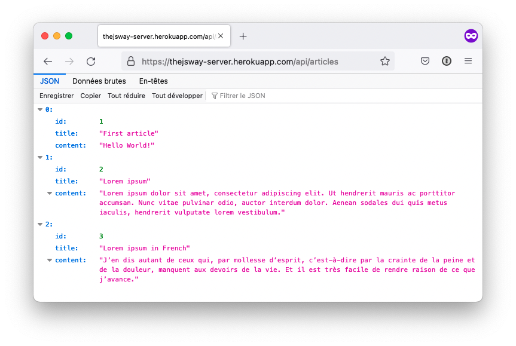
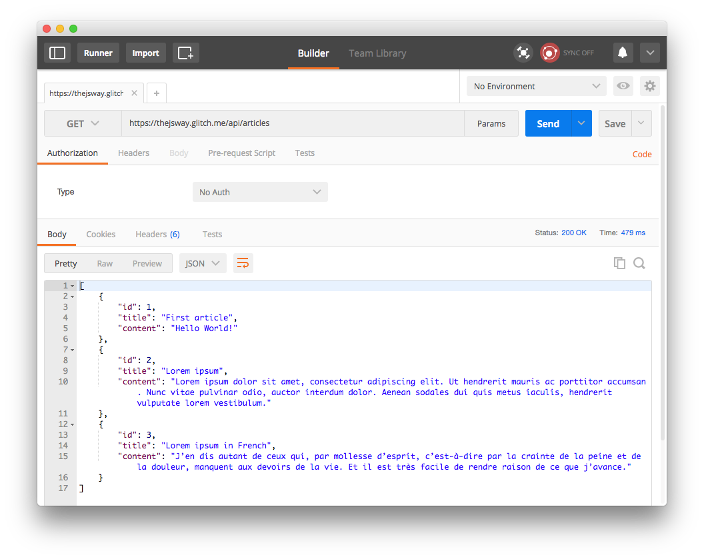
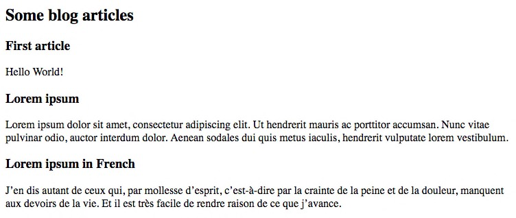
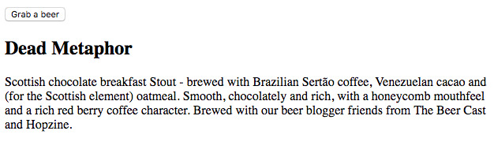
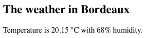
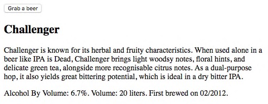
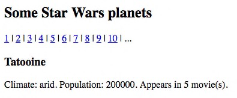

# Use web APIs

In this chapter, you'll learn how to leverage real-world web services in your applications.

## TL;DR

* An **API** or **Application Programming Interface** is a set of well-defined services offered by a software program or service to others. Developers use them to integrate external technologies or services into their applications.

* A **web API** is an API accessible through web technologies (HTTP or HTTPS). They often use JSON as their data format.

* A web API can be consumed programmatically using an **AJAX call**. Before that, the API must be checked out and its documentation studied in order to understand how it works and what it returns.

```js
// Fetch data from the API
fetch("http://my-api-url")
  .then(response => response.json()) // Translate JSON into JavaScript
  .then(content => {
    // Use returned content
    // ...
  })
  .catch(err => {
    console.error(err.message);
  });
```

* A ever growing number of services are exposed through web APIs. Some are open, others require the **authentication** of the client, for example with an **access key**.

## Introducing web APIs

The **API** acronym stands for **Application Programming Interface**. An API is an entry point offered by a software program or service to other programs. It is a set of well-defined methods of communication. Through APIs, developers can easily integrate external technologies or services into their applications.

APIs exist under a wide variety of forms. As an example, the Document Object Model is itself an API for interacting programmatically with a web page: it defines methods for navigating and updating the page structure.

A **web API** is an API available on the Web and accessible through web technologies, namely the HTTP protocol or its secured counterpart HTTPS. Web APIs are a key technology for software interactions: whenever you authenticate into a website using your Google account, or click a button to post something on your favorite social network, you're using them. A ever growing number of services are exposed through web APIs, forming a thriving ecosystem for building digital products.

## Consuming a web API

To be able to use a web API, you have to know its address and its usage mode. Most of web APIs are accessible via an **URL** and use the **JSON** format for data exchanges.

### Checking out an API

The first web API you'll use here simulates a blog and exposes a series of articles. Its URL is <https://thejsway-server.herokuapp.com/api/articles>. Opening it in a browser shows the JSON data returned by the API.



This raw result is not easy to read. For an easier interaction with web API, using a specialized tool like [Postman](https://www.getpostman.com) or [RESTClient](https://addons.mozilla.org/fr/firefox/addon/restclient/) is strongly recommended. Here's how the result looks like on Postman.



This web API returns an array containing some articles. Each article corresponds to a JavaScript object with `id`, `title` and `content` properties.

> Curious about creating such an API? You'll learn how to build this very service (and others) in an upcoming chapter.

Real-world APIs are almost always accompanied by an online **documentation** showing how to use it. Studying this documentation is essential for using the API flawlessly.

### Calling an API with JavaScript

Now that we know the address and data format of our example API, let's try to show its result on a web page. To do so, we'll leverage our AJAX knowledge from the previous chapter. Check out the following example, which shows how to access the article list from the API.

Here's the HTML code for the page.

```html
<h2> Some blog articles</h2>
<div id="articles"></div>
```

And here's the associated JavaScript code.

```js
// Fetch data from the API
fetch("https://thejsway-server.herokuapp.com/api/articles")
  .then(response => response.json()) // Translate JSON into JavaScript
  .then(articles => {
    articles.forEach(article => {
      // Create title element
      const titleElement = document.createElement("h3");
      titleElement.textContent = article.title;
      // Create content element
      const contentElement = document.createElement("p");
      contentElement.textContent = article.content;
      // Add title and content to the page
      const articlesElement = document.getElementById("articles");
      articlesElement.appendChild(titleElement);
      articlesElement.appendChild(contentElement);
    });
  })
  .catch(err => {
    console.error(err.message);
  });
```

Using a web API works just like querying a web server: fetching the API URL, translating the JSON response into a JavaScript array and iterating on it.

Here is the resulting web content.



## Web APIs and authentication

Web APIs can be classified into two categories:

* Open APIs that don't need any authentication to be used.
* APIs requiring the consumer to authenticate himself through various methods.

### Open APIs

These APIs are free to use by anyone, anyhow. To prevent abuse, they often use **rate limiting** instead: the number of calls from one specific source (identified by its IP address) is capped.

Many public institutions like the [British Police](https://data.police.uk/docs/) or the [French government](https://www.data.gouv.fr/) publish data to citizens using open APIs.

There is also a lot of fun little APIs out there. For example, the [Punk API](https://punkapi.com) lets you search into a huge catalog of beers. Here's how to renew your drinking habits by getting a random one from this API.

```html
<button id="grabButton">Grab a beer</button>
<div id="beer"></div>
```

```js
// Anonymous function for retrieving and displaying a random beer
const grabRandomBeer = () => {
  // Fetching random beer data from API
  fetch("https://api.punkapi.com/v2/beers/random")
    .then(response => response.json())
    .then(beers => {
      // API returns an array containg only one element: we get it
      const beer = beers[0];
      // Creating DOM element for some beer properties
      const nameElement = document.createElement("h2");
      nameElement.textContent = beer.name;
      const descriptionElement = document.createElement("p");
      descriptionElement.textContent = beer.description;
      // Clear previous beer data
      const beerElement = document.getElementById("beer");
      beerElement.innerHTML = "";
      // Add beer info to the page
      beerElement.appendChild(nameElement);
      beerElement.appendChild(descriptionElement);
    })
    .catch(err => {
      console.error(err.message);
    });
};

// Grab a new beer when clicking the button
document.getElementById("grabButton").addEventListener("click", grabRandomBeer);
```

Each time the `"Grab a beer"` button is clicked on the web page, an anonymous function is called to retrieve and display a random beer.



### Key-based authentication

Another class of APIs requires the client to authenticate himself when accessing the service. Authentication can be done via several techniques. In this paragraph, we'll use the simplest one: access key. An **access key** is a generated string containing characters and digits and associated to a user.

> Of course, authentication-based APIs often also have rate limits.

There is no universal standard regarding access keys. Each service is free to use its own custom format. The client must provide its access key when accessing the API, generally by adding it at the end of the API URL.

A prerequisite for using any key-based web API is to generate oneself an access key for this particular service.

Let's put this into practice for obtaining about the current weather in your area. To do so, you could simply look outside the window, but it's way cooler to use the [Weather Underground](https://www.wunderground.com/weather/api) web service instead.

This service has a key-based API for retrieving the weather in any place. To obtain it, you'll have to sign up as a user (it's free) and generate a new API key by registering your application.

Once you've done this, weather data is available through an URL of the form <http://api.wunderground.com/api/ACCESS_KEY/conditions/q/COUNTRY/TOWN.json>. Replace `ACCESS_KEY`, `COUNTRY` and `TOWN` with your own settings, and you should obtain the weather in your surroundings.

The necessary first step is to check out and understand the API data format. The result of an API call looks like this when getting weather for Bordeaux, France.

```json
{
  "response": {
    "version": "0.1",
    "termsofService": "http://www.wunderground.com/weather/api/d/terms.html",
    "features": {
      "conditions": 1
    }
  },
  "current_observation": {
    "image": {
      "url": "http://icons.wxug.com/graphics/wu2/logo_130x80.png",
      "title": "Weather Underground",
      "link": "http://www.wunderground.com"
    },
    "display_location": {
      "full": "Bordeaux, France",
      "city": "Bordeaux",
      "state": "33",
      ...
    },
    "observation_location": {
      "full": "Bordeaux, ",
      "city": "Bordeaux",
      "state": "",
      "country": "FR",
      ...
    },
    "estimated": {},
    "station_id": "LFBD",
    "observation_time": "Last Updated on June 28, 9:30 PM CEST",
    ...
  }
}

```

Now we just have to call the API from our JavaScript code and displays the main result on a web page.

```html
<h2>The weather in</h2>
<div id="weather"></div>
```

```js
fetch(
  "http://api.wunderground.com/api/YOUR_OWN_KEY/conditions/q/france/bordeaux.json"
)
  .then(response => response.json())
  .then(weather => {
    // Access some weather properties
    const location = weather.current_observation.display_location.full;
    const temperature = weather.current_observation.temp_c;
    const humidity = weather.current_observation.relative_humidity;
    const imageUrl = weather.current_observation.icon_url;
    // Create DOM elements for properties
    const summaryElement = document.createElement("div");
    summaryElement.textContent = `Temperature is ${temperature} °C with ${humidity} humidity.`;
    const imageElement = document.createElement("img");
    imageElement.src = imageUrl;
    // Add location to title
    document.querySelector("h2").textContent += ` ${location}`;
    // Add elements to the page
    const weatherElement = document.getElementById("weather");
    weatherElement.appendChild(summaryElement);
    weatherElement.appendChild(imageElement);
  })
  .catch(err => {
    console.error(err.message);
  });
```



## Coding time!

### More beer please

Improve the previous Punk API example to display additional information about the showcased beer : alcohol by volume (ABV), volume and date of first brewage.



### GitHub profile

The ubiquitous code sharing platform [GitHub](https://github.com) has a public API. The goal of this exercise is to display some information about a GitHub user, identified by his login. The API documentation is available [here](https://developer.github.com/v3/users/).

Use this API to show the profile picture, name and website address of a GitHub user whose login is entered in a text box.


> You can test your code by using the GitHub logins of prominent JS community members like `brendaneich` (JavaScript's father), `douglascrockford` or `vjeux`.

### Star Wars universe

The open [Star Wars API](https://swapi.co/) has all the Star Wars data you've ever wanted. In this exercise, you'll show information about some of the planets in the  universe.

Here is the starting HTML code.

```html
<h2>Some Star Wars planets</h2>
<div id="links"></div>
<div id="infos"></div>
```

Write the associated JavaScript code so that a list of links for the first ten planets identifiers (from 1 to 10) is generated automatically. Clicking on a planet link shows information about it.

