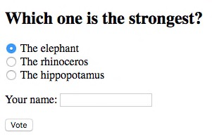
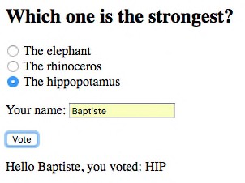
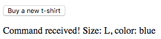
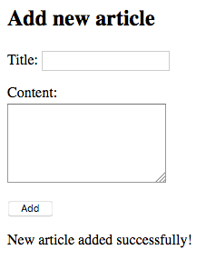
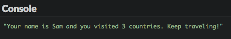

# Send data to a web server

You know now how to retrieve some data from web servers or APIs. This chapter will teach you how to send data to them.

## TL;DR

* You can send information to a web server through an AJAX call translating into an HTTP `POST` request using the `fetch()` method.

* For sending HTML form data or key/value pairs, you use the `FormData` object.

```js
// Create a FormData object containing the HTML form data
const formData = new FormData(myForm);
// Send form data to the server with an asynchronous POST request
fetch("https://my-server-url", {
  method: "POST",
  body: formData
})
  .then();
```

* The `FormData` object can also be used to send arbitrary key/value pairs to a server.

```js
// Create a new, empty FormData object
const formData = new FormData();
// Fill the object with key/value pairs
formData.append("size", "L");
formData.append("color", "blue");
// ...
```

* When the information expected by the server is more structured, sending it as JSON data is more convenient.

```js
// Create some JavaScript data
const myData = {
  // ...
};

// Send this data as JSON to the server
fetch("https://https://my-server-url", {
  method: "POST",
  headers: {
    Accept: "application/json",
    "Content-Type": "application/json"
  },
  body: JSON.stringify(myData)
})
  .then();
```

## Sending data: the basics

Sending data to a server is usually done via an HTTP `POST` method. In that case, the request body contains the data to be sent.

The data format depends on what the server expects. It can either be:

* Key/value pairs like when a form is directly submitted.
* JSON for more structured data.

## Sending form data

If the web server expects direct form data, you can use the JavaScript `FormData` object to encapsulate the information to be sent.

Here's an example form for choosing the strongest animal of all.

```html
<h2>Which one is the strongest?</h2>
<form>
    <p>
        <input type="radio" name="strongest" id="elephant" value="ELE" checked>
        <label for="elephant">The elephant</label>
        <br>
        <input type="radio" name="strongest" id="rhinoceros" value="RHI">
        <label for="rhinoceros">The rhinoceros</label>
        <br>
        <input type="radio" name="strongest" id="hippopotamus" value="HIP">
        <label for="hippopotamus">The hippopotamus</label>
        <br>
    </p>
    <p>
        <label for="name">Your name</label>:
        <input type="text" name="name" id="name" required>
    </p>
    <input type="submit" value="Vote">
</form>
<p id="result"></p>
```



And here is the associated JavaScript code which handles the form submission.

```js
// Handle form submission
document.querySelector("form").addEventListener("submit", e => {
  // Cancel default behavior of sending a synchronous POST request
  e.preventDefault();
  // Create a FormData object, passing the form as a parameter
  const formData = new FormData(e.target);
  // Send form data to the server with an asynchronous POST request
  fetch("https://thejsway-server.herokuapp.com/animals", {
    method: "POST",
    body: formData
  })
    .then(response => response.text())
    .then(result => {
      document.getElementById("result").textContent = result;
    })
    .catch(err => {
      console.error(err.message);
    });
});
```

The event listener starts by disabling the default form submission behavior, which is to send a synchronous HTTP `POST` request to a server. Instead, a `FormData` object is created with the form itself (the `e.target` expression) as a parameter. All form fields are automatically added as key/value pairs in this object.

Once the form fields are encapsulated in the `FormData` object, the `fetch()` method seen previously is used to send an asynchronous request to the `https://thejsway-server.herokuapp.com/animals` URL. The second parameter of the `fetch()` call sets the HTTP method as `POST` and adds the form data into the body of the request.

Lastly, the page's `result` element is updated when the server responds to the asynchronous request.



The `FormData` object can also be used independently of any form, to send custom key/value pairs to a server. Here is a very basic example form containing only a button.

```html
<button id="buyButton">Buy a new t-shirt</button>
<p id="result"></p>
```

When the user clicks on the button, custom data is added to a `FormData` object and sent to the server through an asynchronous `POST` request.

```js
document.getElementById("buyButton").addEventListener("click", () => {
    // Create a new, empty FormData object
    const formData = new FormData();
    // Fill the object with key/value pairs
    formData.append("size", "L");
    formData.append("color", "blue");
    // Send data to the server
    fetch("https://thejsway-server.herokuapp.com/tshirt", {
      method: "POST",
      body: formData
    })
    .then(response => response.text())
    .then(result => {
      document.getElementById("result").textContent = result;
    })
    .catch(err => {
      console.error(err.message);
    });
});
```



## Sending JSON data

When the information expected by the web server is more structured (with complex types, nested fields, etc), it's often a better choice to send it as JSON data.

For example, check out how to send a JavaScript array as JSON data to a web server.

```js
// Create an array containing two objects
const cars = [
  {
    model: "Peugeot",
    color: "blue",
    registration: 2012,
    checkups: [2015, 2017]
  },
  {
    model: "Citroën",
    color: "white",
    registration: 1999,
    checkups: [2003, 2005, 2007, 2009, 2011, 2013]
  }
];

// Send this array as JSON data to the server
fetch("https://thejsway-server.herokuapp.com/api/cars", {
  method: "POST",
  headers: {
    Accept: "application/json",
    "Content-Type": "application/json"
  },
  body: JSON.stringify(cars)
})
  .then(response => response.text())
  .then(result => {
    console.log(result);
  })
  .catch(err => {
    console.error(err.message);
  });
```


The second parameter of the `fetch()` call sets `POST` as the HTTP method to use, updates the request headers to indicate that the data format is JSON, and adds the JSON representation of the JavaScript array into the body of the request.

## Coding time!

### New article

Write the HTML code that shows input fields for creating a new blog article by entering its title and content.

Then, write the associated JavaScript code to send the article fields as form data to the URL `https://thejsway-server.herokuapp.com/articles`. You should receive a confirmation message from the server and display it on the page.



W> The server only accepts `POST` requests at this URL.

### Visited countries

The goal of this exercise is to send your traveling info to a server. Data is expected as a JSON object containing two fields:

* A `name` field representing your name. Its value is a string.
* A `countries` field representing the countries you already visited. Its value is an array of objects. Each object has a `name` field (string) for the country name, and a `year` field (integer) for the year you last visited it.

This data must be sent to the URL `https://thejsway-server.herokuapp.com/api/countries`. You should receive a confirmation message from the server and display it in the console.


