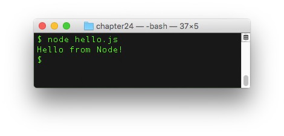
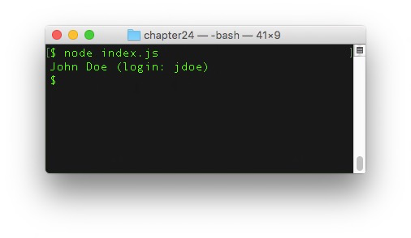
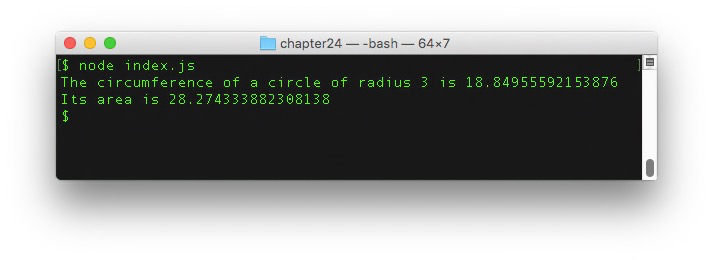
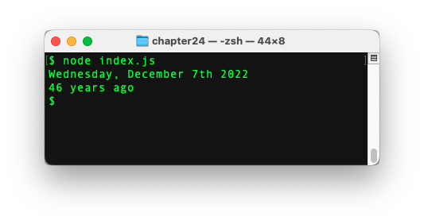

# Discover Node.js

In this chapter, you'll discover how to create JavaScript applications outside the browser thanks to a technology called Node.js.

## TL;DR

* **Node.js** (or simply Node) is a platform built on Chrome's JavaScript engine (V8) to create JavaScript applications outside the browser.

* Node emphasizes modularity: instead of being monolithic, applications are designed as a set of small, focused **modules** working together to achieve the desired behavior.

* Node adheres to the [CommonJS](http://requirejs.org/docs/commonjs.html) module format. It provides a `require()` for loading a module.

* Inside a module, the `module.exports` object is used to export pieces of code. You can **add properties** to it to export element. You can also **reassign** `module.exports` to export only a specific element.

* Node provides a way to structure an application under the form of a **package**. A package is a folder containing an application described by a `package.json` file. The default entry point of a package is the `index.js` file.

* Package versions are defined using the **semantic versioning** format: a three-digit string of the form `MAJOR.MINOR.PATCH`. This format facilitates the management of **dependencies** between packages.

* [npm](https://www.npmjs.com) (Node Package Manager) is the standard package manager for the Node ecosystem. It consists of a command line client and an online registry of public packages accessed by the client. This registry is the largest ecosystem of open source libraries in the world.

* The main npm commands are `npm install` (to install all the dependencies of a package or adding a new one) and `npm update` (to update all the packages and install missing ones according to `package.json`).

* Once installed through npm, packages defined as dependencies are stored in the `node_modules/` subfolder and can be loaded as modules using `require()`.

* Some packages (containing only executable files or no entry point) cannot be loaded as modules. Some modules (single JavaScript files) are not packages.

## Introducing Node.js

### A bit of history

To understand what [Node.js](https://nodejs.org) (or Node for short) is, we have to travel back in time to the 2000's. As JavaScript was becoming increasingly important for improving the user experience on the web, web browser designers spent a considerable amount of resources on executing JS code as fast as possible. In particular, the Chrome JavaScript engine, codenamed V8, became open source in 2008 and was a huge step forward in general performance and optimization.


The core idea behind Node.js was simple yet visionary: since the V8 engine is so good at executing code, why not leverage its power to create efficient JavaScript applications *outside the browser*? And thus Node.js was born in 2009, originally written by Ryan Dahl. Its project quickly became very popular and Node is now one of the top technologies for building apps and creating APIs with JavaScript.


Node also made it easier for developers to publish, share and reuse code. Today, hundreds of thousands of ready-to-use JavaScript libraries, called **packages**, are available and easy to integrate in any Node-based project (more on that later). This rich ecosystem is one of Node's greatest strengths.

### A first example

> The rest of this chapter assumes a working Node environnement. Refer to the appendix for setting one up.

The simplest possible Node program is as follows.

```js
console.log("Hello from Node!");
```

As you see, the `console.log()` command is also available in Node. Just like in a web browser, it outputs the value passed as parameter to the console. Assuming this code is saved into a file named `hello.js`, here's how to execute it through Node in a terminal.

```console
node hello.js
```



An in-depth study of the Node platform is out of this book's scope. Let's focus on two of its defining features: **modules** and **packages**.

## Node.js modules

### The benefits of modularity

The general idea behind modules is pretty straightforward and similar to the one behind functions. Instead of writing all the code in one place, thus creating a monolithic application, it's often better to split the functionalities into smaller, loosely coupled parts. Each part should focus on a specific task, making it far easier to understand and reuse. The general application's behavior results from the interactions between these building blocks.

These smaller parts are sometimes referred to as components in other environments. In Node, they are called **modules** and can come under different forms. The general definition of a module is: anything that can be loaded using Node's `require()` function. The Node.js platform adheres to the [CommonJS](http://requirejs.org/docs/commonjs.html) module format.

### Creating a module

The simplest form of module is a single JavaScript file, containing special commands to **export** specific pieces of code. The rest of the code is **private** to the module and won't be visible outside of it.

For example, a `greetings.js` module could contain the following code.

```js
// Create three functions
const sayHello = name => `Hello, ${name}`;
const flatter = () => `Look how gorgeous you are today!`;
const sayGoodbye = name => `Goodbye, ${name}`;

// Export two of them
module.exports.sayHello = sayHello;
module.exports.flatter = flatter;
```

In Node, functions can be *exported* (made accessible outside) by specifying additional properties on the special `module.exports` object. Here, two functions are exported under the names `sayHello` and `flatter`. The third one is not exported.

This module could have been written in a slightly more concise way by directly defining the functions as properties of the `module.exports` object.

```js
// Create and export two functions
module.exports.sayHello = name => `Hello, ${name}`;
module.exports.flatter = () => `Look how gorgeous you are today!`;

// Create a non-exported function
const sayGoodbye = name => `Goodbye, ${name}`;
```

### Loading a module

Assuming both files are located in the same directory, another JavaScript file could load the previously created module by using the `require()` function provided by Node.js.

```js
// Load the module "greetings.js"
const greetings = require("./greetings.js");

// Use exported functions
console.log(greetings.sayHello("Baptiste")); // "Hello, Baptiste"
console.log(greetings.flatter()); // "Look how gorgeous you are today!"
console.log(greetings.sayGoodbye("Baptiste")); // Error: sayGoodbye doesn't exist
```

The parameter passed to `require()` identifies the module to load. Here, the `"./"` substring at the beginning indicates a **relative path**: the module should be searched for in the same directory as the file that loads it.

The result of the call to `require()` is an object, named `greetings` here. This object references the value of the `module.exports` object defined inside the module. Thus, the `greetings` object has two functions `sayHello` and `flatter` as properties. Trying to access its non-existent `sayGoodbye` property triggers an error during execution.

> Giving the object resulting from a call to `require()` the same name as the loaded module's name, through not mandatory, is a common practice.

### Exporting only a specific object

Numerous modules in the Node.js ecosystem export only a single object aggregating all of the module's functionality. To do so, they reassign the `module.exports` object instead of adding properties to it.

For example, check out how the following module `calculator.js` is defined.

```js
// Declare a factory function that returns an object literal
const createCalc = () => {
  // The returned object has 4 methods
  return {
    add(x, y) {
      return x + y;
    },
    subtract(x, y) {
      return x - y;
    },
    multiply(x, y) {
      return x * y;
    },
    divide(x, y) {
      return x / y;
    }
  };
};

// Export the factory function
module.exports = createCalc;
```

In this module, the only exported element is a function that returns an object literal. Using it in another file (located in the same folder) is as follows.

```js
const calculator = require("./calculator.js");

// Create an object by calling the exported function of this module
const calc = calculator();

// Use the object's methods
console.log(`2 + 3 = ${calc.add(2, 3)}`); // "2 + 3 = 5"
```

The result of the call to `require()` is a function stored in the `calculator` variable, referencing the `createCalc()` function. Calling this function returns an object with several methods, which can be subsequently used.

### Exporting only a class

When you want a module to only export a specific class, you can also reassign the `module.exports` object.

Here is a module `user.js` that defines and exports a `User` class.

```js
// Export a User class
module.exports = class User {
  constructor(firstName, lastName) {
    this.firstName = firstName;
    this.lastName = lastName;
    // Create user login by combining first letter of first name + last name
    this.login = (firstName[0] + lastName).toLowerCase();
  }
  describe() {
    return `${this.firstName} ${this.lastName} (login: ${this.login})`;
  }
};
```

Here's how to use this class in another file (located in the same folder).

```js
// Notice the first uppercase letter, since User is a class
const User = require("./user.js");

// Create an object from this class
const johnDoe = new User("John", "Doe");

// Use the created object
console.log(johnDoe.describe());
```



## Node.js packages

The Node platform provides a way to structure an application under the form of a **package**.

### Anatomy of a package

Technically, a package is a folder containing the following elements:

* A `package.json` file which describes the application and its dependencies.
* A entry point into the application, defaulting to the `index.js` file.
* A `node_modules/` subfolder, which is the default place where Node looks for modules to be loaded into the application.
* All the other files forming the source code of the application.

### The `package.json` file

This JSON file describes the application and its dependencies: you can think of it as the app's ID document. It has a well-defined format consisting of many fields, most of them optional. The two mandatory fields are:

* `name` (all lowercase letters without dots, underscores and any non-URL safe character in it).
* `version` (following the semantic versioning format - more on that later).

Below is an example of a typical `package.json` file.

```json
{
  "name": "thejsway-node-example",
  "version": "1.0.0",
  "description": "Node example for the book \"The JavaScript Way\"",
  "scripts": {
    "start": "node index.js"
  },
  "dependencies": {
    "moment": "^2.18.1",
    "semver": "^5.3.0"
  },
  "keywords": [
    "javascript",
    "node",
    "thejsway"
  ],
  "author": "Baptiste Pesquet"
}
```

### Semantic versioning

Node packages are versioned using a format called **semantic versioning**. A version number is a three-digit string of the form `MAJOR.MINOR.PATCH` (example : `2.18.1`).

Here are the rules for defining a version number:

* The very first version should be `1.0.0`.
* Bug fixes and minor changes should increment the `PATCH` digit.
* New features added in a backwards-compatible way should increment the `MINOR` digit.
* Breaking changes should increment the `MAJOR` digit.

These strict rules exist to facilitate the management of **dependencies** between packages.

### Dependencies

In the `package.json` file definition, the `dependencies` field is used to declared the external packages needed by the current package. Each dependency is created with the package name followed by a **version range**. This version range specifies the package versions that are acceptable to use.

There are many ways to define a version range. The most commonly used ones are:

* Targeting a very specific version. Example: `2.18.1`.
* Using the `~` operator to allow patch-level changes. For example, the `~2.18.1` version range accepts version `2.18.7`, but not `2.19.0` nor `3.0.0`.
* Using the `^` operator to allow changes that do not modify the left-most non-zero digit in the version. Examples:
  * The `^2.18.1` version range accepts versions `2.18.7` and `2.19.0`, but not `3.0.0`.
  * The `^0.2.3` version range accepts version `0.2.5` but not `0.3.0` nor `1.0.0`.

Fine-tuning the targeted versions of external packages though version ranges helps limiting the risk of breaking the application apart when updating its dependencies.

## Package management with **npm**

Soon after the creation of Node.js, it became apparent that something was missing to orchestrate code sharing and reuse through modules. So [npm](https://www.npmjs.com) (Node Package Manager) was born in 2010. It is still the standard package manager for the Node ecosystem, even if it is being challenged by [yarn](https://yarnpkg.com), a more recent alternative. It consists of a command line client, also called **npm**, and an online database of public packages, called the **npm registry** and accessed by the client.


 Over 477,000 packages are now available on the registry, ready to reuse and covering various needs. This makes npm the largest ecosystem of open source libraries in the world.

The npm client is used by typing commands in a terminal open in the package's folder. It offers numerous possibilities for managing packages. Let's study two of the most important ones.

### Installing dependencies

To install all the dependencies of a package, you type the following npm command.

```console
npm install
```

This will read the `package.json` file, look for the packages satisfying the version ranges declared in the `dependencies` field, and download and install them (and their own dependencies) in the `node_modules/` subfolder.

### Adding a new dependency

There are two ways for adding a new dependency to a package. The first one is to manually edit the `package.json` to declare the dependency and its associated version range. The next step is to run the following npm command.

```console
npm update
```

This will update all the packages listed to the latest version respecting their version range, and install missing packages.

The other way is to run the following command.

```console
npm install <package-id>
```

This command will fetch a specific package from the registry, download it in the `node/modules/` subfolder and (since npm 5) update the `package.json` file to add it as a new dependency. The `<package-id>` parameter is usually the dependency's package name.

### Using a dependency

Once external packages have been installed in `node_modules/`, the application can load them as modules with the `require()` function.

For example, the npm registry has a **semver** package that handles semantic versioning. Assuming this package has been installed as a dependency, it can be used to perform manual version range checks.

```js
// Load the npm semver package as a module
// Notice the omission of "./" since the package was installed in node_modules/
const semver = require("semver");

// Check if specific versions satisfy a range
console.log(semver.satisfies("2.19.0", "^2.18.1")); // true
console.log(semver.satisfies("3.0.0", "^2.18.5")); // false
```

### Relationship between packages and modules

Let's recap what you learned so far:

* A *module* is anything that can be loaded with `require()`.
* A *package* is a Node application described by a `package.json` file.

A package used in another Node application is loaded with `require()`, making it a module. To be loaded as a module, a package must contain an `index.js` file or a `main` field in `package.json` defining a specific entry point.

Some packages only contain an executable command and thus cannot be loaded as modules. On the other hand, a single JavaScript file loaded with `require()` is a module but not a package, since it doesn't have a `package.json` file.

Check out the [npm documentation](https://docs.npmjs.com/how-npm-works/packages) for more details on this aspect.

## Coding time!

### Circles again

Create a `circle.js` module exporting two functions `circumference()` and `area()`, each taking the circle radius as a parameter.

Load this module in a `index.js` file and test the two functions.



### Accounting

Create a `accounting.js` module exporting.

Load this module in a `index.js` file and test the two functions.

```js
// TODO: load the "accounting.js" module

// Create object from the exported class
const myAccount = new Account("Jeff");
myAccount.credit(150);
console.log(myAccount.describe());
```


### Playing with dates

The npm package [moment](https://momentjs.com/) is very popular for managing dates and times.

Create a Node package and install the current `moment` version as a dependency. Then, load this package and use it to:

* Display the current date.
* Compute the number of years since 1976, November 26th.



T> Use the [moment documentation](https://momentjs.com/docs/) to discover how to use this package.
