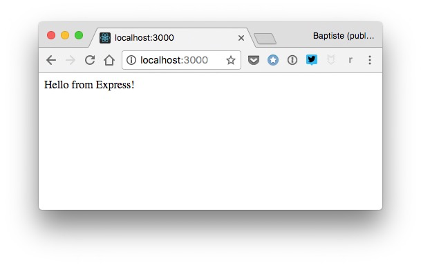
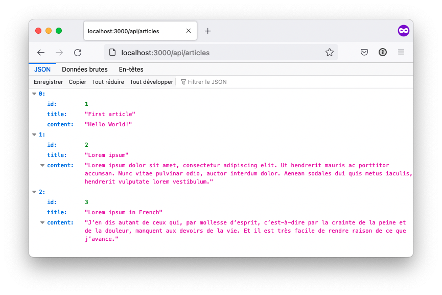
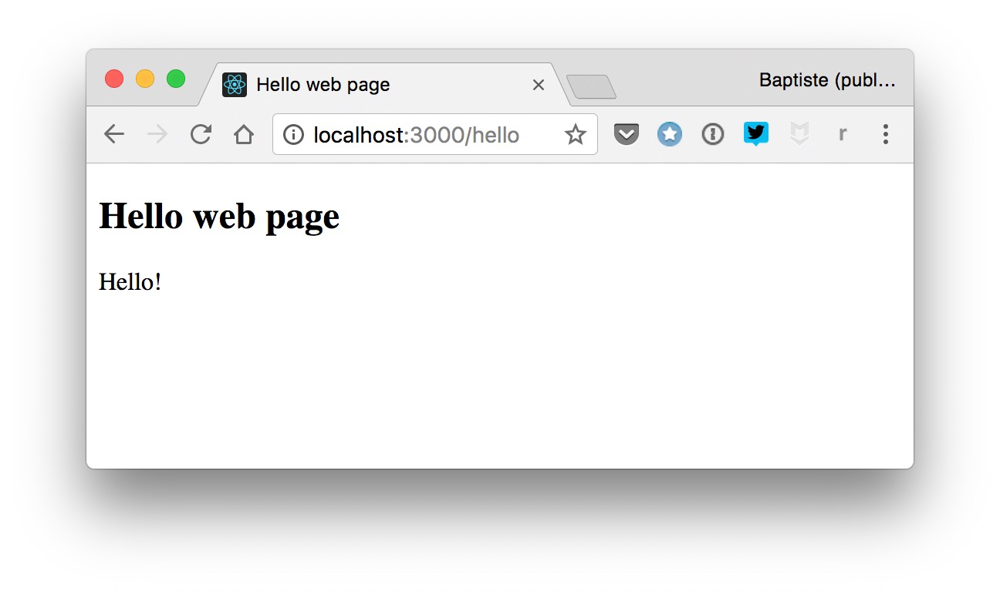
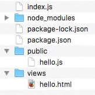
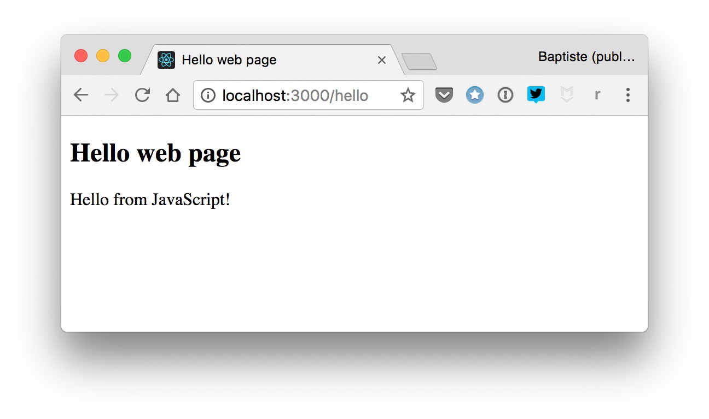

# Create a web server

It's time to put your Node.js knowledge into practice and create a real-world web server in JavaScript. This is often called **back-end programming**.

> You will build exactly the server that was used in the previous chapters dealing with client-side web development. To test your server code, you can go back to code examples from chapters 22 and 23, and only change the start of the server URL from `https://thejsway-server.herokuapp.com` to your own server URL (which would be `http://localhost:3000` if your server runs on your local machine).

## TL;DR

* The Node.js platform is well suited for creating **web servers** in JavaScript, with or without the help of a framework.

* A **framework** provides a standard way to design and structure an application. **Express** is a common choice for building a web server with Node.

* In order to respond to requests, an Express app defines **routes** (entry points associated to URLs) and listens to incoming HTTP requests.

* The main Express method are `get()` to handle a `GET` request, `post()` to handle a `POST` request and `use()` to define a **middleware** (code that runs during the request/response cycle).

* Incoming form or JSON data can be managed through specialized packages like **multer** and **body-parser**.

* JavaScript can be used on both the client side (browser) and the server side of a web application. This empowers you to create complete **web applications**.

## Using a framework

We saw in the previous chapter that Node.js is a platform for building JavaScript applications outside the browser. as such, Node is well suited for creating **web servers** in JavaScript.

> As a reminder, a web server is a machine built specially to publish resources on the Web.

### About frameworks

It's entirely possible to build a web server from scratch with Node, but we'll take a different approach and use a framework for it.

In computer programming, a **framework** provides a standard way to design and structure an application. It typically takes care of many low-level details so that the developer can concentrate on high-level, business-related tasks.

### Choosing a framework

Among the many possible frameworks for creating a web server in JavaScript, we'll use one of the most well-known: **Express**. To paraphrase its [web site](http://expressjs.com/), Express is "a minimal and flexible Node.js web application framework that provides a robust set of features for web and mobile applications".

In other words, Express provides a foundation on which you can easily and quickly build a web server.

### Installing Express

The Express framework is available as an npm package and its installation is straightforward. First, you'll need an existing Node application with a  `package.json` file it. Run the following command in a terminal open in your application folder to install Express as a dependency.

```console
npm install express
```

As an alternative, you can directly add Express as a dependency in your `package.json` file and run the `npm install` command.

```json
"dependencies": {
  "express": "^4.15.3"
},
```

## Responding to requests

The main job of a web server is to respond to HTTP requests. Here's the JavaScript code for a minimal Express-based web server that returns `"Hello from Express!"` for a request to the root URL.

```js
// Load the Express package as a module
const express = require("express");

// Access the exported service
const app = express();

// Return a string for requests to the root URL ("/")
app.get("/", (request, response) => {
  response.send("Hello from Express!");
});

// Start listening to incoming requests
// If process.env.PORT is not defined, port number 3000 is used
const listener = app.listen(process.env.PORT || 3000, () => {
  console.log(`Your app is listening on port ${listener.address().port}`);
});
```

You can launch your server with either `node index.js` or `npm start`, then type its root URL (<http://localhost:3000> if your server runs on your local machine) in a browser. You should see the string `"Hello from Express!"` appear.



Let's dissect this example.

### Accessing Express services

Once Express is installed, you can load its package in your main application file and access the exported services provided by the framework. The beginning of the server code does just that.

```js
// Load the Express package as a module
const express = require("express");

// Access the main Express object
const app = express();
```

### Defining routes

In web development terminology, a **route** is an entry point into an application. It is relative to the application URL. The `"/"` route matches the root of the application.

```js
// Return a string for requests to the root URL ("/")
app.get("/", (request, response) => {
  response.send("Hello from Express!");
});
```

When an HTTP request is made to the route URL, the associated callback function is executed. This function takes as parameters objects representing the HTTP request and response. Here, the function body sends a text response with the content `"Hello from Express!"`.

### Listening to requests

To process incoming request, a web server must listen on a specific port. A **port** is a communication endpoint on a machine.

The main Express object has a `listen()` method that tasks as parameter the listening port and a callback function called for each request. The last part of the server code calls this method to start listening.

```js
// Start listening to incoming requests
// If process.env.PORT is not defined, 3000 is used
const listener = app.listen(process.env.PORT || 3000, () => {
  console.log(`Your app is listening on port ${listener.address().port}`);
});
```

## Creating an API

Your web server is pretty limited for now, handling only one route and always returning the same string. Let's create your own little API by publishing some data in JSON format.

### Enabling AJAX requests

In a previous chapter, we talked about cross-origin requests (from one domain to another). Authorizing them on your server is mandatory to accept AJAX calls from clients.

Enabling CORS on an Express web server is done by adding the following code in your main application file.

```js
// Enable CORS (see https://enable-cors.org/server_expressjs.html)
app.use((req, res, next) => {
  res.header("Access-Control-Allow-Origin", "*");
  res.header(
    "Access-Control-Allow-Headers",
    "Origin, X-Requested-With, Content-Type, Accept"
  );
  next();
});
```

This is an example of a **middleware**: code that runs somewhere between the reception of the HTTP request and the sending of the HTTP response.

## Exposing data

To match what was done on the client side in a previous chapter, we'll publish some blog articles. The API route is `"/api/articles"`, and the associated callback return a list of JavaScript objects.

Here's the code to be added to the server just before the last part (the one that starts the listening).

```js
// Define an article list
const articles = [
  { id: 1, title: "First article", content: "Hello World!" },
  {
    id: 2,
    title: "Lorem ipsum",
    content:
      "Lorem ipsum dolor sit amet, consectetur adipiscing elit. Ut hendrerit mauris ac porttitor accumsan. Nunc vitae pulvinar odio, auctor interdum dolor. Aenean sodales dui quis metus iaculis, hendrerit vulputate lorem vestibulum."
  },
  {
    id: 3,
    title: "Lorem ipsum in French",
    content:
      "J’en dis autant de ceux qui, par mollesse d’esprit, c’est-à-dire par la crainte de la peine et de la douleur, manquent aux devoirs de la vie. Et il est très facile de rendre raison de ce que j’avance."
  }
];

// Return the articles list in JSON format
app.get("/api/articles", (request, response) => {
  response.json(articles);
});
```

When accessing the `"/api/articles"` route (<http://localhost:3000/api/articles> if your server runs locally) with a browser or a specialized tool like Postman or RESTClient, you should see the article list in JSON format.



## Accepting data

So far, your web server offers a *read-only* service: it publishes some data but doesn't accept any... Until now!

As you saw in a previous chapter, information submitted to a web server can be either form data or JSON data.

### Handling form data

Form data comes encapsulated into the HTTP `POST` request sent by the client to the server. The first server task is to extract this information from the request. The simplest way to do this is to use a specialized npm package, such as [multer](https://www.npmjs.com/package/multer). Install it with the `npm install multer` command or directly in your app dependencies.

```json
"dependencies": {
  ...
  "multer": "^1.3.0"
},
```

Once **multer** is installed, add the following code towards the beginning of your server main file.

```js
// Load the multer package as a module
const multer = require("multer");

// Access the exported service
const upload = multer();
```

The following route accepts form data sent to the `"/animals"` route. Notice the use of `app.post()` instead of `app.get()` to handle `POST` HTTP requests, and the addition of `upload.array()` as a second parameter to add a `body` object containing the fields of the form to the `request` object.

```js
// Handle form data submission to the "/animals" route
app.post("/animals", upload.array(), (request, response) => {
  const name = request.body.name;
  const vote = request.body.strongest;
  response.send(`Hello ${name}, you voted: ${vote}`);
});
```

The values of the `name` and `vote` variables are extracted from the request body, and a string is constructed and sent back to the client.


### Handling JSON data

Managing incoming JSON data requires parsing it from the received `POST` request. Using an npm package like [body-parser](https://www.npmjs.com/package/body-parser) is the easiest solution. Install it with the `npm install body-parser` command or directly in your app dependencies.

```json
"dependencies": {
  ...
  "body-parser": "^1.17.2"
},
```

Then, add the following code towards the beginning of your server main file.

```js
// Load the body-parser package as a module
const bodyParser = require("body-parser");

// Access the JSON parsing service
const jsonParser = bodyParser.json();
```

The following code handle `POST` requests to the `"/api/cars"` route. JSON data is parsed by `jsonParser` and defined as the request body.

```js
// Handle submission of a JSON car array
app.post("/api/cars", jsonParser, (request, response) => {
  const cars = request.body;
  response.send(`You sent me a list of cars: ${JSON.stringify(cars)}`);
});
```


## Publishing web pages

Finally, let's learn how to serve HTML content so that your web server can come into its own.

For example, `GET` HTTP requests to the `"/hello"` route should show a basic web page. A naive way to do so would be to simply return an HTML string.

```js
// Return HTML content for requests to "/hello"
app.get("/hello", (request, response) => {
  const htmlContent = `<!doctype html>
    <html>
    <head>
      <meta charset="utf-8">
      <title>Hello web page</title>
    </head>
    <body>
      Hello!
    </body>
    </html>`;
  response.send(htmlContent);
});
```

However, things would quickly get out of hands as the complexity of the web page grows. A better solution is to define the HTML content in an external file stored in a dedicated subfolder, and return that file as a result of the request.

For example, create a subfolder named `views` and a file named `hello.html` inside it. Give the HTML file the following content.

```html
<!doctype html>
<html>

<head>
    <meta charset="utf-8">
    <title>Hello web page</title>
</head>

<body>
    <h2>Hello web page</h2>
    <div id="content">Hello!</div>
</body>

</html>
```

Then, update the callback for the `"/hello"` route to send the HTML file as the request response.

```js
// Return a web page for requests to "/hello"
app.get("/hello", (request, response) => {
  response.sendFile(`${__dirname}/views/hello.html`);
});
```

Pointing your browser to the `"/hello"` URL (<http://localhost:3000/hello> if your server runs locally) should now display the web page.



Most web pages will need to load client-side resources such as images, CSS and JavaScript files. A common practice is to put these assets in a dedicated subfolder.

For example, create a `public` subfolder and a `hello.js` JavaScript file inside it with the following content.

```js
// Update the "content" DOM element
document.getElementById("content").textContent = "Hello from JavaScript!";
```

You should now have the following folder structure for your server.



Update the `hello.html` to load this JavaScript file.

```html
<script src="/hello.js"></script>
```

Lastly, you must tell Express that client assets are located in the `public` subfolder, so that the server can serve them directly. Add the following code towards the beginning of your main application file.

```js
// Serve content of the "public" subfolder directly
app.use(express.static("public"));
```

Accessing the `"/hello"` URL shows you a slightly different result. The `hello.js` file was loaded and executed by the browser, updating the web page content.



In this example, JavaScript was used both for back-end (server side) and front-end (client side) programming. This is one of its core strengths: knowing only one programming language empowers you to create complete **web applications**. How great is that?

## Coding time!

### T-shirt color

Add a `"/tshirt"` route to your server for handling the submission of form data containing a `size` and a `color` field, like in the chapter 23 example. In the route callback, send back a confirmation message to the client.


### Visited countries

Add a `"/api/countries"` route to your server to manager traveler information received as JSON data, like in the chapter 23 exercise. In the route callback, send back a confirmation message to the client.


### New article

Add a `"/articles"` route to your server. This route should accept a new blog article as form data and add it to the server's article list, like in the chapter 23 exercise. The new article ID must be equal to the maximum ID among existing articles plus one.


