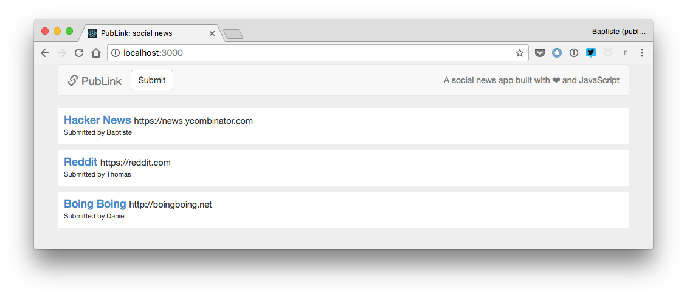
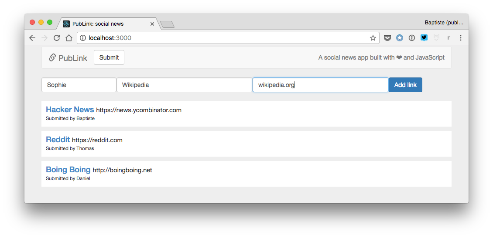
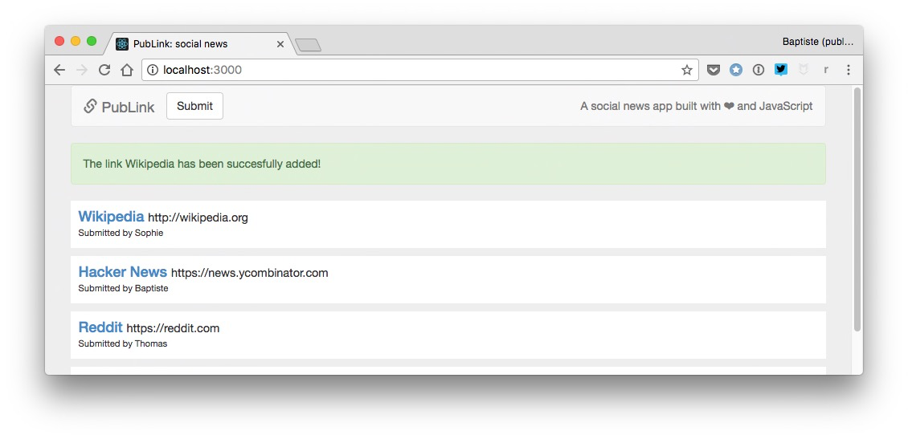

# Project: a social news web app

This final project is the culmination of the book. You can check out the [expected result](https://thejsway-publink.herokuapp.com). Good luck!

## Objective

This project builds upon the social news program and web pages you created previously. This time, the objective is to make a social news *application* based on a Node.js server.

## Functional requirements

* A link is defined by its title, its URL and its author (submitter).
* If a new link URL does not start with `"http://"` or `"https://"`, `"http://"` is automatically added at its beginning.
* The web app displays a list of at least three already existing links, fetched from the server through an AJAX request.
* A button exists for the user to submit a new link. When clicked, a form appears before the link list to input the new link properties (author, title and URL).
* In this form, all link fields are mandatory.
* When the new link is validated by the user, it is sent as form data to the server. If the operation is successful, the server returns the new link as JSON data. The new link is added at the top of the link list, replacing the form. A message indicates the success of the operation, then disappears after two seconds.

## Technical requirements

* The server must use a user-defined module exporting link-related code.
* You should reuse any useful code from the previous projects.
* All your code should be correctly indented.
* Names should be wisely chosen and adhere to the camelCase convention.
* Code duplication should be avoided.

## Expected result

Here are a few screenshots of the expected result.

