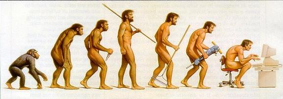

# Welcome to programming

## TL;DR

* A **computer** is a machine whose role is to execute quickly and flawlessly a series of actions given to it.

* A **program** is a list of actions given to a computer. These actions take the form of textual commands. All these commands form the program's **source code**.

* The **programmer**'s task is to create programs. To accomplish this goal, he can use different programming languages.

* Before writing code, one must think ahead and decompose the problem to be addressed in a series of elementary operations forming an **algorithm**.

## What's a program?



Since their invention in the 1950s, **computers** have revolutionized our daily lives. Calculating a route from a website or a GPS, booking a train or plane ticket, or seeing and chatting with friends on the other side of the world: all these actions are possible thanks to computers.

I> Let's take the term "computer" in its broadest sense, meaning a machine that can perform arithmetic and logical operations. It could mean either a desktop or laptop computer (PC, Mac), a computing server, or a mobile device like a tablet or smartphone.

Nonetheless, a computer can only perform a series of simple operations when instructed to do so. They normally have no ability to learn, judge, or improvise. They simply do what they're told to do! Their value comes from how they can quickly handle and process huge amounts of information.

A computer often requires human intervention. That's where programmers and developers come in! They write programs that result in instructions to a computer.

A **computer program** (also called an application or software) is usually comprised of one or more text files containing commands in the form of code. This is why developers are also called coders.

A **programming language** is a way to give orders to a computer. It's a bit like a human language! Each programming language has vocabulary (keywords that each play a specific role) and grammar (rules defining how to write programs in that language).

## How do you create programs?

### Closest to the hardware: assembly language

The only programming language directly understandable by a computer is machine language. A more human-readable representation of machine language is **assembly language**. It is a set of very primitive operations linked to a specific family of processors (the computer's "brain") and manipulating its memory.

Here's an example of a basic program written in assembly language. It displays `"Hello"` to the user.

```assembly
str:
    .ascii "Hello\n"
    .global _start

_start:
movl $4, %eax
movl $1, %ebx
movl $str, %ecx
movl $8, %edx
int $0x80
movl $1, %eax
movl $0, %ebx
int $0x80
```

Pretty scary, isn't it? Fortunately, other programming languages are much simpler and convenient to use than assembly language.

### The family of programming languages

There are a large number of programming languages, each adapted to different uses and with its own syntax. However, there are similarities between the most popular programming languages. For example, here's a simple program written in Python:

```python
print("Hello")
```

You can also write the same thing in PHP:

```php
<?php
    echo("Hello\n");
?>
```

Or even C#!

```csharp
class Program {
    static void Main(string[] args) {
        Console.WriteLine("Hello");
    }
}
```

What about Java?

```java
public class Program {
    public static void main(String[] args) {
        System.out.println("Hello");
    }
}
```

All these programs display `"Hello"` through a different set of instructions.

### Program execution

The fact of asking a computer to process the orders contained in a program is called **execution**. Regardless of which programming language is used, a program must be translated into assembly code in order to be executed. The translation process depends on the language used.

With some languages, the translation into assembly code happens line by line in real time. In this case, the program is executed like a human reads a book, starting at the top and working down line-by-line. These languages are said to be **interpreted**. Python and PHP are examples of interpreted languages.

Another possibility is to read and check for errors throughout the whole source code before execution. If no errors are detected, an executable targeting one specific hardware platform is generated. The intermediate step is called **compilation**, and the programming languages which use it are said to be **compiled**.

Lastly, some languages are pseudo-compiled in order to be executed on different hardware platforms. This is the case for the Java language and also for those of the Microsoft .NET family (VB.NET, C#, etc).

## Learn to code

### Introduction to algorithms

Except in very simple cases, you don't create programs by writing source code directly. You'll first need to think about the instructions you'll want to convey.

Take a concrete example from everyday life: I want to make a burrito. What are the steps that will enable me to achieve my goal?

```text
Begin
    Get out the rice cooker
    Fill it with rice
    Fill it with water
    Cook the rice
    Chop the vegetables
    Stir-fry the vegetables
    Taste-test the vegetables
        If the veggies are good
            Remove them from the stove
        If the veggies aren't good
            Add more pepper and spices
        If the veggies aren't cooked enough
            Keep stir-frying the veggies
    Heat the tortilla
    Add rice to tortilla
    Add vegetables to tortilla
    Roll tortilla
End
```


You reach your goal by combining a set of actions in a specific order. There are different types of actions:

* Simple actions ("get out the rice cooker")
* Conditional actions ("if the veggies are good")
* Actions that are repeated ("keep stir-frying the veggies")

We used a simple writing style, not a specific programming language. In fact, we just wrote what is called an **algorithm**. We can define an algorithm as an ordered sequence of operations for solving a given problem. An algorithm breaks down a complex problem into a series of simple operations.

### The role of the programmer

Writing programs that can reliably perform expected tasks is a programmer's goal. A beginner can learn to quickly create simple programs. Things get more complicated when the program evolves and becomes more complex. It takes experience and a lot of practice before you feel like you'll control this complexity! Once you have the foundation, the only limit is your imagination!

> "The computer programmer is a creator of universes for which he alone is the lawgiver. No playwright, no stage director, no emperor, however powerful, has ever exercised such absolute authority to arrange a stage or field of battle and to command such unswervingly dutiful actors or troops." (Joseph Weizenbaum)
