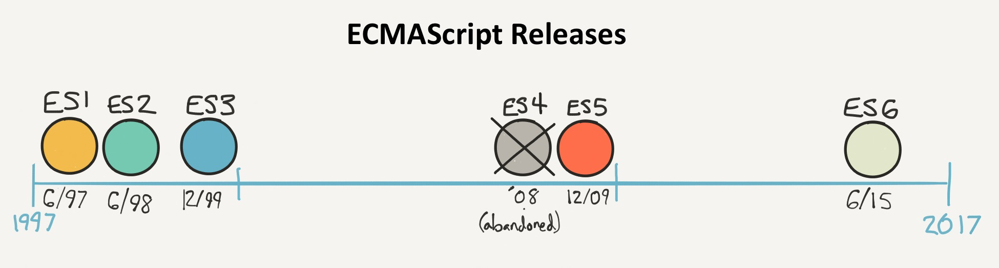

# Introducing JavaScript

## TL;DR

* Originally created to animate web pages, the JavaScript language can now be used almost everywhere, from servers to mobile apps and connected devices.

* JavaScript is becoming essential for many software developers. It's an excellent choice as a first language for learning programming.

* It's been standardized under the name **ECMAScript** and is continuously improved ever since.

* The JavaScript version used in this book is **ES2015**, otherwise known as **ES6**. Albeit recent, it is now well supported by most environments.

## History of JavaScript

JavaScript is first and foremost the programming language of the web. It was invented in 1995 by [Brendan Eich](https://en.wikipedia.org/wiki/Brendan_Eich), who at the time worked for [Netscape](https://en.wikipedia.org/wiki/Netscape_Communications), which created the first popular web browser (Firefox's ancestor).

I> A **browser** is the software you use to visit webpages and use web applications.

W> JavaScript should not be confused with Java, another language invented at the same time! Both share a similar syntax, but their use cases and "philosophies" are very different.

The idea behind JavaScript was to create a simple language to make web pages dynamic and interactive, since back then, pages were very simple.

Web builders started gradually enriching their pages by adding JavaScript code. For this code to work, the recipient web browser (the software used to surf the web) had to be able to process JavaScript. This language has been progressively integrated into browsers, and now all browsers are able to handle it!

Because of the explosion of the Web and the advent of the web 2.0 (based on rich, interactive pages), JavaScript has become increasingly popular. Web browser designers have optimized the execution speed of JavaScript, which means it's now a very fast language.

This led to the emergence of the [Node.js](https://nodejs.org) platform, which allows you to create JavaScript applications outside the browser. Thanks to a software called [MongoDB](https://www.mongodb.com), JavaScript has even entered the database world (software whose role is to store information).

Finally, the popularity of smartphones and tablets with different systems (iOS, Android, Windows Phone) has led to the emergence of so-called cross-platform development tools. They allow you to write a single mobile application that's compatible with these systems. These tools are almost always based on... JavaScript!

## JavaScript: an essential language

In short, JavaScript is everywhere. It sits on top of a rich ecosystem of **components** (small software *bricks* that you can easily plug into your project) and a vibrant developer community. Knowing it will open the doors of the web browser-side programming (known as front-end development), server side development (backend), and mobile development. A growing number of people see JavaScript as the most important technology in software development nowadays.

Both ubiquitous and still relatively easy to learn, JavaScript is also a [great choice](https://medium.freecodecamp.com/what-programming-language-should-i-learn-first-%CA%87d%C4%B1%C9%B9%C9%94s%C9%90%CA%8C%C9%90%C9%BE-%C9%B9%C7%9D%CA%8Dsu%C9%90-19a33b0a467d#.3yu73z1px) as a first language for learning programming.

## Version used in this book

JavaScript was standardized in 1997 under the name [ECMAScript](https://en.wikipedia.org/wiki/ECMAScript). Since then, the language has undergone several rounds of improvements to fix some awkwardness and support new features.

This book uses the most recently standardized version of JavaScript, called **ES2015** or sometimes **ES6**. This version brings a lot of interesting novelties to the table. It is now well supported by most environments and platforms, starting with web browsers (more details in this [compatibility table](http://kangax.github.io/compat-table/es6/)).
