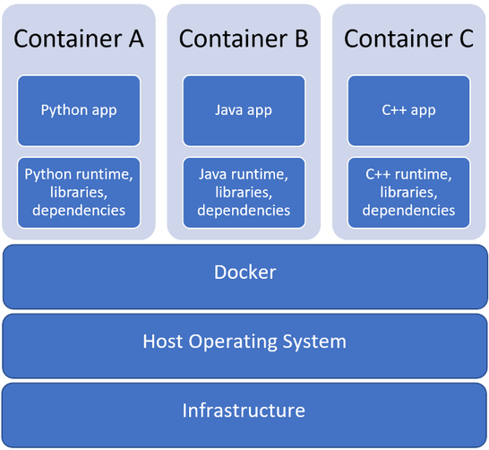

# Environment setup

Let's make you able to get your feet wet with JavaScript by setting up your work environment.

!!! tip

    You should read the whole chapter before going ahead and deciding on a setup method.

Depending on how eager you are to get into the action and how comfortable you feel setting up your local machine, you may follow along this book by either:

* coding online, leveraging free and feature-packed JavaScript playgrounds;
* using a local development environment.

First option is the easiest and quickest; second one is more powerful and will probably become necessary as you tackle bigger programming challenges in a not-so-distant future.

!!! tip

    Simply *reading* along the book is not enough: *coding* along is mandatory to get a real grasp of how things work and become a capable programmer. So be sure to test every code sample and search every exercise and project!

## Prerequisite: a modern browser

Whichever option you may choose for your work environment, you'll need a web browser able to run code written in recent flavors of JavaScript.

The safest bet is to choose either [Google Chrome](https://www.google.com/chrome/) or [Mozilla Firefox](https://www.mozilla.org/en-US/firefox/new/), two "evergreen" (self-updated) browsers with excellent JavaScript support. Other capable browsers include [Opera](https://www.opera.com), [Brave](https://brave.com) and [Microsoft Edge](https://www.microsoft.com/en-us/edge). On the contrary, stay away from all versions of Internet Explorer which will have serious issues with ES2016+ code.

## Solution 1: coding online

Maybe you're a little bit of the impatient type, or maybe you'd rather not (or haven’t the right privileges to) set up your local machine right now. Fortunately, several online services, often called *playgrounds*, allow you to type and run JavaScript code directly from your browser. All you'll need in addition is an active Internet connection.

For chapters 1 to 23, you'll need a **front-end** coding playground able to understand and combine HTML, CSS and JavaScript code. There is a handful of free front-end playgrounds online. Good examples are [CodePen](http://codepen.io), [JSFiddle](https://jsfiddle.net/) and [JS Bin](http://jsbin.com/).

!!! tip "About CodePen"

    If you choose to use CodePen, you really should start by visiting [Welcome to CodePen](https://codepen.io/hello/). It introduces the platform in a very friendly way and gives you everything you need to get started.

Starting with chapter 24, a **back-end** playground will be necessary to create [Node.js](https://nodejs.org) applications.

!!! info "What is Node.js?"

    Node.js (or simply Node) is a platform for running JavaScript code outside the browser. We'll cover this topic in detail in the third part of this book.

A prominent choice for tinkering with Node.js online is [Glitch](https://glitch.com), a platform for quickly building Node-based web applications. Glitch emulates a local Node setup and automates things like code execution, package management, hosting and deployment. You can also remix (clone) any Glitch app to personalize it for your needs. You can learn more about Glitch [here](https://glitch.com/about/) and start by remixing [this project](https://glitch.com/edit/#!/thejsway-starterapp).

Another valuable option is [Replit](https://replit.com), an online coding environment with which you can create front-end and back-end applications with JavaScript (among many other platforms). The Replit [documentation](https://docs.replit.com/) is a good place to start.

## Solution 2: using a local development environment

Setting up your local machine takes a bit of work, but will ultimately give you a tailored and powerful environment. This is also your only choice if you need to work offline.

### Install a code editor

At heart, programming is typing code as text in a number of files. To actually program, you'll need to use a **code editor** on your machine.

The choice is vast here, and you may already have previous experience and personal preferences. A few highlights are [Visual Studio Code](https://code.visualstudio.com/) (used as reference in this book), [Brackets](http://brackets.io/), [Atom](https://atom.io/) and [Sublime Text](https://www.sublimetext.com/).

Once you have a code editor installed on your local machine, you can either:

* build your own JavaScript environment;
* start with a ready-made environment specifically crafted for this book.

Let's discuss these two methods.

### Solution a: build your own development environment

In this scenario, you'll install and configure each piece of your JavaScript development toolchain manually.

#### Install Node.js and npm

To set up Node on your local machine, download the latest version [here](https://nodejs.org), execute the downloaded file then follow the instructions.  The **npm** package manager is automatically installed along with Node.

#### Install a code formatter and a linter

Over the years, a lot of tools have been created to ease a JavaScript developer's life. In particular, two kinds of tools are of great interest to any JavaScript professional:

* A **code formatter** frees you from the burden of formatting your code manually and improves consistency. [Prettier](https://github.com/prettier/prettier) is the current standard.
* A **linter** can greatly improve your code's quality, detecting bugs and enforcing good practices. [ESLint](http://eslint.org) is a common choice.

The easiest way to set up these tools is to add them as **extensions** (sometimes named add-ons) to your code editor. For Visual Studio Code, use the following links for [Prettier](https://marketplace.visualstudio.com/items?itemName=esbenp.prettier-vscode) and [ESLint](https://marketplace.visualstudio.com/items?itemName=dbaeumer.vscode-eslint). Follow the instructions provided in their documentation to setup them.

!!! info

    Refer to the [style guide](appendix02.md#code-quality) for more information about configuring ESLint.

#### Organize your code

It's important to set up your basic folder and file structure before actually starting to code. That way, your project will be organized, and you'll be starting off with some good programming habits.

You should have a folder in your storage disk dedicated to coding along this book. The folder name doesn’t matter, `thejsway-code` will do nicely. All local files you subsequently create will be stored in subfolders of this root folder. The most logical solution is to create a subfolder for each chapter of the book.

You can either use a [predefined folder structure](https://github.com/thejsway/thejsway-starter-code) or follow the next few paragraphs to create this folder structure by hand.

##### For chapters 1 to 23

In these chapters, you'll execute your JavaScript code through the browser. Your files will be stored according to their type: HTML files (the ones with an `.html` extension) in an `html` subfolder, CSS files (`.css`) in a `css` subfolder and JavaScript files (`.js`) in a `js` subfolder. Each chapter is set up in a series of folders as follows.


For examples and each exercise of a chapter, create an HTML file in the `html` subfolder of the chapter folder. In these HTML files, a `<script>` will load the associated JavaScript code.

```html
<!doctype html>
<html>

<head>
    <meta charset="utf-8">
    <title>Code examples</title>
</head>

<body>
    <!-- If necessary, HTML code goes here -->
    <!-- ... -->

    <!-- Load the JavaScript code located in the examples.js file>
    <script src="../js/examples.js"></script>
</body>

</html>
```

This `<script>` tag asks the browser to load the `examples.js` JavaScript file, located at path `../js/examples.js`. The two dots (`..`) at the beginning of the path indicate you're going back one level in the directory structure relative to the HTML file itself before looking in the `js` subfolder for a file named `examples.js`.

Opening the HTML file in your web browser will trigger the execution of the JavaScript code stored in the `.js` file. Its result will be shown in the browser console (see below).

##### From chapter 24 onwards

In these chapters, you'll create Node.js applications to execute your JavaScript code. Each Node app must sit in its own folder and is described by a `package.json` file located at the root of this folder. Subdirectories may be used to store specific files:

* `node_modules` (automatically created) for external dependencies.
* `public` for client assets loaded by the browser, like CSS and JavaScript files.
* `views` for HTML files.
* `modules` for internal modules.

### Solution b: start with a ready-made environment

!!! note

    The following process is only available with Visual Studio Code.

Rather than installing and configuring every piece of software manually, you can obtain a ready to use, fine-tuned JavaScript environment in a few pretty easy steps. Black magic? No, Docker combined with VS Code.

[Docker](https://www.docker.com/) is a tool for running applications and services in small, lightweight "containers" which do not interfere with your local machine's installed software or configuration. This means you don’t have to worry about configuring or setting up complicated development tools on your local machine. The general idea is given by the following schema. See [here](https://docs.docker.com/get-started/overview) for a more detailed overview of Docker.

[](https://code.visualstudio.com/blogs/2020/07/27/containers-edu)

Start by installing [Docker Desktop](https://docs.docker.com/desktop/) on your local machine. Depending on your operating system, a few post-install configuration steps may be necessary. Once it's done, start Docker Desktop.

Next, simply follow [this link](https://vscode.dev/redirect?url=vscode://ms-vscode-remote.remote-containers/cloneInVolume?url=https://github.com/thejsway/thejsway-starter-code) to kickstart a *containerized JavaScript development environment* using Visual Studio Code. Clicking it will cause VS Code to automatically install the [Dev Containers](https://marketplace.visualstudio.com/items?itemName=ms-vscode-remote.remote-containers) extension if needed, clone the environment source code into a container volume, and spin up a dev container for use.

!!! tip

    Feeling curious? Read [this article](https://code.visualstudio.com/docs/devcontainers/containers) and check out [this code repository](https://github.com/microsoft/vscode-remote-try-node) to gain a better understanding of how dev containers work and what's going on under the hood.

The newly created container packs everything you need to code alongside this book:

* A recent version of Node.js;
* The [Prettier]((https://marketplace.visualstudio.com/items?itemName=esbenp.prettier-vscode)) and [ESLint](https://marketplace.visualstudio.com/items?itemName=dbaeumer.vscode-eslint) VS Code extensions, already configured in accordance with the language flavor used throughout the book;
* The predefined folder structure described above, and the initial code for all book exercises.

Pretty neat, isn’t it?

### Use the browser's development tools

In a local development scenario, you'll often interact with your code through your browser's **developer tools**.

Designed to help with web development, these tools are included in all modern browsers (with minor differences between them). They tools usually include a **JavaScript console** (to show JS output and optionally type commands), a **page inspector** (to browse the page structure) and many more!


To discover more about browser developer tools, you might want to check out the following resources: [Using the browser developer tools](https://www.khanacademy.org/computing/computer-programming/html-css/web-development-tools/a/using-the-browser-developer-tools), [Optimize your website with DevTools](https://openclassrooms.com/courses/optimize-your-website-with-devtools), [DevTools Overview](https://developer.chrome.com/devtools) (Chrome), [DevTools User Docs](https://developer.mozilla.org/en-US/docs/Tools) (Firefox).

## TL;DR

* You have two options for coding along this book: leveraging online services or using a development environment on your local machine.

* First option is the fastest, second one is more interesting in the long run.

* Your local machine can be set up for JavaScript coding either by installing everything yourself or exploit a preconfigured, *containerized* environment.

* In all cases, testing the code examples and searching the exercises is mandatory for a successful learning!
