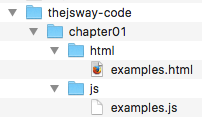
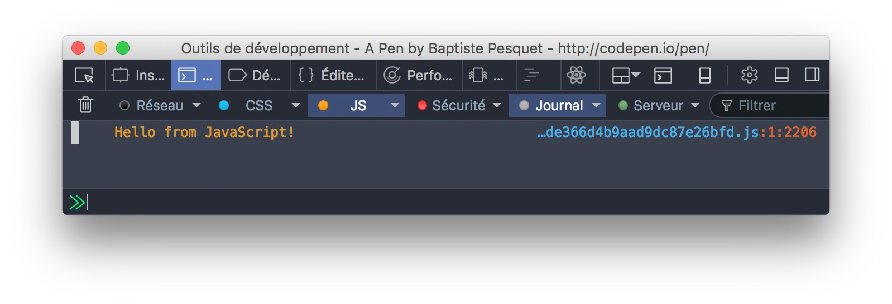

# Environment setup

## Prerequisite: a modern browser

This book targets a recent version of the JavaScript language. More specifically, you'll need a browser able to run code written in the ES2015 (ES6) language specification.

A **browser** is the software you use to visit webpages and use web applications. Check this [compatibility table](https://kangax.github.io/compat-table/es6/) for more detail about ES2015 support among browsers.

The safest bet is to choose either Google Chrome or Mozilla Firefox, two "evergreen" (self-updated) browsers with excellent ES2015 support in their recent versions. Other capable browsers include Opera and Microsoft Edge (Windows 10's default browser). On the contrary, all versions of Internet Explorer will have issues with ES2015 code: stay away from them.

## Solution A: coding online

Maybe you're a little bit of the impatient type, or maybe you'd rather not set up your local machine right now. Fortunately, one of the beauties of JavaScript is that it can run on almost any browser. All you'll need in addition is an active Internet connection.

Coding online requires a **JavaScript playground**, an online service where you can type some JavaScript code and immediately visualize its result.

### For chapters 1 to 23: CodePen

To follow along these chapters, you'll need a **front-end** coding playground able to run HTML, CSS and JavaScript code. There is a handful of front-end playgrounds online. My personal favorite is [CodePen](http://codepen.io), but there are alternatives like [JSFiddle](https://jsfiddle.net/) and [JS Bin](http://jsbin.com/).


If you choose to use CodePen, you *really* should start by visiting [Welcome to CodePen](https://codepen.io/hello/). It introduces the platform in a very friendly way and gives you everything you need to get started.

In addition, there are some helpful articles in the CodePen documentation about [autocomplete](https://blog.codepen.io/documentation/editor/autocomplete/), the [console](https://blog.codepen.io/documentation/editor/console/), [pen autosaving](https://blog.codepen.io/documentation/editor/autosave/), [keybindings](https://blog.codepen.io/documentation/editor/key-bindings/) and [auto-updating](https://blog.codepen.io/documentation/editor/auto-updating-previews/). Albeit not mandatory, mastering CodePen will make you more productive while studying this book.

T> I advise you to enable autosave and disable auto-update for all your book-related pens. Showing the CodePen console will often be needed to look at the results produced by the code.

You should use a pen (not necessarily saved) to try every code sample this book contains. You should also dedicate a specific and saved pen to each exercise and project you'll search.

> For performance reasons, the CodePen console does not always show the same amount of information as the "real" browser console.

### From chapter 24 onwards: Glitch

Starting with chapter 24, a **back-end** playground will be necessary to create Node.js applications. The prominent choice is [Glitch](https://glitch.com), a platform for quickly building Node-based web applications. Glitch emulates a local Node setup and automates things like code execution, package management, hosting and deployment. You can also remix (clone) any Glitch app to personalize it for your needs.


You can learn more about Glitch [here](https://glitch.com/about/) and start by remixing [this project](https://glitch.com/edit/#!/thejsway-starterapp).

## Solution B: building a local development environment

Setting up your local machine takes a bit of work, but will give you a tailored and powerful environment. This is also your only choice if you need to work offline.

The following steps will help you code effectively on your machine.

### Install a code editor

At heart, programming is typing code as text in a number of files.
To actually program, you'll need to use a **code editor** on your machine. Here are some of them:

* [Visual Studio Code](https://code.visualstudio.com/) (my editor of choice).
* [Brackets](http://brackets.io/).
* [Atom](https://atom.io/).
* [Sublime Text](https://www.sublimetext.com/).

### Install Node.js and npm

The **Node.js** platform is necessary from chapter 24 onwards. The **npm** package manager is automatically installed along with Node.

To setup Node on your local machine, download the latest version [here](https://nodejs.org), execute the downloaded file and follow the instructions.

> Some examples in this book need Node 8 or higher.

The easiest way to test that node is installed is to run the `node --version` command in your terminal/command prompt, and check that a version string is returned.

```console
node --version
```

### Install a code formatter and a linter

Over the years, a lot of tools have been created to ease a JavaScript developer's life. In particular, two kinds of tools are of great interest to any JavaScript professional:

* A **code formatter** frees you from the burden of formatting your code manually and improves consistency. [Prettier](https://github.com/prettier/prettier) is the current standard.
* A **linter** can greatly improve your code's quality, detecting bugs and enforcing good practices. [ESLint](http://eslint.org) is a common choice.

The easiest way to setup ESLint and Prettier is to add them as **extensions** (sometimes named add-ons) to your code editor. For VS Code, use these links:

* [Prettier extension](https://marketplace.visualstudio.com/items?itemName=esbenp.prettier-vscode).
* [ESLint extension](https://marketplace.visualstudio.com/items?itemName=dbaeumer.vscode-eslint).

Follow the instructions provided in their documentation to setup them.

> ESLint configuration is discussed in the next chapter.

### Organize your code

It's important to set up your basic folder and file structure before actually starting to code. That way, your project will be organized, and you'll be starting off with some good programming habits.

Create a folder in your storage disk dedicated to coding along this book. The folder name doesn't matter, `thejsway-code` will do nicely. All local files you subsequently create should be stored in subfolders of this root folder. The most logical solution is to create a subfolder for each chapter of the book.

You can either download a [predefined folder structure](https://raw.githubusercontent.com/bpesquet/thejsway/master/resources/code-skeleton.zip) or follow the next few paragraphs to create this folder structure by hand.

#### For chapters 1 to 23

In these chapters, you'll execute your JavaScript code in the browser. Your files will be stored according to their type: HTML files (the ones with an `.html` extension) in an `html` subfolder, CSS files (`.css`) in a `css` subfolder and JavaScript files (`.js`) in a `js` subfolder. Each chapter is set up in a series of folders as follows.



For examples and each exercise of a chapter, create an HTML file in the `html` subfolder of the chapter folder. In these HTML files, a `<script>` will load the associated JavaScript code.

```html
<!doctype html>
<html>

<head>
    <meta charset="utf-8">
    <title>Code examples</title>
</head>

<body>
    <!-- HTML code goes here -->

    <script src="../js/examples.js"></script>
</body>

</html>
```

This `<script>` tag asks the browser to load the `examples.js` JavaScript file, located at path `../js/examples.js`. The two dots (`..`) at the beginning of the path indicate you're going back one level in the directory structure relative to the HTML file itself before looking in the `js` subfolder for a file named `examples.js`.

Next, open the HTML file in your browser to execute the JavaScript code stored in the `.js` file. Its result will be shown in the browser console (see below).

#### From chapter 24 onwards

In these chapters, you'll create Node.js applications to execute your JavaScript code. Each Node app must sit in its own folder and is described by a `package.json` file located at the root of this folder. Subdirectories may be used to store specific files:

* `node_modules` (automatically created) for external dependencies.
* `public` for client assets loaded by the browser, like CSS and JavaScript files.
* `views` for HTML files.
* `modules` for internal modules.

### Use the browser's development tools

Modern browsers include **developer tools** to help with web development. Each browser differs in exactly which tools they provide, but there are more similarities than differences among them.

These tools usually include a **JavaScript console** (to show JS output and type commands), a **page inspector** (to browse the page structure) and many more!



Check out the following links to discover more about browser developer tools:

* [Khan Academy - Inspecting HTML and CSS](https://www.khanacademy.org/computing/computer-programming/html-css/web-development-tools/a/using-the-browser-developer-tools).
* [OpenClassrooms - Optimize your website with DevTools](https://openclassrooms.com/courses/optimize-your-website-with-devtools).
* [Chrome DevTools Overview](https://developer.chrome.com/devtools).
* [Firefox Developer Tools](https://developer.mozilla.org/en-US/docs/Tools).
